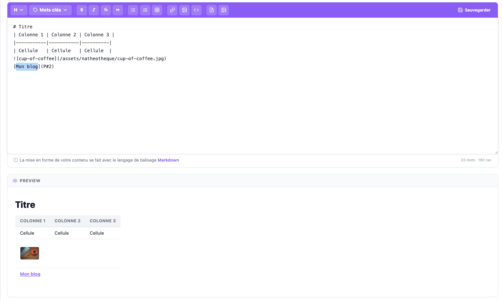

Éditeur Markdown riche en Vue 3 (Composition API), avec toolbar
configurable, aperçu en direct et système de modules extensible. C'est le
composant utilisé partout où un contenu long doit être rédigé en Markdown :
blocs de contenu d'une page, réponses de FAQ, modération de commentaires,
modèles d'e-mails.



## Utilisation de base

```vue
<script lang="ts">
import MarkdownEditor from '@/vue/Components/Global/MarkdownEditor/MarkdownEditor.vue';
</script>

<template>
  <MarkdownEditor
    :me-id="'content-' + id"
    :me-value="text"
    :me-translate="translate.markdown"
    @editor-value-change="(id, value) => (text = value)"
  />
</template>
```

Aucune configuration côté serveur n'est nécessaire : au montage, le
composant appelle lui-même la route `admin_markdown_load-datas` (interne à
[`MarkdownController`](https://github.com/counteraccro/natheo/blob/master/src/Controller/Admin/Global/MarkdownController.php))
pour récupérer les URLs dont il a besoin (médiathèque, liens internes).

## Props

| Prop | Type | Défaut | Rôle |
|---|---|---|---|
| `me-id` | `String` | `'mdInput'` | Identifiant HTML du textarea (utile pour plusieurs éditeurs sur une même page) |
| `me-value` | `String` | `''` | Contenu Markdown initial |
| `me-rows` | `Number` | `12` | Hauteur minimale, en lignes |
| `me-required` | `Boolean` | `false` | Affiche l'éditeur en rouge et un message d'erreur tant que le contenu est vide |
| `me-save` | `Boolean` | `false` | Affiche le bouton Sauvegarder |
| `me-preview` | `Boolean` | `true` | Affiche le panneau d'aperçu en direct |
| `me-translate` | `Object` | `{}` | Traductions de l'interface — voir [Traductions](#traductions) |
| `me-key-words` | `Array<{label, keyword}>` | `[]` | Mots-clés injectables (dropdown dédié dans la toolbar) |
| `me-modules` | `Array<EditorModule>` | `[]` | Modules custom ajoutés à la toolbar — voir [Modules](#modules--étendre-la-toolbar) |
| `me-toolbar` | `Array<Array<string>>` | *(voir ci-dessous)* | Groupes de boutons de la toolbar |

### Toolbar par défaut

```typescript
[
  ['heading', 'keywords'],
  ['bold', 'italic', 'strikethrough', 'blockquote'],
  ['bulletList', 'orderedList', 'table'],
  ['link', 'image', 'code'],
  ['save'],
]
```

### Boutons disponibles

| Nom | Description | Condition d'affichage |
|---|---|---|
| `heading` | Titres H1–H6 (dropdown) | — |
| `keywords` | Mots-clés (dropdown) | `me-key-words` non vide |
| `bold` | Gras — `Ctrl+B` | — |
| `italic` | Italique — `Ctrl+I` | — |
| `strikethrough` | Barré | — |
| `blockquote` | Citation | — |
| `bulletList` | Liste à puces | — |
| `orderedList` | Liste numérotée | — |
| `table` | Tableau | — |
| `link` | Lien — `Ctrl+K` | — |
| `image` | Image | — |
| `code` | Code inline | — |
| `save` | Sauvegarder | `me-save` à `true` |

> 💡 Le bouton `save` est toujours rendu en dernier, tout à droite de la
> toolbar (après les modules custom), quelle que soit sa position dans
> `me-toolbar` : il suffit qu'il soit présent quelque part dans la
> configuration pour apparaître.

## Événements

### `editor-value-change`

Déclenché à chaque frappe. Reçoit l'`id` de l'éditeur et la valeur courante.

### `editor-value`

Déclenché à la perte de focus (`blur`) **ou** au clic sur Sauvegarder — même
signature que `editor-value-change`. C'est cet événement qu'on écoute pour
déclencher une sauvegarde côté serveur.

## Aperçu en direct

Le panneau d'aperçu (`me-preview`) convertit le Markdown en HTML avec
[marked](https://marked.js.org/), assaini avec
[DOMPurify](https://github.com/cure53/DOMPurify). Le rendu de chaque élément
(titres, citations, tableaux...) est entièrement personnalisé dans
[`markdownEditorCore.ts`](https://github.com/counteraccro/natheo/blob/master/assets/ts/MarkdownEditor/markdownEditorCore.ts)
pour réutiliser directement les classes utilitaires et variables CSS du
thème d'administration — l'aperçu a donc le même rendu typographique que le
reste du back-office.

## Liens internes en Markdown

Le bouton **Lien interne** insère un lien au format `[texte](P#42)`, où `42`
est l'identifiant de la page ciblée — pas une URL en clair. Cette syntaxe
n'est comprise qu'à l'affichage : `MarkdownEditorService::parseInternalLink()`
(voir [`MarkdownEditorService`](https://github.com/counteraccro/natheo/blob/master/src/Service/Admin/MarkdownEditorService.php))
repère les motifs `P#<id>` et les remplace par l'URL réelle de la page, dans
la langue courante. Un lien interne reste donc valide même si l'URL de la
page cible change par la suite.

## Modules — étendre la toolbar

Un module ajoute un bouton à la toolbar (après les groupes natifs, avant
Sauvegarder) qui exécute une action sur l'éditeur au clic :

```typescript
interface EditorModule {
  name: string;                    // identifiant unique
  label: string;                   // tooltip du bouton
  icon: string;                    // SVG inline (chaîne HTML)
  action(api: EditorApi): void;    // exécuté au clic
}
```

`action()` reçoit une petite API pour manipuler le contenu, sans jamais
accéder au DOM du textarea directement :

```typescript
interface EditorApi {
  insertText(text: string): void;
  wrapSelection(before: string, after: string, placeholder?: string): void;
  insertLinePrefix(prefix: string): void;
  insertBlock(text: string): void;
  getSelection(): { text: string; start: number; end: number };
  focus(): void;
  getMarkdown(): string;
  setMarkdown(value: string): void;
}
```

### Les deux modules livrés avec le CMS

Le CMS embarque déjà deux modules, prêts à l'emploi — il suffit de les
ajouter à `me-modules`, leur fenêtre modale est montée automatiquement par
`MarkdownEditor.vue` lui-même :

```typescript
import type { EditorModule } from '@/ts/MarkdownEditor/MarkdownEditor.type';
import { InternalLinkModule } from '@/ts/MarkdownEditor/modules/internalLink';
import { MediaModule } from '@/ts/MarkdownEditor/modules/Mediatheque';

const editorModules: EditorModule[] = [InternalLinkModule, MediaModule];
```

```vue
<MarkdownEditor :me-modules="editorModules" :me-save="true" />
```

| Module | Fichier | Modale associée |
|---|---|---|
| `InternalLinkModule` | [`internalLink.ts`](https://github.com/counteraccro/natheo/blob/master/assets/ts/MarkdownEditor/modules/internalLink.ts) | [`InternalLink.vue`](https://github.com/counteraccro/natheo/blob/master/assets/vue/Components/Global/MarkdownEditor/InternalLink.vue) |
| `MediaModule` | [`Mediatheque.ts`](https://github.com/counteraccro/natheo/blob/master/assets/ts/MarkdownEditor/modules/Mediatheque.ts) | [`Mediatheque.vue`](https://github.com/counteraccro/natheo/blob/master/assets/vue/Components/Global/MarkdownEditor/Mediatheque.vue) |

### Comment ils communiquent : un `CustomEvent` sur `window`

Le module et sa modale ne se connaissent pas directement — ils
communiquent via un événement du navigateur, préfixé `natheo:` par
convention. C'est ce qui permet à `MarkdownEditor.vue` de rester
indépendant de l'interface de chaque module :

```typescript
// internalLink.ts — extrait
action(api: EditorApi): void {
  window.dispatchEvent(new CustomEvent('natheo:open-internal-link', {
    detail: {
      onSelect: (page) => {
        const { text } = api.getSelection();
        api.wrapSelection('[', `](P#${page.id})`, text || page.title);
      },
    },
  }));
}
```

```typescript
// InternalLink.vue — extrait
onMounted(() => window.addEventListener('natheo:open-internal-link', handleOpen));
onUnmounted(() => window.removeEventListener('natheo:open-internal-link', handleOpen));

function handleOpen(e) {
  onSelectCallback = e.detail.onSelect; // rappelé quand l'utilisateur choisit une page
  isOpen.value = true;
}
```

### Créer un nouveau module

Pour un module au-delà des deux ci-dessus, le principe est le même
(définition + `CustomEvent` + modale), mais cette fois **vous devez monter
vous-même votre composant modale** dans le parent qui utilise l'éditeur —
seuls `InternalLink` et `MediathequeModale` sont automatiquement inclus par
`MarkdownEditor.vue`. [`internalLink.ts`](https://github.com/counteraccro/natheo/blob/master/assets/ts/MarkdownEditor/modules/internalLink.ts)
et sa modale sont le meilleur point de départ à copier.

## Traductions

`me-translate` attend un objet à plat. Les clés lues par le composant :

| Clé | Rôle |
|---|---|
| `textareaPlaceholder` | Placeholder du textarea |
| `help` | Texte d'aide sous l'éditeur (à côté du lien vers le guide Markdown) |
| `msgEmptyContent` | Message affiché quand `me-required` est actif et le contenu vide |
| `words`, `caracteres` | Unités du compteur, en pied d'éditeur |
| `preview`, `emptyPreview` | Titre du panneau d'aperçu, et texte quand il est vide |
| `btnSave` | Libellé du bouton Sauvegarder |
| `btnKeyWord` | Libellé du bouton du dropdown Mots-clés |
| `titreH1` … `titreH6` | Libellés du dropdown Titres |
| `modaleInternalLink` | Objet imbriqué : traductions de la modale Lien interne |
| `modaleMediatheque` | Objet imbriqué : traductions de la modale Médiathèque |

Chaque bouton simple (`bold`, `italic`, `link`...) accepte aussi sa propre
clé de traduction, pour surcharger son tooltip par défaut.

Plutôt que de reconstruire cet objet à la main, la classe
[`MarkdownEditorTranslate`](https://github.com/counteraccro/natheo/blob/master/src/Utils/Translate/MarkdownEditorTranslate.php)
(domaine `editor_markdown`, fichiers `translations/editor_markdown+intl-icu.{fr,en,es}.yaml`)
génère déjà ce tableau côté PHP — voir [Traductions & multilingue](../traductions_i18n.md)
pour le fonctionnement général de ce pattern.
