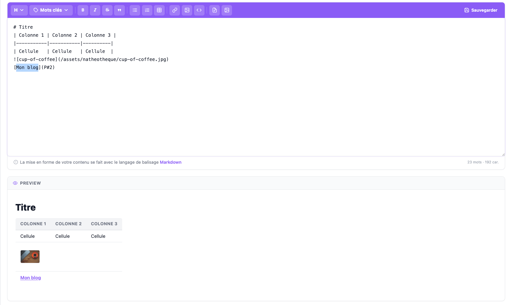

Éditeur Markdown riche en Vue 3 (Composition API), avec toolbar
configurable, aperçu en direct et système de modules extensible. C'est le
composant utilisé partout où un contenu long doit être rédigé en Markdown :
blocs de contenu d'une page, réponses de FAQ, modération de commentaires,
modèles d'e-mails.



## Utilisation de base

```vue
<script lang="ts">
import MarkdownEditor from '@/vue/Components/Global/MarkdownEditor/MarkdownEditor.vue';
</script>

<template>
  <MarkdownEditor
    :me-id="'content-' + id"
    :me-value="text"
    :me-translate="translate.markdown"
    @editor-value-change="(id, value) => (text = value)"
  />
</template>
```

Aucune configuration côté serveur n'est nécessaire : si l'un des
[modules livrés](#les-deux-modules-livrés-avec-le-cms) est activé, le composant
appelle lui-même la route `admin_markdown_load-datas` (interne à
[`MarkdownController`](https://github.com/counteraccro/natheo/blob/master/src/Controller/Admin/Global/MarkdownController.php))
pour récupérer les URLs dont ces modules ont besoin (`media`, `internalLinks`).
L'appel est fait **une seule fois par page**, quel que soit le nombre
d'éditeurs (`loadEditorDatas()` dans `markdownEditorCore.ts`), avec la langue
lue dans l'attribut `lang` de `<html>` de `admin_base.html.twig`. Sans module,
aucun appel n'est fait.

## Props

| Prop | Type | Défaut | Rôle |
|---|---|---|---|
| `me-id` | `String` | `''` | Identifiant renvoyé avec chaque événement, et `id` HTML du textarea s'il est renseigné (sinon un identifiant unique est généré) |
| `me-value` | `String` | `''` | Contenu Markdown. Réactif : une nouvelle valeur passée par le parent remplace le contenu de l'éditeur |
| `me-rows` | `Number` | `12` | Hauteur minimale, en lignes |
| `me-required` | `Boolean` | `false` | Affiche l'éditeur en rouge et un message d'erreur tant que le contenu est vide ou ne contient que des espaces (`aria-invalid` posé sur le textarea) |
| `me-save` | `Boolean` | `false` | Affiche le bouton Sauvegarder |
| `me-preview` | `Boolean` | `true` | Affiche le panneau d'aperçu en direct |
| `me-translate` | `Object` | `{}` | Traductions de l'interface — voir [Traductions](#traductions) |
| `me-key-words` | `Array<{label, keyword}>` | `[]` | Mots-clés injectables (dropdown dédié dans la toolbar) |
| `me-modules` | `Array<EditorModule>` | `[]` | Modules custom ajoutés à la toolbar — voir [Modules](#modules--étendre-la-toolbar) |
| `me-toolbar` | `Array<Array<string>>` | *(voir ci-dessous)* | Groupes de boutons de la toolbar |

### Toolbar par défaut

```typescript
[
  ['heading', 'keywords'],
  ['bold', 'italic', 'strikethrough', 'blockquote'],
  ['bulletList', 'orderedList', 'table'],
  ['link', 'image', 'code'],
  ['save'],
]
```

### Boutons disponibles

| Nom | Description | Condition d'affichage |
|---|---|---|
| `heading` | Titres H1–H6 (dropdown) | — |
| `keywords` | Mots-clés (dropdown) | `me-key-words` non vide |
| `bold` | Gras — `Ctrl+B` | — |
| `italic` | Italique — `Ctrl+I` | — |
| `strikethrough` | Barré | — |
| `blockquote` | Citation | — |
| `bulletList` | Liste à puces | — |
| `orderedList` | Liste numérotée | — |
| `table` | Tableau | — |
| `link` | Lien — `Ctrl+K` | — |
| `image` | Image | — |
| `code` | Code inline | — |
| `save` | Sauvegarder | `me-save` à `true` |

> 💡 Le bouton `save` est toujours rendu en dernier, tout à droite de la
> toolbar (après les modules custom), quelle que soit sa position dans
> `me-toolbar` : il suffit qu'il soit présent quelque part dans la
> configuration pour apparaître.

Les boutons des titres `H1` à `H6`, de la citation et des listes agissent sur
chaque ligne de la sélection : un préfixe de la même famille est remplacé
(`#` → `##`, `- ` → `1. `), et un nouveau clic sur un préfixe déjà présent
sur toutes les lignes le retire. Le tableau et les médias sont insérés comme
des blocs entourés d'une ligne vide. Toutes les insertions passent par
`document.execCommand('insertText')` (repli sur `setRangeText`) afin de
conserver l'historique d'annulation natif (`Ctrl+Z`).

## Événements

Les deux événements reçoivent la valeur de `me-id` et la valeur courante.

### `editor-value-change`

Déclenché à chaque modification du contenu (frappe, bouton de la toolbar,
module, ou nouvelle valeur de `me-value`).

### `editor-value`

Déclenché au clic sur Sauvegarder (toujours), ou à la perte de focus
(`blur`) **seulement si le contenu a changé** depuis la dernière émission.
C'est cet événement qu'on écoute pour transmettre la valeur au parent sans
réagir à chaque frappe.

> ⚠️ Aucun de ces événements n'enregistre quoi que ce soit côté serveur :
> c'est au composant parent de sauvegarder (voir
> [Le bouton Sauvegarder](../../GuideAdmin/Modules/editeur_markdown.md#le-bouton-sauvegarder)
> côté utilisateur).

## Aperçu en direct

Le panneau d'aperçu (`me-preview`) convertit le Markdown en HTML avec
[marked](https://marked.js.org/), assaini avec
[DOMPurify](https://github.com/cure53/DOMPurify). L'aperçu utilise sa propre
instance `Marked` (option `breaks: true`), dont le renderer, défini dans
[`markdownEditorCore.ts`](https://github.com/counteraccro/natheo/blob/master/assets/ts/MarkdownEditor/markdownEditorCore.ts),
reprend le rendu par défaut de marked et n'ajoute que les classes utilitaires
et variables CSS du thème d'administration : l'aperçu a donc le même rendu
typographique que le reste du back-office. Les liens internes `P#id` n'étant
résolus que côté serveur, ils sont affichés comme un simple texte souligné
en pointillés (cible en `title`).

### `renderMarkdown()` : un seul point d'entrée pour tout `v-html`

La conversion + l'assainissement sont regroupés dans
[`markdownRender.ts`](https://github.com/counteraccro/natheo/blob/master/assets/ts/MarkdownEditor/markdownRender.ts) :

```typescript
import { renderMarkdown } from '@/ts/MarkdownEditor/markdownRender';

renderMarkdown(markdown);                     // instance marked par défaut (gfm), sans target
renderMarkdown(markdown, editorParser, true); // renderer de l'aperçu, target autorisé
```

C'est ce helper qu'utilisent l'aperçu de l'éditeur, l'écran de modération
des commentaires et les composants du thème front `natheo_horizon`
(`ContentText`, `ContentFaq`, `ContentComment`). Tout nouveau `v-html`
alimenté par du Markdown doit passer par lui plutôt que d'appeler `marked`
directement : il ne modifie pas l'instance globale de marked et garantit le
passage par DOMPurify.

Côté serveur, les emails et le contenu des blocs de texte renvoyé par l'API
sont convertis par [`App\Utils\Markdown`](https://github.com/counteraccro/natheo/blob/master/src/Utils/Markdown.php)
(league/commonmark, extensions tableaux, barré et attributs `{.classe}`),
sans `breaks` : un simple retour à la ligne n'y produit pas de `<br>`,
contrairement à l'aperçu.

## Liens internes en Markdown

Le bouton **Lien interne** insère un lien au format `[texte](P#42)`, où `42`
est l'identifiant de la page ciblée — pas une URL en clair. Cette syntaxe
n'est comprise qu'à l'affichage : `MarkdownEditorService::parseMarkdown()`
(voir [`MarkdownEditorService`](https://github.com/counteraccro/natheo/blob/master/src/Service/Admin/MarkdownEditorService.php))
remplace chaque cible `P#<id>` par l'URL réelle de la page, dans la langue
courante. Un lien interne reste donc valide même si l'URL de la page cible
change par la suite.

Règles de remplacement :

- seule la **cible d'un lien** est remplacée : le motif doit suivre `](` et
  être suivi d'un espace ou de `)` (`/(?<=\]\()P#(\d+)(?=[\s)])/`). Un `P#12`
  dans le texte courant n'est pas touché ;
- une page inexistante, ou sans traduction dans la langue courante, produit
  un lien `#` (pas d'exception) ;
- chaque identifiant n'est résolu qu'une fois par texte (cache local) ;
- le statut de la page n'est pas vérifié : une page dépubliée ou désactivée
  produit quand même son URL.

`parseMarkdown()` est appelé par l'API pour les blocs de texte des pages et
les réponses de FAQ. **Il ne l'est pas par `MailService::sendMail()`** : un
lien interne dans un email part tel quel (`P#42`).

## Modules — étendre la toolbar

Un module ajoute un bouton à la toolbar (après les groupes natifs, avant
Sauvegarder) qui exécute une action sur l'éditeur au clic :

```typescript
interface EditorModule {
  name: string;                    // identifiant unique
  label: string;                   // tooltip si aucune traduction n'est trouvée
  translateKey?: keyof MarkdownEditorTranslate; // clé de me-translate utilisée pour le tooltip
  icon: string;                    // SVG inline (chaîne HTML)
  action(api: EditorApi): void;    // exécuté au clic
}
```

`action()` reçoit une petite API pour manipuler le contenu, sans jamais
accéder au DOM du textarea directement :

```typescript
interface EditorApi {
  editorId: string;                // identifiant unique de l'instance (cible des modales)
  insertText(text: string): void;
  wrapSelection(before: string, after: string, placeholder?: string): void;
  insertLinePrefix(prefix: string): void;
  insertBlock(text: string): void;
  getSelection(): { text: string; start: number; end: number };
  focus(): void;
  getMarkdown(): string;
  setMarkdown(value: string): void;
}
```

### Les deux modules livrés avec le CMS

Le CMS embarque déjà deux modules, prêts à l'emploi — il suffit de les
ajouter à `me-modules`. Leur fenêtre modale est montée automatiquement par
`MarkdownEditor.vue` lui-même, **uniquement si le module est présent**, et
en un exemplaire par instance d'éditeur :

```typescript
import type { EditorModule } from '@/ts/MarkdownEditor/MarkdownEditor.type';
import { InternalLinkModule } from '@/ts/MarkdownEditor/modules/internalLink';
import { MediaModule } from '@/ts/MarkdownEditor/modules/Mediatheque';

const editorModules: EditorModule[] = [InternalLinkModule, MediaModule];
```

```vue
<MarkdownEditor :me-modules="editorModules" :me-save="true" />
```

| Module | Fichier | Modale associée |
|---|---|---|
| `InternalLinkModule` | [`internalLink.ts`](https://github.com/counteraccro/natheo/blob/master/assets/ts/MarkdownEditor/modules/internalLink.ts) | [`InternalLink.vue`](https://github.com/counteraccro/natheo/blob/master/assets/vue/Components/Global/MarkdownEditor/InternalLink.vue) |
| `MediaModule` | [`Mediatheque.ts`](https://github.com/counteraccro/natheo/blob/master/assets/ts/MarkdownEditor/modules/Mediatheque.ts) | [`Mediatheque.vue`](https://github.com/counteraccro/natheo/blob/master/assets/vue/Components/Global/MarkdownEditor/Mediatheque.vue) |

### Comment ils communiquent : un `CustomEvent` sur `window`

Le module et sa modale ne se connaissent pas directement — ils
communiquent via un événement du navigateur, préfixé `natheo:` par
convention. C'est ce qui permet à `MarkdownEditor.vue` de rester
indépendant de l'interface de chaque module. L'événement transporte
l'`editorId` de l'éditeur émetteur : comme chaque éditeur monte sa propre
modale, seule celle dont l'`editorId` correspond s'ouvre (sinon, avec
plusieurs éditeurs sur une page, toutes les modales s'ouvriraient en même
temps) :

```typescript
// internalLink.ts — extrait
action(api: EditorApi): void {
  window.dispatchEvent(new CustomEvent('natheo:open-internal-link', {
    detail: {
      editorId: api.editorId,
      onSelect: (page) => {
        // texte sélectionné conservé, sinon le titre de la page sert de libellé
        api.wrapSelection('[', `](P#${page.id})`, escapeLinkText(page.title));
      },
    },
  }));
}
```

```typescript
// InternalLink.vue — extrait
onMounted(() => window.addEventListener('natheo:open-internal-link', handleOpen));
onUnmounted(() => window.removeEventListener('natheo:open-internal-link', handleOpen));

function handleOpen(e) {
  if (e.detail.editorId !== props.editorId) return; // event d'un autre éditeur
  onSelectCallback = e.detail.onSelect; // rappelé quand l'utilisateur choisit une page
  isOpen.value = true;
  loadPages(); // liste rechargée à chaque ouverture
}
```

`escapeLinkText()` et `formatLinkUrl()` (exportés par `markdownEditorCore.ts`)
échappent respectivement les crochets d'un libellé et entourent de `<...>`
une URL contenant espaces ou parenthèses : à réutiliser dans tout module qui
construit un lien Markdown.

La modale Médiathèque accepte aussi un `editorId` vide : elle répond alors
aux événements `natheo:open-media` émis **hors** éditeur (c'est ainsi que
l'écran d'édition d'une page l'utilise pour son image d'en-tête).

### Créer un nouveau module

Pour un module au-delà des deux ci-dessus, le principe est le même
(définition + `CustomEvent` + modale), mais cette fois **vous devez monter
vous-même votre composant modale** dans le parent qui utilise l'éditeur —
seuls `InternalLink` et `MediathequeModale` sont automatiquement inclus par
`MarkdownEditor.vue`. Transmettez `api.editorId` dans l'événement et
filtrez-le côté modale si plusieurs éditeurs peuvent cohabiter sur la page. [`internalLink.ts`](https://github.com/counteraccro/natheo/blob/master/assets/ts/MarkdownEditor/modules/internalLink.ts)
et sa modale sont le meilleur point de départ à copier.

## Traductions

`me-translate` attend un objet à plat. Les clés lues par le composant :

| Clé | Rôle |
|---|---|
| `textareaPlaceholder` | Placeholder du textarea |
| `help` | Texte d'aide sous l'éditeur (à côté du lien vers le guide Markdown) |
| `msgEmptyContent` | Message affiché quand `me-required` est actif et le contenu vide |
| `words`, `caracteres` | Unités du compteur, en pied d'éditeur |
| `preview`, `emptyPreview` | Titre du panneau d'aperçu, et texte quand il est vide |
| `btnSave` | Libellé du bouton Sauvegarder |
| `btnKeyWord` | Libellé du bouton du dropdown Mots-clés |
| `btnHeading` | Tooltip du dropdown Titres |
| `btnBold`, `btnItalic`, `btnStrike`, `btnQuote`, `btnList`, `btnListNumber`, `btnTable`, `btnLink`, `btnImage`, `btnCode` | Tooltips des boutons simples (le raccourci `Ctrl+B`/`I`/`K` est ajouté automatiquement) |
| `btnLinkInterne`, `btnMediatheque` | Tooltips des deux modules livrés (via leur `translateKey`) |
| `titreH1` … `titreH6` | Libellés du dropdown Titres |
| `placeholders` | Objet imbriqué : textes insérés quand rien n'est sélectionné (`bold`, `italic`, `strike`, `code`, `link`, `image`, `tableColumn`, `tableCell`) |
| `modaleInternalLink` | Objet imbriqué : traductions de la modale Lien interne (dont `loading` et `error`) |
| `modaleMediatheque` | Objet imbriqué : traductions de la modale Médiathèque (dont `root`, `files` et `error`) |

L'objet est typé par l'interface `MarkdownEditorTranslate`
(`MarkdownEditor.type.ts`). En cas de clé absente : les `placeholders`, les
titres `H1`…`H6` et le tooltip Titres retombent sur un texte français, les
modules sur leur `label`, mais les tooltips des boutons simples affichent le
**nom de la clé** (`btnBold`...) : pensez à toujours passer l'objet complet.

Plutôt que de reconstruire cet objet à la main, la classe
[`MarkdownEditorTranslate`](https://github.com/counteraccro/natheo/blob/master/src/Utils/Translate/MarkdownEditorTranslate.php)
(domaine `editor_markdown`, fichiers `translations/editor_markdown+intl-icu.{fr,en,es}.yaml`)
génère déjà ce tableau côté PHP — voir [Traductions & multilingue](../traductions_i18n.md)
pour le fonctionnement général de ce pattern.
