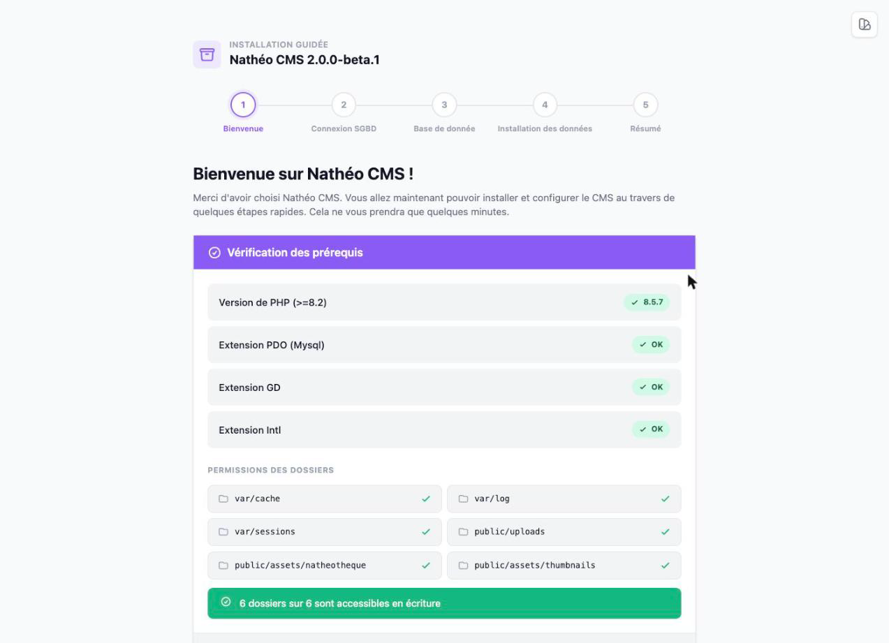
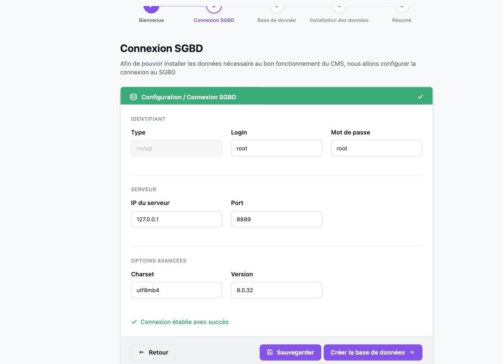
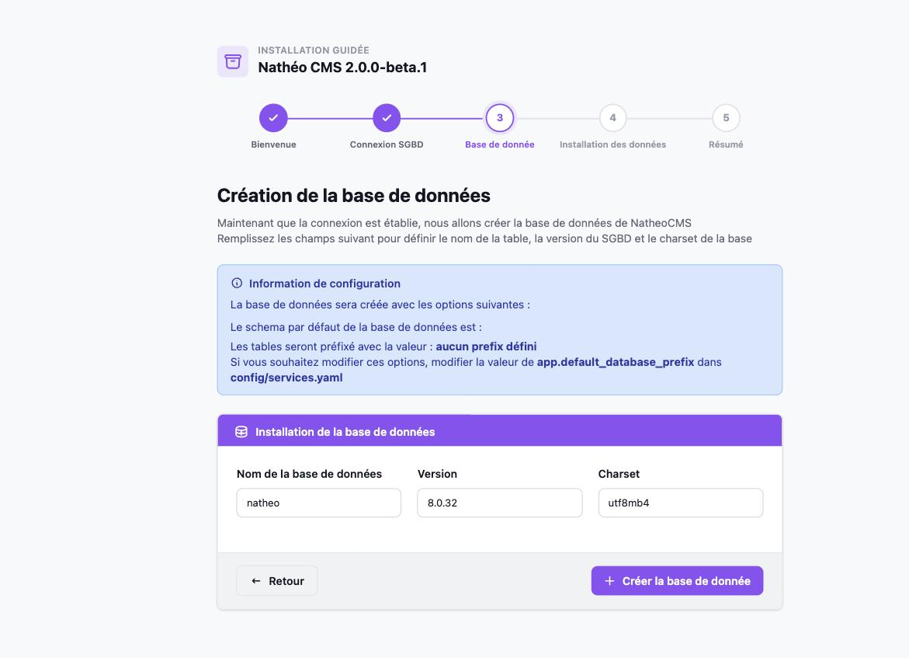
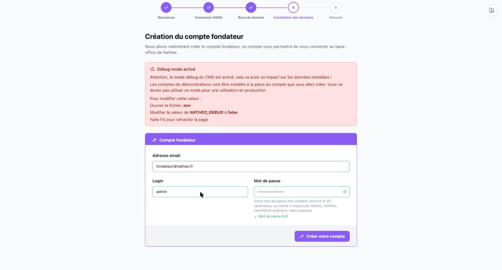
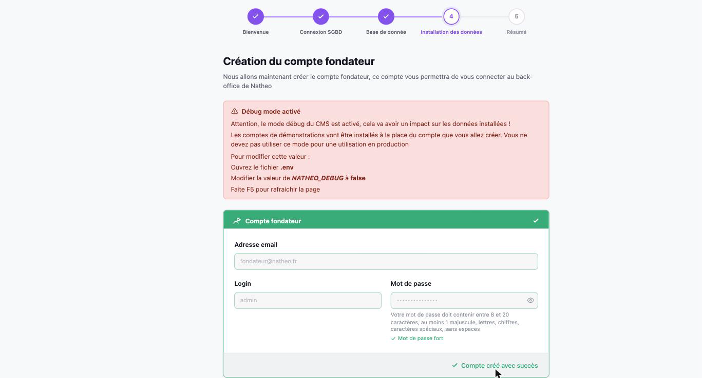
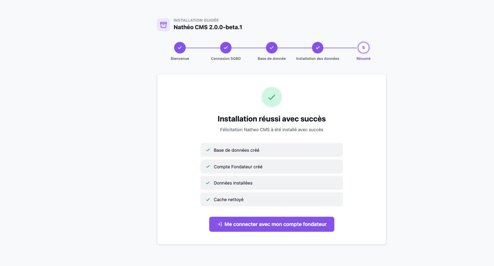

Nathéo CMS propose un installeur graphique en 5 étapes pour accompagner l'installation, sans avoir à taper de commandes Doctrine à la main.

### Pré-requis
[Voir les pré-requis](pre_requis.md)

## Installation du code

### Étape 1 : cloner le dépôt Git

```bash
git clone https://github.com/counteraccro/natheo.git
cd natheo
```

### Étape 2 : installer les dépendances PHP

```bash
composer install
```

### Étape 3 : génération des assets

```bash
yarn install
yarn build
```

### Étape 4 : accès au site

Créer un virtual host qui pointe vers le dossier `[chemin-vers-natheo]/public`, puis ouvrir
`http://[mon-virtual-host]/fr/installation/`.

> 💡 Pour installer avec **PostgreSQL** plutôt que MySQL (valeur par défaut), adaptez `DATABASE_URL` dans le `.env`
> *avant* de lancer l'installeur — voir la [procédure de changement de base de données](base_de_donnees.md). Le
> type de SGBD affiché à l'étape 2 de l'installeur est en lecture seule : il reflète simplement ce DSN.

## L'installeur

### Étape 1 — Bienvenue



L'installeur vérifie automatiquement l'environnement : version de PHP, extensions `pdo_mysql`/`gd`/`intl`, et droits
d'écriture sur les dossiers nécessaires (`var/cache`, `var/log`, `var/sessions`, `public/uploads`,
`public/assets/natheotheque`, `public/assets/thumbnails`). Le bouton **Commencer l'installation** reste désactivé
tant qu'un de ces points est en erreur.

### Étape 2 — Connexion SGBD



Renseignez les identifiants de connexion à votre serveur MySQL ou PostgreSQL (login, mot de passe, IP, port), puis
les options avancées (charset, version du SGBD). Le bouton **Créer la base de données** ne s'active qu'une fois la
connexion testée avec succès.

### Étape 3 — Création de la base de données



Choisissez le nom de la base de données à créer. Le préfixe des tables suit la valeur de
`app.default_database_prefix` dans `config/services.yaml` (vide par défaut). Cette étape crée la base, exécute les
[migrations Doctrine](https://symfony.com/doc/current/doctrine.html#migrations-creating-the-database-tables-schema)
pour générer le schéma, puis régénère `APP_SECRET`.

### Étape 4 — Compte fondateur et jeu de données



Renseignez l'email, le login et le mot de passe (8 à 20 caractères, au moins une majuscule, une minuscule, un
chiffre et un caractère spécial) du compte fondateur — il aura le rôle `ROLE_SUPER_ADMIN`.

> ⚠️ Si `NATHEO_DEBUG=true` dans le `.env`, un bandeau d'avertissement s'affiche : **les comptes de démonstration
> seront installés à la place du compte fondateur saisi ici**. Pour désactiver ce comportement, passez
> `NATHEO_DEBUG` à `false` dans le `.env` puis rafraîchissez la page avant de continuer.



Une fois le compte créé, le bouton **Finaliser l'installation** charge les fixtures de démonstration puis vide le
cache applicatif.

### Étape 5 — Résumé



Le résumé récapitule les quatre opérations réalisées (base de données créée, compte fondateur créé, données
installées, cache nettoyé). Le bouton **Me connecter avec mon compte fondateur** redirige vers l'authentification
du back-office.

## Voir aussi
- [Installation en mode développeur](installation_dev.md)
- [Options de configuration](configuration_installation.md)
- [Bases de données prises en charge](base_de_donnees.md)
