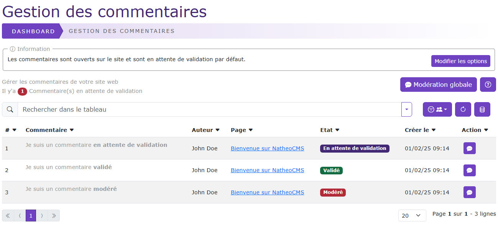

# Gestion des commentaires

[Index](../../../../../index.md) > [Documentation fonctionnelle](../../../index.md) > [Administration](../../index.md) >
Gestion des commentaires

*Modération des commentaires du CMS*



## Informations générales

Sidebar : **Content > Commentaire**  
Droit d'accès : **ROLE_CONTRIBUTEUR**

Nom entité : **Comment**  
Nom de la table en bdd : **natheo.comment**

| Nom                | Type          | Null | Valeur par défaut  |
|--------------------|---------------|------|--------------------|
| id                 | 	Int(11)      | 	Non | 	Aucune            |
| page_id            | 	Int(11)      | 	Non | 	Aucune            |
| user_moderation_id | 	Int(11)      | 	Non | 	Aucune            |
| author             | 	varchar(255) | 	Non | 	Aucune            |
| email              | 	varchar(255) | 	Oui | 	NULL              |
| comment            | 	longtext     | 	NON | 	NULL              |
| status             | 	int(11)      | 	NON | 	NULL              |
| disabled           | 	boolean      | 	Oui | 	NULL              |
| moderation_comment | 	longtext     | 	Oui | 	NULL              |
| ip                 | 	varchar(255) | 	Oui | 	NULL              |
| user_agent         | 	varchar(255) | 	Oui | 	NULL              |
| created_at         | 	datetime     | 	Non | 	CURRENT_TIMESTAMP |
| update_at          | 	datetime     | 	Oui | 	NULL              |

### Règles de gestions globales

- Comment
  - Une page peut posséder n Comment
  - Un commentaire ne peut appartenir qu'a 1 page
  - Un commentaire peut posséder 1 user (user_moderation_id)
  - Le champ created_at est mis à la date du jour à la création d'une option
  - Le champ update_at est mis à jour à la date du jour au format [aaaa-mm-jj hh:mm:ss] à chaque modification

## Définition

La gestion des commentaires permet de pouvoir modérer l'ensemble des commentaires du site

## Règles de gestions globales du tableau de données

Le tableau de données regroupe l'ensemble des commentaires enregistrés en base de donnée, le trie par défaut ce fait sur l'id
du commentaire.

### Liste des actions possibles

#### Modération
[Permet de modérer un commentaire](moderation.md)

#### Modération globale
Permet de [modérer de façon groupé des commentaires](moderation_globale.md)

## Fixtures

Path du fichier de données : ``src/DataFixtures/data/content/comment/comment_fixtures_data.yaml``
Nom de la fixture : **CommentFixtures**  
Groupe de fixtures : **content, page, comment**

Commande pour lancer uniquement cette fixture : ``php bin/console doctrine:fixture:load --group=comment``

## Exemple de fixture pour générer les faqs

Le fichier de config pour générer les pages est construit sous la forme suivante :

````yaml
comments:
  comment_1:
    page: Page_presentation
    author: 'John Doe'
    email: john-doe@monemail.com
    comment: 'Je suis un commentaire **en attente de validation**'
    status: 1
    ip: 1.1.1
    userAgent: 'windows'
    disabled: 0
  comment_2:
    page: Page_presentation
    author: 'John Doe'
    email: john-doe@monemail.com
    comment: 'Je suis un commentaire **validé**'
    status: 2
    ip: 1.1.1
    userAgent: 'windows'
    moderationComment: 'Raison de test'
    disabled: 0
    userModeration: 'User'
  comment_3:
    page: Page_presentation
    author: 'John Doe'
    email: john-doe@monemail.com
    comment: 'Je suis un commentaire **modéré**'
    status: 3
    ip: 1.1.1
    userAgent: 'windows'
    moderationComment: 'Raison de la modération'
    disabled: 0
    userModeration: 'User'
````
