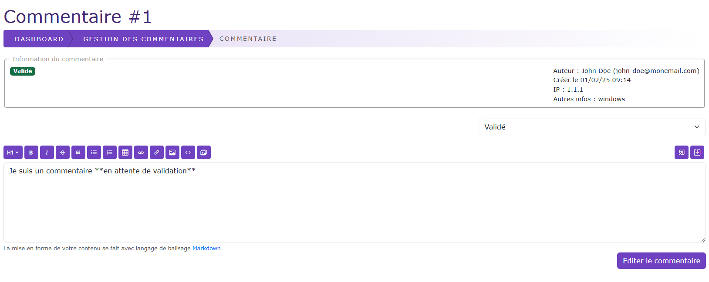

# Modération d'un commentaire

[Index](../../../../../index.md) > [Documentation fonctionnelle](../../../index.md) > [Administration](../../index.md) > [Gestion des commentaires](../Comment/comment.md) > 
Modération d'un commentaire

*Modération des commentaires du CMS*

Cette page permet de pouvoir modérer un commentaire et changer son status.

## Edition du commentaire
Via l'éditeur il est possible de modifier le commentaire

## Status
Un commentaire peut avoir les status suivants : 
* validé : Le commentaire apparait en bas de page et est validé
* En attente de validation : Le commentaire n'est pas visible en bas de la page
* Modéré : Le contenu du commentaire n'est pas visible mais un message de modération le remplace.

Si le commentaire à le status Modéré, alors on peut saisir un commentaire de modération

## Bouton "Editer le commentaire"
Un clique sur ce bouton permet de mettre à jour le commentaire