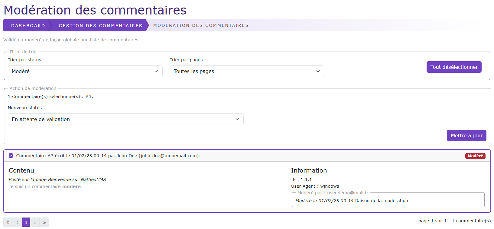

# Modération globale des commentaires

[Index](../../../../../index.md) > [Documentation fonctionnelle](../../../index.md) > [Administration](../../index.md) > [Gestion des commentaires](../Comment/comment.md) >
Modération globales

*Modération globales des commentaires du CMS*

Cette page permet de modérer de façon globale un ou plusieurs commentaires qu'importe la page associé

## Bloc filtre de trie
Ce bloc permet de filtrer les commentaires en fonction de son status et/ou la page associée

Un clique sur le bouton "Tout désélectionner" permet désélectionner l'ensemble des commentaires sélectionnés

## Bloc Action de modération
Le bloc "Action de modération" apparait si un ou plusieurs commentaires sont sélectionnés

Via ce bloc on peut changer le status des commentaires selectionnés. 

Dans le cas ou le status est modéré, un commentaire de modération est possible.

Cliquez sur le bouton "Mettre à jour" permet d'éditer les commentaires sélectionnés