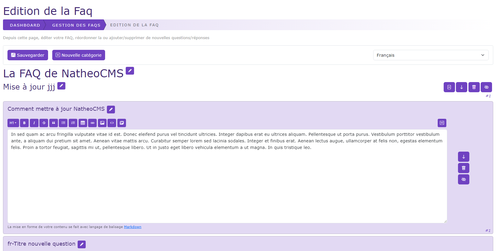
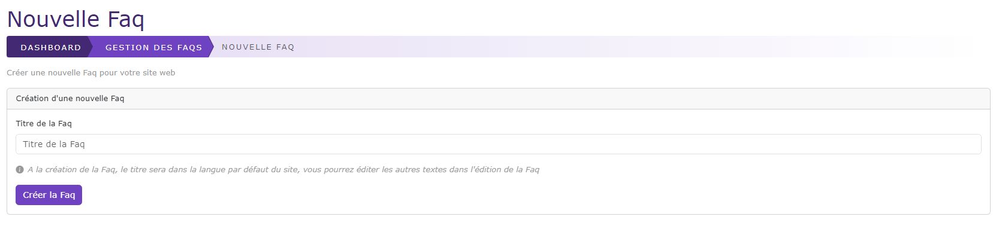
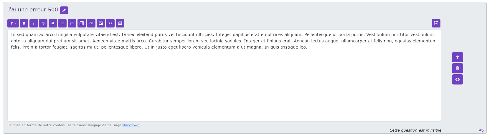

# Créer / Editer une faq

[Index](../../../../../index.md) > [Documentation fonctionnelle](../../../index.md) > [Administration](../../index.md) > [Gestion des faqs](faq.md) > Créer / éditer une faq

*Permet de pouvoir créer/ éditer une faq*

## Nouvelle Faq

La création d'une nouvelle faq ce fait en cliquant sur le bouton "Nouvelle Faq"

Pour créer une nouvelle faq, il suffit de saisir le titre de la faq et de cliquer sur le bouton "créer la Faq"

A la création d'une nouvelle Faq, une catégorie ainsi qu'une question est créé par défaut dans toutes les langues du site

Une fois la Faq créée, vous êtes redirigé vers l'édition de la Faq.

*Par défaut, le titre de la FAQ est saisi dans la langue par défaut choisi sur l'interface*

## Nouvelle Catégorie

## Nouvelle question

## Edition d'une donnée

## Désactiver une question / catégorie
Vous pouvez désactiver une question / catégorie en cliquant sur le bouton 
Dans le cas d'une catégorie, cela désactive aussi l'ensemble des questions associées

*Exemple de question désactivée*

## Supprimer une question / catégorie

## Activer une question / catégorie
Vous pouvez activer une question / catégorie en cliquant sur le bouton 

## Déplacer une question / catégorie
Vous pouvez déplacer une question / catégorie vers le haut ou le bas en cliquant sur les boutons 
ou 

Au clic sur le bouton  permet de remonter une question/catégorie d'une place vers le haut

Au clic sur le bouton  permet de descendre une question/catégorie d'une place vers le bas