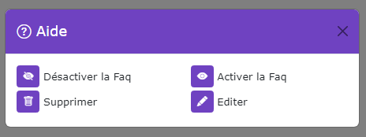

# Gestion des Faqs

[Index](../../../../../index.md) > [Documentation fonctionnelle](../../../index.md) > [Administration](../../index.md) >
Gestion des faqs

*Gestion des faqs du CMS*


## Informations générales

Sidebar : **Content > FAQ**  
Droit d'accès : **ROLE_CONTRIBTEUR**

Nom entité : **Faq**  
Nom de la table en bdd : **natheo.faq**

| Nom        | Type      | Null | Valeur par défaut  |
|------------|-----------|------|--------------------|
| id         | 	Int(11)  | 	Non | 	Aucune            |
| user_id    | 	Int(11)  | 	Non | 	Aucune            |
| disabled   | 	boolean  | 	Non | 	Aucune            |
| created_at | 	datetime | 	Non | 	CURRENT_TIMESTAMP |
| update_at  | 	datetime | 	Oui | 	NULL              |

Nom entité : **FaqTranslation**  
Nom de la table en bdd : **natheo.faq_translation**

| Nom    | Type          | Null | Valeur par défaut |
|--------|---------------|------|-------------------|
| id     | 	Int(11)      | 	Non | 	Aucune           |
| faq_id | 	Int(11)      | 	Non | 	Aucune           |
| locale | 	varchar(10)  | 	Non | 	Aucune           |
| title  | 	varchar(255) | 	Non | 	Aucune           |

Nom entité : **FaqCategory**  
Nom de la table en bdd : **natheo.faq_category**

| Nom          | Type     | Null | Valeur par défaut |
|--------------|----------|------|-------------------|
| id           | 	Int(11) | 	Non | 	Aucune           |
| faq_id       | 	Int(11) | 	Non | 	Aucune           |
| disabled     | 	boolean | 	Non | 	Aucune           |
| render_order | 	Int(11) | 	Non | 	Aucune           |

Nom entité : **FaqCategoryTranslation**  
Nom de la table en bdd : **natheo.faq_category_translation**

| Nom    | Type         | Null | Valeur par défaut |
|--------|--------------|------|-------------------|
| id     | 	Int(11)     | 	Non | 	Aucune           |
| faq_id | 	Int(11)     | 	Non | 	Aucune           |
| locale | 	varchar(10) | 	Non | 	Aucune           |
| title  | 	text        | 	Non | 	Aucune           |

Nom entité : **faq_question**  
Nom de la table en bdd : **natheo.faq_question**

| Nom             | Type     | Null | Valeur par défaut |
|-----------------|----------|------|-------------------|
| id              | 	Int(11) | 	Non | 	Aucune           |
| faq_category_id | 	Int(11) | 	Non | 	Aucune           |
| disabled        | 	boolean | 	Non | 	Aucune           |
| render_order    | 	Int(11) | 	Non | 	Aucune           |

Nom entité : **faqQuestionTranslation**  
Nom de la table en bdd : **natheo.faq_question_translation**

| Nom             | Type         | Null | Valeur par défaut |
|-----------------|--------------|------|-------------------|
| id              | 	Int(11)     | 	Non | 	Aucune           |
| faq_category_id | 	Int(11)     | 	Non | 	Aucune           |
| locale          | 	varchar(10) | 	Non | 	Aucune           |
| title           | 	text        | 	Non | 	Aucune           |
| answer          | 	text        | 	Non | 	Aucune           |

Nom entité : **FaqStatistique**  
Nom de la table en bdd : **natheo.faq_statistique**

| Nom        | Type          | Null | Valeur par défaut  |
|------------|---------------|------|--------------------|
| id         | 	Int(11)      | 	Non | 	Aucune            |
| faq_id     | 	Int(11)      | 	Non | 	Aucune            |
| key        | 	varchar(255) | 	Non | 	Aucune            |
| value      | 	varchar(255) | 	Non | 	Aucune            |
| created_at | 	datetime     | 	Non | 	CURRENT_TIMESTAMP |
| update_at  | 	datetime     | 	Oui | 	NULL              |

### Règles de gestions globales

- faq
  - Une faq peut posséder n faq_translation
  - Une faq peut posséder n faq_statistique
  - Une faq peut posséder n faq_category
  - Une faq est lié à un utilisateur
  - Le champ created_at est mis à la date du jour à la création d'une option
  - Le champ update_at est mis à jour à la date du jour au format [aaaa-mm-jj hh:mm:ss] à chaque modification de la
    valeur d'une option
- faq_translation
  - Une faq_translation est lié à une faq
- faq_category
  - Une faq_category est lié à une faq
  - Une faq_category peut posséder n faq_question
  - Une faq_category possède n faq_category_translation
- faq_category_translation
  - Une faq_category_translation est lié à une faq_category
- faq_question
  - Une faq_question est lié à une faq_category
  - Une faq_question possède n faq_question_translation
- faq_question_translation
  - Une faq_question_translation est lié à une faq_question
- faq_statistique

## Définition

La gestion des Faqs permet de créer des FAqs permettant d'afficher sur le cms sous la forme de question/réponse des informations.

## Règles de gestions globales du tableau de données

Le tableau de données regroupe l'ensemble des faqs enregistrés en base de donnée, le trie par défaut ce fait sur l'id
de la faq.
Pour chaque FAQ, le nombre de question et de réponses sont affichés

### Liste des actions possibles

Liste des actions possibles sur le listing des faq



#### Désactiver une faq

Met le champ ``faq.disabled à true``.   
Une faq désactivée n'apparait plus sur la partie public du site.
Si on tente d'y accéder quand même via son url, une erreur de type 404 doit apparaitre

#### Activer une faq

Met le champ ``faq.disabled à false``.   
Une page activée est accéssible depuis la partie public du site si celle-ci à le status publié.

#### Supprimer une faq

Supprime définitivement la faq de la base de données
La suppression d'une faq entraine la suppression des éléments suivants :

* la faq
* les données faq_translation associées
* les données faq_category associées
* les données faq_category_translation associées
* les données faq_question associées
* les données faq_question_translation associées
* les données faq_statistique associées
  Cette action est définitive et sans possibilité de retour.

#### Modifier une faq

Permet de pouvoir modifier une faq
Voir [Modifier une faq](add_edit_faq.md);

#### Créer un faq

Permet de pouvoir créer une nouvelle faq
Voir [Modifier une faq](add_edit_faq.md);

## Fixtures

Path du fichier de données : ``src/DataFixtures/data/faq_fixtures_data.yaml``
Nom de la fixture : **FaqFixtures**  
Groupe de fixtures : **content, faq**

Commande pour lancer uniquement cette fixture : ``php bin/console doctrine:fixture:load --group=faq``

## Exemple de fixture pour générer les faqs

Le fichier de config pour générer les pages est construit sous la forme suivante :

````yaml
faq:
  faq-1:
    user: Aymeric
    disabled: 0
    faqTranslation:
      fr:
        locale: fr
        title: 'La FAQ de NatheoCMS'
      en:
        locale: en
        title: '[EN] La FAQ de NatheoCMS'
      es:
        locale: es
        title: '[ES] La FAQ de NatheoCMS'
    faqStatistique:
      FAQ_STAT_NB_CATEGORIES:
        key: KEY_STAT_NB_CATEGORIES
        value: 2
      FAQ_STAT_NB_QUESTIONS:
        key: KEY_STAT_NB_QUESTIONS
        value: 4
    faqCategory:
      installation:
        disabled: 0
        renderOrder: 1
        faqCategoryTranslation:
          fr:
            locale: fr
            title: 'Installation'
          en:
            locale: en
            title: '[EN] Installation'
          es:
            locale: es
            title: '[ES] Installation'
        faqQuestion:
          q-installation-1:
            disabled: 0
            renderOrder: 1
            faqQuestionTranslation:
              fr:
                locale: fr
                title: 'Comment installer NatheoCMS'
                answer: 'In sed quam ac arcu fringilla vulputate vitae id est. Donec eleifend purus vel tincidunt ultricies. Integer dapibus erat eu ultrices aliquam. Pellentesque ut porta purus. Vestibulum porttitor vestibulum ante, a aliquam dui pretium sit amet. Aenean vitae mattis arcu. Curabitur semper lorem sed lacinia sodales. Integer et finibus erat. Aenean lectus augue, ullamcorper at felis non, egestas elementum felis. Proin a tortor feugiat, sagittis mi ut, pellentesque libero. Ut in justo eget libero vehicula elementum a ut magna. In quis tristique leo.'
              en:
                locale: en
                title: '[EN] Comment installer NatheoCMS'
                answer: '[EN] In sed quam ac arcu fringilla vulputate vitae id est. Donec eleifend purus vel tincidunt ultricies. Integer dapibus erat eu ultrices aliquam. Pellentesque ut porta purus. Vestibulum porttitor vestibulum ante, a aliquam dui pretium sit amet. Aenean vitae mattis arcu. Curabitur semper lorem sed lacinia sodales. Integer et finibus erat. Aenean lectus augue, ullamcorper at felis non, egestas elementum felis. Proin a tortor feugiat, sagittis mi ut, pellentesque libero. Ut in justo eget libero vehicula elementum a ut magna. In quis tristique leo.'
              es:
                locale: es
                title: '[ES] Comment installer NatheoCMS'
                answer: '[ES] In sed quam ac arcu fringilla vulputate vitae id est. Donec eleifend purus vel tincidunt ultricies. Integer dapibus erat eu ultrices aliquam. Pellentesque ut porta purus. Vestibulum porttitor vestibulum ante, a aliquam dui pretium sit amet. Aenean vitae mattis arcu. Curabitur semper lorem sed lacinia sodales. Integer et finibus erat. Aenean lectus augue, ullamcorper at felis non, egestas elementum felis. Proin a tortor feugiat, sagittis mi ut, pellentesque libero. Ut in justo eget libero vehicula elementum a ut magna. In quis tristique leo.'
          q-installation-2:
            disabled: 0
            renderOrder: 2
            faqQuestionTranslation:
              fr:
                locale: fr
                title: "Comment mettre à jour NateoCMS"
                answer: 'In sed quam ac arcu fringilla vulputate vitae id est. Donec eleifend purus vel tincidunt ultricies. Integer dapibus erat eu ultrices aliquam. Pellentesque ut porta purus. Vestibulum porttitor vestibulum ante, a aliquam dui pretium sit amet. Aenean vitae mattis arcu. Curabitur semper lorem sed lacinia sodales. Integer et finibus erat. Aenean lectus augue, ullamcorper at felis non, egestas elementum felis. Proin a tortor feugiat, sagittis mi ut, pellentesque libero. Ut in justo eget libero vehicula elementum a ut magna. In quis tristique leo.'
              en:
                locale: en
                title: "[EN] Comment mettre à jour NateoCMS"
                answer: '[EN] In sed quam ac arcu fringilla vulputate vitae id est. Donec eleifend purus vel tincidunt ultricies. Integer dapibus erat eu ultrices aliquam. Pellentesque ut porta purus. Vestibulum porttitor vestibulum ante, a aliquam dui pretium sit amet. Aenean vitae mattis arcu. Curabitur semper lorem sed lacinia sodales. Integer et finibus erat. Aenean lectus augue, ullamcorper at felis non, egestas elementum felis. Proin a tortor feugiat, sagittis mi ut, pellentesque libero. Ut in justo eget libero vehicula elementum a ut magna. In quis tristique leo.'
              es:
                locale: es
                title: "[ES] Comment mettre à jour NateoCMS"
                answer: '[ES] In sed quam ac arcu fringilla vulputate vitae id est. Donec eleifend purus vel tincidunt ultricies. Integer dapibus erat eu ultrices aliquam. Pellentesque ut porta purus. Vestibulum porttitor vestibulum ante, a aliquam dui pretium sit amet. Aenean vitae mattis arcu. Curabitur semper lorem sed lacinia sodales. Integer et finibus erat. Aenean lectus augue, ullamcorper at felis non, egestas elementum felis. Proin a tortor feugiat, sagittis mi ut, pellentesque libero. Ut in justo eget libero vehicula elementum a ut magna. In quis tristique leo.'
          q-installation-3:
            disabled: 1
            renderOrder: 3
            faqQuestionTranslation:
              fr:
                locale: fr
                title: "J'ai une erreur 500"
                answer: 'In sed quam ac arcu fringilla vulputate vitae id est. Donec eleifend purus vel tincidunt ultricies. Integer dapibus erat eu ultrices aliquam. Pellentesque ut porta purus. Vestibulum porttitor vestibulum ante, a aliquam dui pretium sit amet. Aenean vitae mattis arcu. Curabitur semper lorem sed lacinia sodales. Integer et finibus erat. Aenean lectus augue, ullamcorper at felis non, egestas elementum felis. Proin a tortor feugiat, sagittis mi ut, pellentesque libero. Ut in justo eget libero vehicula elementum a ut magna. In quis tristique leo.'
              en:
                locale: en
                title: "[EN] J'ai une erreur 500"
                answer: '[EN] In sed quam ac arcu fringilla vulputate vitae id est. Donec eleifend purus vel tincidunt ultricies. Integer dapibus erat eu ultrices aliquam. Pellentesque ut porta purus. Vestibulum porttitor vestibulum ante, a aliquam dui pretium sit amet. Aenean vitae mattis arcu. Curabitur semper lorem sed lacinia sodales. Integer et finibus erat. Aenean lectus augue, ullamcorper at felis non, egestas elementum felis. Proin a tortor feugiat, sagittis mi ut, pellentesque libero. Ut in justo eget libero vehicula elementum a ut magna. In quis tristique leo.'
              es:
                locale: es
                title: "[ES] J'ai une erreur 500"
                answer: '[ES] In sed quam ac arcu fringilla vulputate vitae id est. Donec eleifend purus vel tincidunt ultricies. Integer dapibus erat eu ultrices aliquam. Pellentesque ut porta purus. Vestibulum porttitor vestibulum ante, a aliquam dui pretium sit amet. Aenean vitae mattis arcu. Curabitur semper lorem sed lacinia sodales. Integer et finibus erat. Aenean lectus augue, ullamcorper at felis non, egestas elementum felis. Proin a tortor feugiat, sagittis mi ut, pellentesque libero. Ut in justo eget libero vehicula elementum a ut magna. In quis tristique leo.'
      miseAJour:
        disabled: 0
        renderOrder: 2
        faqCategoryTranslation:
          fr:
            locale: fr
            title: 'Mise à jour'
          en:
            locale: en
            title: '[EN] Mise à jour'
          es:
            locale: es
            title: '[ES] Mise à jour'
        faqQuestion:
          q-installation-1:
            disabled: 0
            renderOrder: 1
            faqQuestionTranslation:
              fr:
                locale: fr
                title: 'Comment mettre à jour NatheoCMS'
                answer: 'In sed quam ac arcu fringilla vulputate vitae id est. Donec eleifend purus vel tincidunt ultricies. Integer dapibus erat eu ultrices aliquam. Pellentesque ut porta purus. Vestibulum porttitor vestibulum ante, a aliquam dui pretium sit amet. Aenean vitae mattis arcu. Curabitur semper lorem sed lacinia sodales. Integer et finibus erat. Aenean lectus augue, ullamcorper at felis non, egestas elementum felis. Proin a tortor feugiat, sagittis mi ut, pellentesque libero. Ut in justo eget libero vehicula elementum a ut magna. In quis tristique leo.'
              en:
                locale: en
                title: '[EN] Comment mettre à jour NatheoCMS'
                answer: '[EN] In sed quam ac arcu fringilla vulputate vitae id est. Donec eleifend purus vel tincidunt ultricies. Integer dapibus erat eu ultrices aliquam. Pellentesque ut porta purus. Vestibulum porttitor vestibulum ante, a aliquam dui pretium sit amet. Aenean vitae mattis arcu. Curabitur semper lorem sed lacinia sodales. Integer et finibus erat. Aenean lectus augue, ullamcorper at felis non, egestas elementum felis. Proin a tortor feugiat, sagittis mi ut, pellentesque libero. Ut in justo eget libero vehicula elementum a ut magna. In quis tristique leo.'
              es:
                locale: es
                title: '[ES] Comment mettre à jour NatheoCMS'
                answer: '[ES] In sed quam ac arcu fringilla vulputate vitae id est. Donec eleifend purus vel tincidunt ultricies. Integer dapibus erat eu ultrices aliquam. Pellentesque ut porta purus. Vestibulum porttitor vestibulum ante, a aliquam dui pretium sit amet. Aenean vitae mattis arcu. Curabitur semper lorem sed lacinia sodales. Integer et finibus erat. Aenean lectus augue, ullamcorper at felis non, egestas elementum felis. Proin a tortor feugiat, sagittis mi ut, pellentesque libero. Ut in justo eget libero vehicula elementum a ut magna. In quis tristique leo.'

````