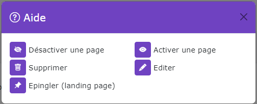

# Gestion des Faqs

[Index](../../../../../index.md) > [Documentation fonctionnelle](../../../index.md) > [Administration](../../index.md) >
Gestion des faqs

* Gestion des faqs du CMS


## Informations générales

Sidebar : **Content > FAQ**  
Droit d'accès : **ROLE_CONTRIBTEUR**

Nom entité : **Faq**  
Nom de la table en bdd : **natheo.faq**

| Nom        | Type      | Null | Valeur par défaut  |
|------------|-----------|------|--------------------|
| id         | 	Int(11)  | 	Non | 	Aucune            |
| user_id    | 	Int(11)  | 	Non | 	Aucune            |
| disabled   | 	boolean  | 	Non | 	Aucune            |
| created_at | 	datetime | 	Non | 	CURRENT_TIMESTAMP |
| update_at  | 	datetime | 	Oui | 	NULL              |

Nom entité : **FaqTranslation**  
Nom de la table en bdd : **natheo.faq_translation**

| Nom    | Type          | Null | Valeur par défaut |
|--------|---------------|------|-------------------|
| id     | 	Int(11)      | 	Non | 	Aucune           |
| faq_id | 	Int(11)      | 	Non | 	Aucune           |
| locale | 	varchar(10)  | 	Non | 	Aucune           |
| title  | 	varchar(255) | 	Non | 	Aucune           |

Nom entité : **FaqCategory**  
Nom de la table en bdd : **natheo.faq_category**

| Nom          | Type     | Null | Valeur par défaut |
|--------------|----------|------|-------------------|
| id           | 	Int(11) | 	Non | 	Aucune           |
| faq_id       | 	Int(11) | 	Non | 	Aucune           |
| disabled     | 	boolean | 	Non | 	Aucune           |
| render_order | 	Int(11) | 	Non | 	Aucune           |

Nom entité : **FaqCategoryTranslation**  
Nom de la table en bdd : **natheo.faq_category_translation**

| Nom    | Type         | Null | Valeur par défaut |
|--------|--------------|------|-------------------|
| id     | 	Int(11)     | 	Non | 	Aucune           |
| faq_id | 	Int(11)     | 	Non | 	Aucune           |
| locale | 	varchar(10) | 	Non | 	Aucune           |
| title  | 	text        | 	Non | 	Aucune           |

Nom entité : **faq_question**  
Nom de la table en bdd : **natheo.faq_question**

| Nom             | Type     | Null | Valeur par défaut |
|-----------------|----------|------|-------------------|
| id              | 	Int(11) | 	Non | 	Aucune           |
| faq_category_id | 	Int(11) | 	Non | 	Aucune           |
| disabled        | 	boolean | 	Non | 	Aucune           |
| render_order    | 	Int(11) | 	Non | 	Aucune           |

Nom entité : **faqQuestionTranslation**  
Nom de la table en bdd : **natheo.faq_question_translation**

| Nom             | Type         | Null | Valeur par défaut |
|-----------------|--------------|------|-------------------|
| id              | 	Int(11)     | 	Non | 	Aucune           |
| faq_category_id | 	Int(11)     | 	Non | 	Aucune           |
| locale          | 	varchar(10) | 	Non | 	Aucune           |
| title           | 	text        | 	Non | 	Aucune           |
| answer          | 	text        | 	Non | 	Aucune           |

Nom entité : **FaqStatistique**  
Nom de la table en bdd : **natheo.faq_statistique**

| Nom        | Type          | Null | Valeur par défaut  |
|------------|---------------|------|--------------------|
| id         | 	Int(11)      | 	Non | 	Aucune            |
| faq_id     | 	Int(11)      | 	Non | 	Aucune            |
| key        | 	varchar(255) | 	Non | 	Aucune            |
| value      | 	varchar(255) | 	Non | 	Aucune            |
| created_at | 	datetime     | 	Non | 	CURRENT_TIMESTAMP |
| update_at  | 	datetime     | 	Oui | 	NULL              |

### Règles de gestions globales

- faq
  - Une faq peut posséder n faq_translation
  - Une faq peut posséder n faq_statistique
  - Une faq peut posséder n faq_category
  - Une faq est lié à un utilisateur
  - Le champ created_at est mis à la date du jour à la création d'une option
  - Le champ update_at est mis à jour à la date du jour au format [aaaa-mm-jj hh:mm:ss] à chaque modification de la
    valeur d'une option
- page_translation
    - Une page_translation est lié à une page
- page_content
    - Une page_content est lié à une page
    - Une page_content possède n page_content_translation
- page_content_translation
    - Une page_content_translation est lié à une page_content
- page_statistique
    - Une page_statistique est lié à une page
- page_tag
    - Une page_tag est lié à une page et à un tag

## Définition

La gestion des pages permet de créer le contenu du site que ce soit du texte ou l'affichage d'un module
comme une FAQ ou un CV

## Règles de gestions globales du tableau de données

Le tableau de données regroupe l'ensemble des pages enregistrés en base de donnée, le trie par défaut ce fait sur l'id
de la page.
Pour chaque page on peut y voir son nombre de commentaires ainsi que ses statistiques

### Liste des actions possibles

Liste des actions possibles sur le listing des pages



#### Désactiver une page

Met le champ ``page.disabled à true``.   
Une page désactivée n'apparait plus sur la partie public du site.
Si on tente d'y accéder quand même via son url, une erreur de type 404 doit apparaitre

#### Activer une page

Met le champ ``page.disabled à false``.   
Une page activée est accéssible depuis la partie public du site si celle-ci à le status publié.

#### Supprimer une page

Supprime définitivement la page de la base de donnée
La suppression d'une page entraine la suppression des éléments suivants :

* la page
* les données page_translation associées
* les données page_content associées
* les données page_content_translation associées
* les données page_commentaire associées
* les données page_statistique associées
* les données page_tag associées
  Cette action est définitive et sans possibilité de retour.

#### Modifier une page

Permet de pouvoir modifier une page
Voir [Modifier une page](add_edit_page.md);

#### Créer un page

Permet de pouvoir créer une nouvelle page
Voir [Modifier une page](add_edit_page.md);

## Fixtures

Path du fichier de données : ``src/DataFixtures/data/page_fixtures_data.yaml``  
Nom de la fixture : **PageFixtures**  
Groupe de fixtures : **content, page**

Commande pour lancer uniquement cette fixture : ``php bin/console doctrine:fixture:load --group=page``

## Exemple de fixture pour générer les pages

Le fichier de config pour générer les pages est construit sous la forme suivante :

````yaml
pages:
  Page_presentation:
    user: Aymeric
    render: 6
    status: 1
    tags:
      - Tag_natheo
      - Tag_evolution
      - Tag_article
    pageTranslation:
      fr:
        locale: fr
        titre: Bienvenue sur NatheoCMS
        url: article/bienvenue
      en:
        locale: en
        titre: '[EN] Bienvenue sur NatheoCMS'
        url: 'article-en/welcome'
      es:
        locale: es
        titre: '[ES] Bienvenue sur NatheoCMS'
        url: 'article-es/bienvenido'
    pageContent:
      presentation_content_1:
        renderBlock: 1
        renderOrder: 1
        type: 1
        pageContentTranslation:
          fr:
            locale: fr
            text: "# Félicitation ! Installation de nathéo CMS terminé\n\n
            Bravo, si vous voyez cette page c'est que vous avez terminé l'installation de Natheo CMS sur votre environnement. Mais le travail n'est pas encore terminé pour autant, il va surement falloir configurer certains détail pour que ce site soit définitivement le votre
            \n\n
            ## Documentations\n\n
            Retrouver l'ensemble de la documentation de <a href='http://dev.natheo/assets/natheotheque/documentations/documentation-natheo.pdf' target='_blank'>NatheoCMS</a> au format PDF
            \n\n
            ## Autres informations\n\n
            Consulter notre site pour obtenir d'autres informations sur NatheoCMS"
          en:
            locale: en
            text: "# [EN]Félicitation ! Installation de nathéo CMS terminé\n\n
            Bravo, si vous voyez cette page c'est que vous avez terminé l'installation de Natheo CMS sur votre environnement. Mais le travail n'est pas encore terminé pour autant, il va surement falloir configurer certains détail pour que ce site soit définitivement le votre
            \n\n
            ## Documentations\n\n
            Retrouver l'ensemble de la documentation de <a href='http://dev.natheo/assets/natheotheque/documentations/documentation-natheo.pdf' target='_blank'>NatheoCMS</a> au format PDF
            \n\n
            ## Autres informations\n\n
            Consulter notre site pour obtenir d'autres informations sur NatheoCMS"
          es:
            locale: es
            text: "# [ES]Félicitation ! Installation de nathéo CMS terminé\n\n
            Bravo, si vous voyez cette page c'est que vous avez terminé l'installation de Natheo CMS sur votre environnement. Mais le travail n'est pas encore terminé pour autant, il va surement falloir configurer certains détail pour que ce site soit définitivement le votre
            \n\n
            ## Documentations\n\n
            Retrouver l'ensemble de la documentation de <a href='http://dev.natheo/assets/natheotheque/documentations/documentation-natheo.pdf' target='_blank'>NatheoCMS</a> au format PDF
            \n\n
            ## Autres informations\n\n
            Consulter notre site pour obtenir d'autres informations sur NatheoCMS"
      presentation_content_2:
        renderBlock: 2
        renderOrder: 1
        type: 2
        typeId: 1
      presentation_content_3:
        renderBlock: 3
        renderOrder: 1
        type: 1
        pageContentTranslation:
          fr:
            locale: fr
            text: "# Pour les développeurs
            \n\n
            Vous souhaitez contribuer au développement du CMS ou tout simplement le modifier pour l'adapter à vos besoins, consulter [la documentation](https://counteraccro.github.io/natheo.doc/) technique."
          en:
            locale: en
            text: "# [EN]Pour les développeurs
            \n\n
            Vous souhaitez contribuer au développement du CMS ou tout simplement le modifier pour l'adapter à vos besoins, consulter [la documentation](https://counteraccro.github.io/natheo.doc/) technique."
          es:
            locale: es
            text: "# [ES]Pour les développeurs
            \n\n
            Vous souhaitez contribuer au développement du CMS ou tout simplement le modifier pour l'adapter à vos besoins, consulter [la documentation](https://counteraccro.github.io/natheo.doc/) technique."

    pageStatistique:
      PAGE_NB_VISITEUR:
        key: PAGE_NB_VISITEUR
        value: 100
      PAGE_NB_READ:
        key: PAGE_NB_READ
        value: 30
````