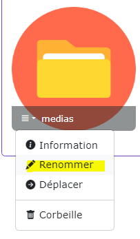

# Améliorations / idées pour la médiathèque

[Index](../../../../../index.md) > [Documentation fonctionnelle](../../../index.md) > [Administration](../../index.md) > [Médiathèque](mediatheque.md) > Gestion des dossiers

*Gestion des dossiers dans la médiathèque*

## Nouveau dossier

Au click sur le bouton "nouveau dossier", ouverture de la modale nouveau dossier

Le dossier est créé dans le "dossier courant".
Le dossier courant est le dossier dans lequel vous êtes lorsque vous cliquez sur le bouton "nouveau dossier"

Cette modale permet de créer un nouveau dossier

### Règle de gestion des champs
- Champ "nom du dossier"
  - Le champ ne peut pas être vide
  - le champ ne peut pas contenir des caractères spéciaux

### Actions possibles
**Bouton Annuler**
Permet de fermer la modale et annule la création du dossier

**Bouton créer le dossier**
Le bouton est actif uniquement si les règles de gestions du champ "nom du dossier" sont valides  

Si tout est ok, une nouvelle entrée en base de donnée dans la table media_folder.  

Dans le cas ou l'option OS_MEDIA_CREATE_PHYSICAL_FOLDER est à true alors un dossier physique est aussi créé.  

## Edition d'un dossier

Sur un dossier, au click sur "renommer"

Ouverture de la modale "Renommer le dossier XXX"

### Règle de gestion des champs
- Champ "nom du dossier"
  - Le champ ne peut pas être vide
  - le champ ne peut pas contenir des caractères spéciaux

### Actions possibles
**Bouton Annuler**  
Permet de fermer la modale et annule l'édition du dossier

**Bouton Editer le dossier**  
Le bouton est actif uniquement si les règles de gestions du champ "nom du dossier" sont valides  
Si tout est ok :  
* le champ name est mis à jour dans la base de donnée
* Le champ path est mis à jour pour prendre en compte le nouveau nom
* Pour chaque média du folder, le champ path et webPath est mis à jour
* Pour chaque folder enfant, le champ path est mis à jour
  * Pour chaque média du folder enfant, le champ path et webPath est mis à jour
