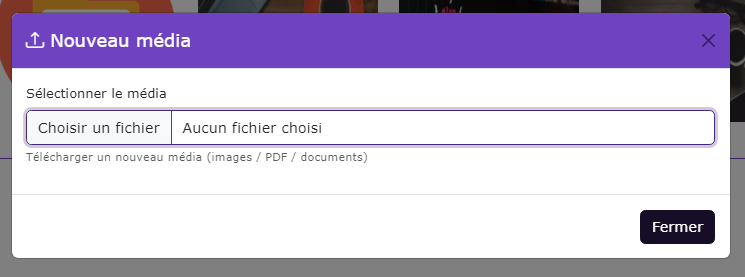
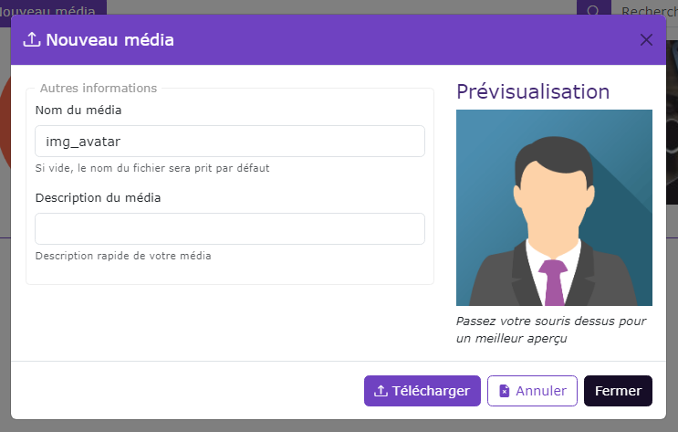
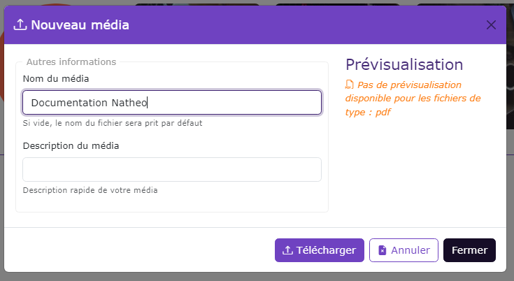

# Gestion des médias

[Index](../../../../../index.md) > [Documentation fonctionnelle](../../../index.md) > [Administration](../../index.md) > [Médiathèque](mediatheque.md) > Gestion des médias

*Gestion des médias dans la médiathèque*

## Nouveau média

Au click sur le bouton "Nouveau média", ouvre la modale nouveau média

Lorsque vous ajoutez une image depuis le bouton "Choisir un fichier", un aperçu de celle-ci est alors disponible.  
Depuis cet aperçu, vous pouvez aussi choisir le nom du média ainsi qu'une description.

Dans le cas d'un fichier de type document, l'aperçu n'est pas disponible

Actuellement seuls les fichiers avec les extensions suivantes sont téléchargeables dans la médiathèque :
- csv
- pdf
- jpg
- png
- xls
- xlsx
- doc
- docx
- gif

### Règle de gestion des champs
- Champ "choisir un fichier"`
  - Le champ ne peut pas être vide
- Champ "nom du média"
  - Si le champ est vide, met par défaut le nom du fichier
- Champ "description"
  - Pas de règle de gestion

### Actions possibles
**Bouton "choisir un fichier**
`Permet de sélectionner un fichier depuis votre ordinateur

**Bouton "télécharger"**
Si les règles de gestions sont valides, alors le fichier est téléchargé sur le serveur est un média est créé en base de donnée

Dans le cas ou l'option OS_MEDIA_CREATE_PHYSICAL_FOLDER est à true alors l'image sera copier dans le dossier courant.

**Bouton "Annuler"**
Retourne à l'état précédent, supprime l'aperçu du document ainsi que les données saisies

**Bouton "Fermer"**

## Edition d'un média