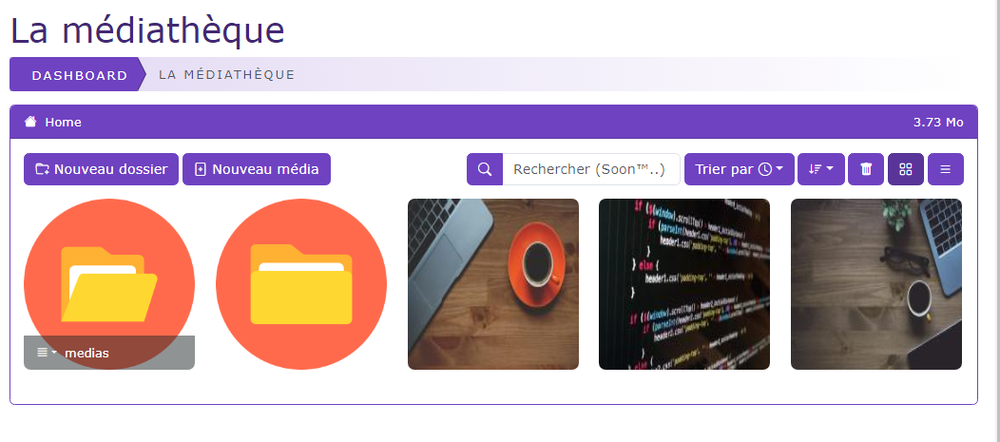

# La médiathèque

[Index](../../../../../index.md) > [Documentation fonctionnelle](../../../index.md) > [Administration](../../index.md) > Médiathèque

* Gestion des médias (images / dossiers)

## Informations générales
Sidebar : **Content > Médiathèque**  
Droit d'accès : **ROLE_CONTRIBTEUR**

Nom entité : **Media**  
Nom de la table en bdd : **natheo.media**

| Nom             | Type          | Null | Valeur par défaut  |
|-----------------|---------------|------|--------------------|
| id              | 	Int(11)      | 	Non | 	Aucune            |
| media_folder_id | 	Int(11)      | 	oui | 	Aucune            |
| user_id         | 	Int(11)      | 	Non | 	Aucune            |
| name            | 	text         | 	Non | 	Aucune            |
| title           | 	varchar(255) | 	Non | 	Aucune            |
| description     | 	text         | 	Non | 	Aucune            |
| type            | 	varchar(50)  | 	Non | 	Aucune            |
| extension       | 	varchar(50)  | 	Non | 	Aucune            |
| size            | 	Int(11)      | 	Non | 	Aucune            |
| thumbnail       | 	varchar(255) | 	Non | 	Aucune            |
| path            | 	text         | 	Non | 	Aucune            |
| web_path        | 	text         | 	Non | 	Aucune            |
| disabled        | 	boolean      | 	Non | 	Aucune            |
| trash           | 	boolean      | 	Non | 	Aucune            |
| created_at      | 	datetime     | 	Non | 	CURRENT_TIMESTAMP |
| update_at       | 	datetime     | 	Oui | 	NULL              |

Nom entité : **MediaFolder**  
Nom de la table en bdd : **natheo.media_folder**

| Nom         | Type          | Null | Valeur par défaut  |
|-------------|---------------|------|--------------------|
| id          | 	Int(11)      | 	Non | 	Aucune            |
| parent_id   | 	Int(11)      | 	oui | 	Aucune            |
| name        | 	varchar(150) | 	Non | 	Aucune            |
| path        | 	text         | 	Non | 	Aucune            |
| disabled    | 	boolean      | 	Non | 	Aucune            |
| trash       | 	boolean      | 	Non | 	Aucune            |
| created_at  | 	datetime     | 	Non | 	CURRENT_TIMESTAMP |
| update_at   | 	datetime     | 	Oui | 	NULL              |

### Règles de gestions globales
- media_folder
    - Un media_folder peut posséder n media_folder (enfant)
    - Un media_folder peut être lié à 1 media_folder (parent)
    - Un media_folder peut posséder n média
    - Le champ created_at est mis à la date du jour à la création d'une option
    - Le champ update_at est mis à jour à la date du jour au format [aaaa-mm-jj hh:mm:ss] à chaque modification de la valeur d'une option
- media
    - un media peut être lié à media_folder
    - un média est lié à un utilisateur
    - Le champ created_at est mis à la date du jour à la création d'une option
    - Le champ update_at est mis à jour à la date du jour au format [aaaa-mm-jj hh:mm:ss] à chaque modification de la valeur d'une option

## Définition
La médiathèque permet de pouvoir stocker des médias (images / documents) directement sur le site et
utiliser ces médias dans la création du contenu de vos pages

## Règles de gestions globales de l'écran

### Nouveau dossier
Le bouton "nouveau dossier" permet de pouvoir créer un nouveau dossier (MediaFolder)
voir [Gestion des dossiers](gestion_folder.md#nouveau-dossier) pour plus d'information

### Editer un dossier
voir [Gestion des dossiers](gestion_folder.md#edition-dun-dossier) pour plus d'information

### Nouveau média
Le bouton "nouveau média" permet de pouvoir uploader un nouveau média dans le dossier courant
voir [Gestion des dossiers](gestion_media.md#nouveau-média) pour plus d'information

### Editer un média
voir [Gestion des dossiers](gestion_media.md#edition-dun-média) pour plus d'information