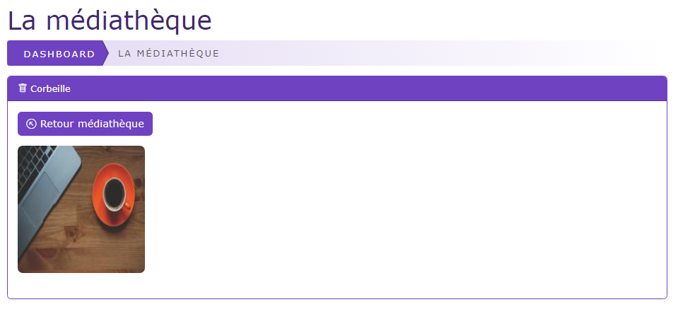
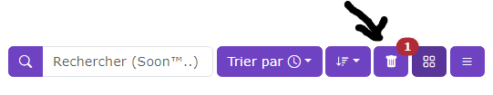
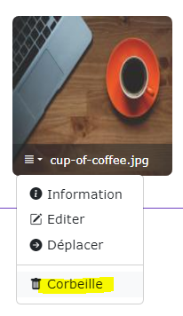
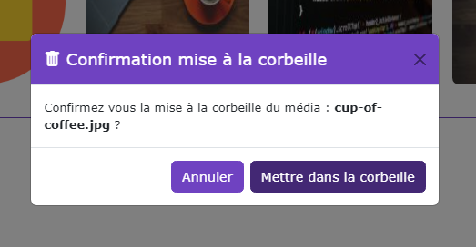
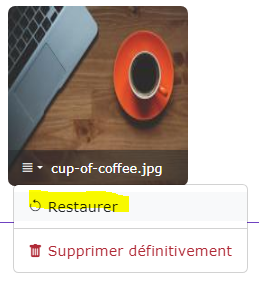
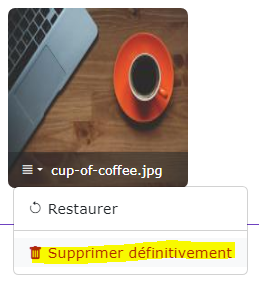
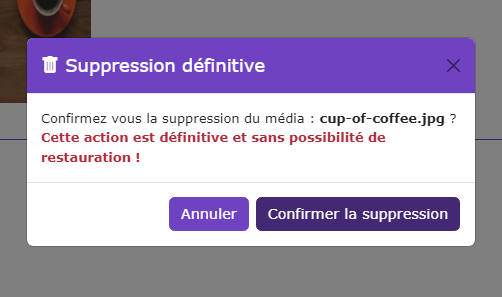

# La corbeille

[Index](../../../../../index.md) > [Documentation fonctionnelle](../../../index.md) > [Administration](../../index.md) > [Médiathèque](mediatheque.md) >  La corbeille

*Fonctionnement de la corbeille*

## Accès à la corbeille

Pour accéder à la corbeille, cliquez sur l'icône de corbeille sur barre de bouton à droite

Le nombre en rouge indique le nombre d'éléments dans la corbeille

## Retour à la médiathèque
Pour retourner à la médiathèque, cliquez sur le bouton "Retour médiathèque"

## Mettre un média / dossier dans la corbeille

Pour mettre un média ou un dossier dans la corbeille, il faut cliquer sur l'icône corbeille du média / dossier dans la médiathèque

Une confirmation est demandé avant de mettre le média / dossier à la corbeille

Un click sur "annuler" permet d'annuler l'action  
Un click sur "mettre dans la corbeille" va faire disparaitre le média / dossier du dossier courant et apparaitra dans la corbeille.

Dans le cas d'un dossier, l'ensemble des éléments présent dans le dossier (média + sous dossier) seront aussi transférés dans la corbeille

## Restaurer un média / dossier dans la médiathèque
Pour restaurer un média / dossier, cliquez sur le bouton "restaurer"

## Supprimer définitivement un média / dossier

Pour supprimer un média / dossier, cliquer sur "supprimer définitivement"

Une confirmation est demandé avant de supprimer de façon définitive le média / dossier

Un click sur "annuler" permet d'annuler l'action  
Un click sur "confirmer la suppression" lance la suppression de façon définitive du média / dossier

Dans le cas d'un dossier, l'ensemble des éléments présent dans le dossier (média + sous dossier) seront aussi supprimés de façon
définitive.