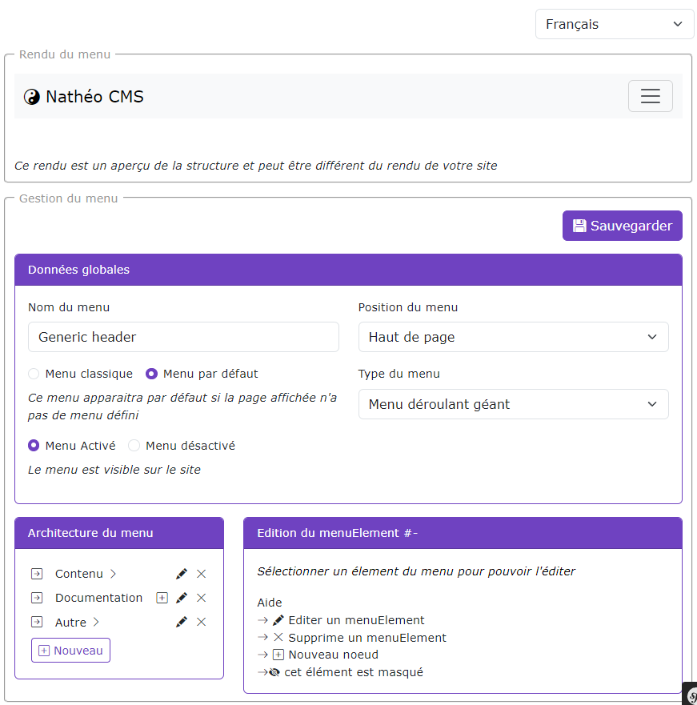
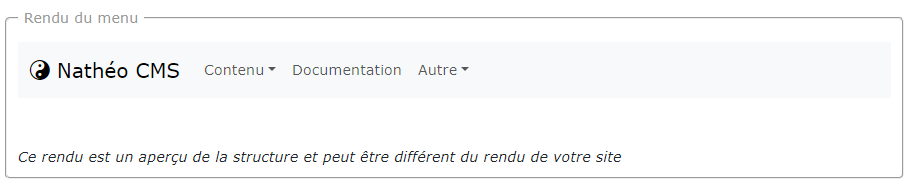
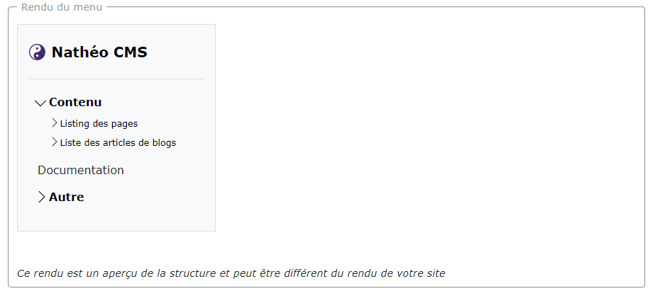
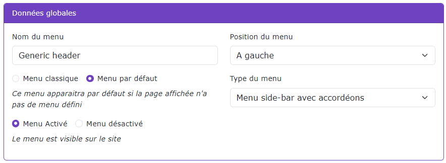
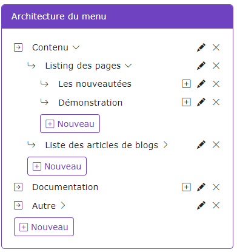
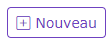
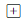
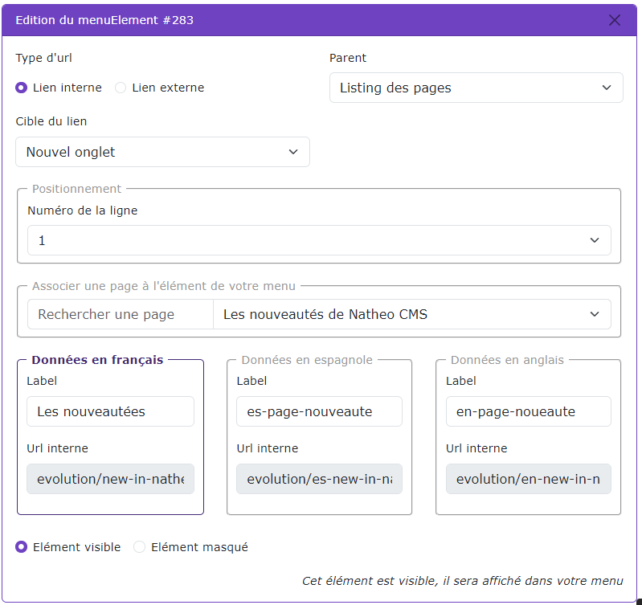

# Créer / Editer un menu

[Index](../../../../../index.md) > [Documentation fonctionnelle](../../../index.md) > [Administration](../../index.md) > [Gestion des menus](menu.md) > Créer / éditer un menu

*Permet de pouvoir créer / éditer un menu*

### Règles de gestions globales
* Un menu doit posséder au moins 1 élement

### Module de la page
La page est découpés en différent module qui sont :

#### Aperçu en temps réel
Ce petit module permet de voir le rendu de votre menu en temps réel en fonction des données saisies

*Un rendu pour un header*

*Le même menu mais pour un menu à gauche*

#### Données globales

Configurer ici les données globales du menu
* Le nom du menu (ne peut pas être vide)
* Notion de menu par défaut
  * Si "menu par défaut" est sélectionné alors ce menu apparaitra si une page n'a pas de menu rattaché.
  * Si c'est "menu classique" qui est sélectionné, ce menu n'apparaitra que sur la page auquel il est rattaché
* La position du menu
  * Défini si le menu est un header / footer / menu à gauche ou à droite
* Type de menu
  * Le type de menu dépend de la position du menu. Par exemple pour le header, on peut définir un header classique ou avec menu déroulant ou bien encore en mode big menu

#### Architecture du menu

Ce module permet de gérer l'architecture du menu comme bon vous semble.

Un menu est défini avec un ensemble d'éléments :
* Chaque élement peut être parent et enfant d'un autre parent.
* Chaque élement s'affiche via un ordre d'affichage défini par row_position
  * Pour les élement de profondeur 1 (Le premier niveau de sous menu), il est possible aussi de les trier par position de colonne
    * Dans ce cas c'est le champ column_position qui est prioritaire dans le trie

**Actions possibles**

 : Permet de créer un nouvel élement dans le parent courant

 : Permet de créer un nouvel élement enfant à l'élément sélectionné

 : Permet d'éditer l'élément courant

 : Permet de supprimer l'élément courant. Tout enfant rattaché à cet élément sera aussi supprimé

#### Edition d'un élement

Ce module permet d'éditer un élément du menu. Le label ainsi que le lien est multi-langue, il possède plusieurs règles qui sont :
* Le type d'url
  * Si le type d'url est défini comme externe, alors vous pouvez saisir pour chaque langue une url personnalisable
  * Si le type d'url est défini comme interne, alors c'est le choix de la page qui va définir l'url. Dans ce cas, l'url est non modifiable
* La notion de parent
  * Un élément de menu peut être parent d'un autre élement, mais il ne peux pas être enfant d'un élément dont il est lui même parent
  * Lors d'un changement de parent, le numéro de ligne sera automatiquement le numéro de ligne le plus élevé.
* La cible du lien
  * Permet de définir si le lien ouvre un nouvel onglet ou reste sur la même page
* Elément masqué / visible
  * Permet de définir si cet élément est visible dans le menu ou non.