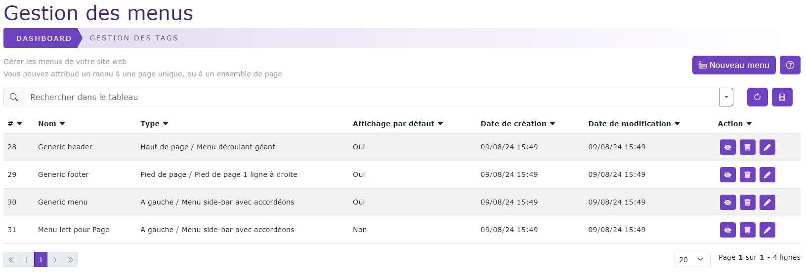
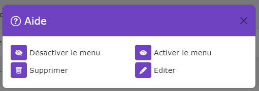

# Gestion des menus

[Index](../../../../../index.md) > [Documentation fonctionnelle](../../../index.md) > [Administration](../../index.md) > Gestion des menus

*Gestion des menus du CMS*

## Informations générales
Sidebar : **Content > Menus**  
Droit d'accès : **ROLE_CONTRIBTEUR**

## Base de données
Nom entité : **Menu**  
Nom de la table en bdd : **natheo.menu**

| Nom          | Type          | Null   | Valeur par défaut  |
|--------------|---------------|--------|--------------------|
| id           | 	Int(11)      | 	Non   | 	Aucune            |
| user_id      | 	Int(11)      | 	Non   | 	Aucune            |
| name         | 	varchar(255) | 	Non   | 	Aucune            |
| type         | 	Int(11)      | 	Non   | 	Aucune            |
| position     | 	Int(11)      | 	Non   | 	Aucune            |
| render_order | 	Int(11)      | 	Non   | 	Aucune            |
| default_menu | 	boolean      | 	false | 	Aucune            |
| disabled     | 	boolean      | 	false | 	Aucune            |
| created_at   | 	datetime     | 	Non   | 	CURRENT_TIMESTAMP |
| update_at    | 	datetime     | 	Oui   | 	NULL              |

Nom entité : **MenuElement**  
Nom de la table en bdd : **natheo.menu_element**

| Nom             | Type          | Null   | Valeur par défaut  |
|-----------------|---------------|--------|--------------------|
| id              | 	Int(11)      | 	Non   | 	Aucune            |
| menu_id         | 	Int(11)      | 	Non   | 	Aucune            |
| parent_id       | 	Int(11)      | 	Non   | 	Aucune            |
| page_id         | 	Int(11)      | 	Non   | 	Aucune            |
| column_position | 	Int(11)      | 	Non   | 	Aucune            |
| row_position    | 	Int(11)      | 	Non   | 	Aucune            |
| link_target     | 	varchar(100) | 	Non   | 	Aucune            |
| disabled        | 	boolean      | 	false | 	Aucune            |

Nom entité : **MenuElementTranslation**  
Nom de la table en bdd : **natheo.menu_element_translation**

| Nom             | Type          | Null   | Valeur par défaut  |
|-----------------|---------------|--------|--------------------|
| id              | 	Int(11)      | 	Non   | 	Aucune            |
| menu_element_id | 	Int(11)      | 	Non   | 	Aucune            |
| locale          | 	varchar(10)  | 	Non   | 	Aucune            |
| text_link       | 	varchar(255) | 	Non   | 	Aucune            |
| external_link   | 	text         | 	Non   | 	Aucune            |

### Règles de gestions globales
* Menu
  * Un menu possède n menuElement
  * Un menu peut posséder n page associés
  * Le champ created_at est mis à la date du jour à la création d'une option
  * Le champ update_at est mis à jour à la date du jour au format [aaaa-mm-jj hh:mm:ss] à chaque modification de la valeur d'un menu
* MenuElement
  * Un menuElement est rattaché à un seul menu
  * Un menuElement peut être rattaché un seul parent
  * Un menuElement peut posséder n enfant
  * Un menuElement possède n MenuElementTranslation
* MenuElementTranslation
  * Un menuElementTranslation est rattaché à un seul menuElement

## Définition
La gestion des menus permet de créer des menus qui peuvent être rattaché à une ou plusieurs pages. Un menu peut être un header, menu vertical
ou encore un footer

## Règles de gestions globales du tableau de données
Le tableau de données regroupe l'ensemble des meus enregistrés en base de donnée, le trie par défaut ce fait sur l'id du menu.

### Liste des actions possibles
Liste des actions possibles sur le listing des menus

#### Désactiver un menu
Met le champ ``menu.disabled à true``.   
Un menu désactivé n'apparait plus sur la partie public du site même si la page auquel le menu est rattachée est elle visible.
Dans ce cas, c'est le menu défini par défaut qui s'affichera s'il n'est pas disabled

#### Activer un menu
Met le champ ``menu.disabled à false``.   
Un menu activé est accéssible depuis la partie public du site.

#### Supprimer un menu
Supprime définitivement le menu de la base de donnée
La suppression d'un menu entraine la suppression des éléments suivants :
* le menu
* les données menu_element associées
* les données menu_element_translation associées
* les données page_menu associées
  Cette action est définitive et sans possibilité de retour.

#### Modifier un menu
Permet de pouvoir modifier une page
Voir [Modifier un menu](add_edit_menu.md);

#### Créer un menu
Permet de pouvoir créer une nouvelle page
Voir [Créer un menu](add_edit_menu.md);

