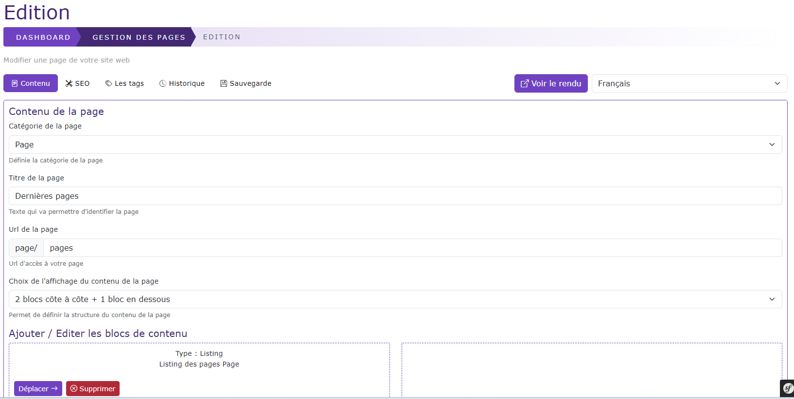

# Créer / Editer une page

[Index](../../../../../index.md) > [Documentation fonctionnelle](../../../index.md) > [Administration](../../index.md) > [Gestion des pages](page.md) > Créer / éditer une page

*Permet de pouvoir créer/ éditer une page*

### Règles de gestions globales

* A chaque modification d'une donnée de la page, une sauvegarde auto est faite, cette sauvegarde auto peut être restaurée depuis l'onglet "historique"
* Lors de la création d'une nouvelle page, après la première sauvegarde (bouton "sauvegarde"), la page est rechargée et passe en mode édition

La page est découpés en différents onglets qui sont : 

#### Onglet contenu
Cet onglet permet de gérer le contenu de la page ainsi que certaines informations comme
* Le titre de la page
* L'url de la page
  * L'url de la page doit être unique qu'importe la langue utilisée
* Un choix de structure de la page, les choix possibles sont :
  * 1 bloc
  * 2 blocs côte à côte
  * 3 blocs côte à côte
  * 2 blocs l'un en dessous de l'autre
  * 3 blocs l'un en dessous de l'autre
  * Un bloc au dessus + 2 blocs côte à côte en dessous
  * 2 blocs côte à côte + 1 bloc en dessous
  * 2 blocs côte à côte + 2 blocs côte à côte en dessous

**Les blocs de contenu**  

La page est construite en blocs de contenu.  
Un click sur le bouton "Nouveau contenu" permet d'ajouter un nouveau contenu via une modale

Actuellement seul le bloc de contenu de type texte est pris en compte

Chaque bloc peut-être soit supprimé, soit déplacer à gauche ou droite en fonction de sa position

#### Onglet SEO

*TODO A FAIRE*

#### Onglet Tags

Permet d'associer un ou plusieurs tags à la page.  
La recherche d'un tag ce fait via l'autocompletion, un clic sur le bouton "associer"
permet d'associer le tag à la page.  
Si le tag n'existe pas il est créé à ce moment-là.

#### Onglet Historique

L'onglet historique permet de restaurer une version antérieur de la page en cliquant
simplement sur le bouton "restaurer"

#### Onglet Sauvegarde

Permet de choisir l'état de la page et de la sauvegarder via le bouton "sauvegarder"
L'état de la page peut être :
* Brouillon
* Publié

Si la page est en état brouillon, elle ne peux pas être visible sur le front du site

#### Bouton préview

Le bouton préview permet d'avoir une préview de la page comprenant le contenu ainsi que les menus associés

