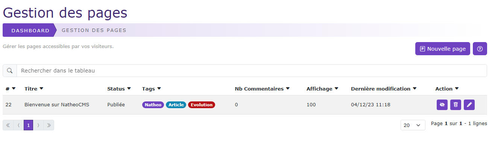

# Gestion des pages

[Index](../../../../../index.md) > [Documentation fonctionnelle](../../../index.md) > [Administration](../../index.md) > Gestion des pages

* Gestion des pages et contenu du CMS

## Informations générales
Sidebar : **Content > Pages**  
Droit d'accès : **ROLE_CONTRIBTEUR**

Nom entité : **Page**  
Nom de la table en bdd : **natheo.page**

| Nom        | Type      | Null | Valeur par défaut  |
|------------|-----------|------|--------------------|
| id         | 	Int(11)  | 	Non | 	Aucune            |
| user_id    | 	Int(11)  | 	Non | 	Aucune            |
| render     | 	Int(11)  | 	Non | 	Aucune            |
| status     | 	Int(11)  | 	Non | 	Aucune            |
| disabled   | 	boolean  | 	Non | 	Aucune            |
| created_at | 	datetime | 	Non | 	CURRENT_TIMESTAMP |
| update_at  | 	datetime | 	Oui | 	NULL              |

Nom entité : **PageTranslation**  
Nom de la table en bdd : **natheo.page_translation**

| Nom        | Type          | Null | Valeur par défaut  |
|------------|---------------|------|--------------------|
| id         | 	Int(11)      | 	Non | 	Aucune            |
| page_id    | 	Int(11)      | 	Non | 	Aucune            |
| locale     | 	varchar(10)  | 	Non | 	Aucune            |
| titre      | 	varchar(255) | 	Non | 	Aucune            |
| url        | 	varchar(255) | 	Non | 	Aucune            |
| created_at | 	datetime     | 	Non | 	CURRENT_TIMESTAMP |
| update_at  | 	datetime     | 	Oui | 	NULL              |

Nom entité : **PageContent**  
Nom de la table en bdd : **natheo.page_content**

| Nom          | Type     | Null | Valeur par défaut |
|--------------|----------|------|-------------------|
| id           | 	Int(11) | 	Non | 	Aucune           |
| page_id      | 	Int(11) | 	Non | 	Aucune           |
| render_block | 	Int(11) | 	Non | 	Aucune           |
| render_order | 	Int(11) | 	Non | 	Aucune           |
| type         | 	Int(11) | 	Non | 	Aucune           |
| type_id      | 	Int(11) | 	Non | 	Aucune           |

Nom entité : **PageContentTranslation**  
Nom de la table en bdd : **natheo.page_content_translation**

| Nom             | Type         | Null | Valeur par défaut |
|-----------------|--------------|------|-------------------|
| id              | 	Int(11)     | 	Non | 	Aucune           |
| page_content_id | 	Int(11)     | 	Non | 	Aucune           |
| locale          | 	varchar(10) | 	Non | 	Aucune           |
| text            | 	text        | 	Non | 	Aucune           |

Nom entité : **PageStatistique**  
Nom de la table en bdd : **natheo.page_statistique**

| Nom        | Type          | Null | Valeur par défaut  |
|------------|---------------|------|--------------------|
| id         | 	Int(11)      | 	Non | 	Aucune            |
| page_id    | 	Int(11)      | 	Non | 	Aucune            |
| key        | 	varchar(255) | 	Non | 	Aucune            |
| value      | 	varchar(255) | 	Non | 	Aucune            |

Nom entité : **PageTag**  
Nom de la table en bdd : **natheo.page_tag**

| Nom     | Type          | Null | Valeur par défaut  |
|---------|---------------|------|--------------------|
| page_id | 	Int(11)      | 	Non | 	Aucune            |
| tag_id  | 	Int(11)      | 	Non | 	Aucune            |

### Règles de gestions globales
- page
    - Une page peut posséder n page_content
    - Une page peut posséder n page_statistique
    - Une page peut posséder n page_tag
    - Une page peut posséder n page_translation
    - Une page est lié à un utilisateur
    - Le champ created_at est mis à la date du jour à la création d'une option
    - Le champ update_at est mis à jour à la date du jour au format [aaaa-mm-jj hh:mm:ss] à chaque modification de la valeur d'une option
- page_translation
    - Une page_translation est lié à une page
- page_content
    - Une page_content est lié à une page
    - Une page_content possède n page_content_translation
- page_content_translation
    - Une page_content_translation est lié à une page_content
- page_statistique
    - Une page_statistique est lié à une page
- page_tag
    - Une page_tag est lié à une page et à un tag

## Définition
La gestion des pages permet de créer le contenu du site que ce soit du texte ou l'affichage d'un module
comme une FAQ ou un CV