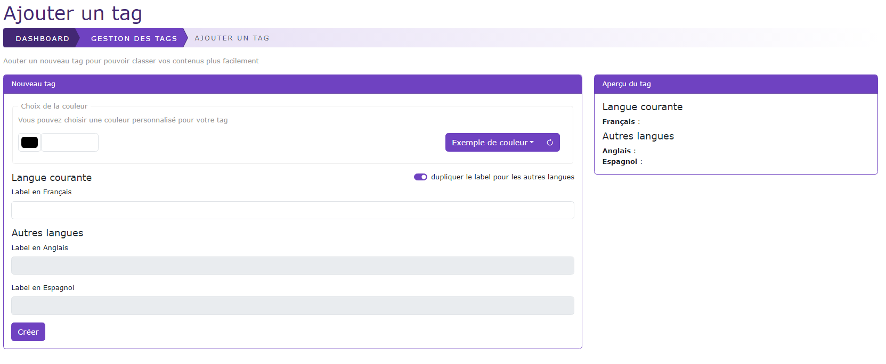
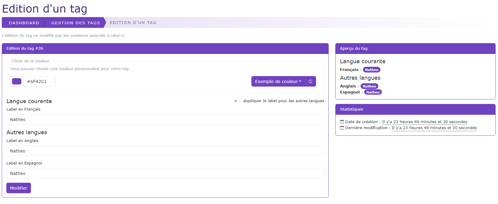

# Créer / Editer un tag

[Index](../../../../../index.md) > [Documentation fonctionnelle](../../../index.md) > [Administration](../../index.md) > [Gestion des tags](tag.md) > Créer / editer un tag

*Permet de pouvoir créer/ éditer un tag*

## Nouveau tag

## Editer un tag
