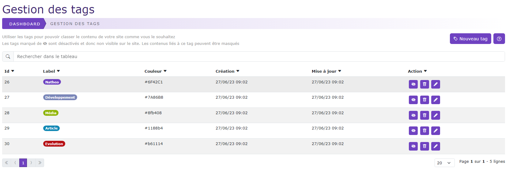
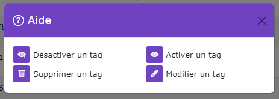

# Gestion des tags

[Index](../../../../../index.md) > [Documentation fonctionnelle](../../../index.md) > [Administration](../../index.md) > Gestion des tags

*Permet de pouvoir gérer les tags dans les contenus du CMS*



## Informations générales
Sidebar : **Content > Tag**  
Droit d'accès : **ROLE_CONTRIBTEUR**

Nom entité : **Tag**  
Nom de la table en bdd : **natheo.tag**

| Nom         | Type        | Null | Valeur par défaut  |
|-------------|-------------|------|--------------------|
| id          | 	Int(11)    | 	Non | 	Aucune            |
| color       | 	Varchar(7) | 	Non | 	Aucune            |
| disabled    | 	boolean    | 	Non | 	Aucune            |
| created_at  | 	datetime   | 	Non | 	CURRENT_TIMESTAMP |
| update_at   | 	datetime   | 	Oui | 	NULL              |

Nom entité : **TagTranslation**  
Nom de la table en bdd : **natheo.tag_translation**

| Nom    | Type          | Null | Valeur par défaut  |
|--------|---------------|------|--------------------|
| id     | 	Int(11)      | 	Non | 	Aucune            |
| tag_id | 	Int(11)      | 	non | 	Aucune            |
| locale | 	Varchar(10)  | 	Non | 	Aucune            |
| label  | 	Varchar(255) | 	Non | 	Aucune            |

### Règles de gestions globales
- tag
    - Un tag peut contenir n tagTranslation
    - Le champ created_at est mis à la date du jour à la création d'une option
    - Le champ update_at est mis à jour à la date du jour au format [aaaa-mm-jj hh:mm:ss] à chaque modification de la valeur d'une option
- tag_translation
    - un tagTranslation ne peut être rattaché qu'à un seul tag

## Définition
Le tag permet de lié une page à un type de donnée.  
La recherche de ce type de donnée permet de lister l'ensemble des pages liées à ce tag

## Règles de gestions globales du tableau de données
Le tableau de données regroupe l'ensemble des tags enregistrés en base de donnée, le trie par défaut ce fait sur l'id du tag.

### Liste des actions possibles
Liste des actions possibles sur le listing des tags



#### Désactiver un tag
Met le champ ``tag.disabled à true``.   
Un tag désactivé n'apparaitra plus dans le choix des tags lorsque l'on veut lier un tag à un page.
Un tag désactivé n'apparaitra plus dans la recherche de tags ni dans le listing de celui-ci. Toute page liée à ce tag 
sera invisibilisé dans la recherche de tags. La page reste accessible via un lien direct. 

#### Activer un tag
Met le champ ``tag.disabled à false``.   
Un tag activé apparait dans le choix des tags lorsque l'on veut lier un tag à une page
Un tag activé apparait dans la recherche de tags et dans le listing de tags.

#### Supprimer un tag
Supprime définitivement un tag de la base de données
Les pages liées ne sont pas supprimées, seule la liaison entre le tag et la page est supprimé
Cette action est définitive et sans possibilité de retour.

#### Modifier un tag
Permet de pouvoir modifier un tag
Voir [Modifier un tag](add_edit_tag.md);

#### Créer un tag
Permet de pouvoir créer un tag
Voir [Modifier un tag](add_edit_tag.md);

## Fixtures
Path du fichier de données : ``src/DataFixtures/data/tag_fixtures_data.yaml``  
Nom de la fixture : **TagFixtures**  
Groupe de fixtures : **content, tag**

Commande pour lancer uniquement cette fixture : ``php bin/console doctrine:fixture:load --group=tag``

## Exemple de fichier de liste de tag
Le fichier de config pour générer les tags est construit sous la forme suivante :
````yaml
tag:
  - color: '#6F42C1'
    translate:
      - locale: fr
        label: 'Natheo'
      - locale: es
        label: 'Natheo'
      - locale: en
        label: 'Natheo'
````