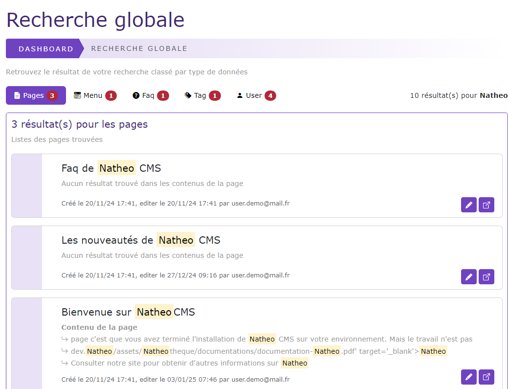

# Recherche globable

[Index](../../../../index.md) > [Documentation fonctionnelle](../../index.md) > [Administration](../index.md) > Recherche globale

*Recherche dans le CMS*

## Informations générales
Droit d'accès : **ROLE_USER**

Permet de faire une recherche globale sur les données du CMS

## Règles de gestions globales
La recherche globale permet de pouvoir faire une recherche sur les données suivantes
* Page : Titre, auteur, contenu
* Menu : Titre, auteur, label des liens
* FAQ : Titre, catégorie, question, réponse, auteur
* Tag : label des tags
* User : login, email, nom, prénom

Chaque donnée est rangé dans un onglet séparé.

Pour chaque élément de recherche, vous pouvez éditer le contenu ou pour la page voir la prévisualisation de celle-ci

La recherche dépend de la langue choisie pour l'interface.

## Effectuer une recherche

Pour lancer une recherche, il suffit de saisir un texte et cliquez sur le bouton "Rechercher"

