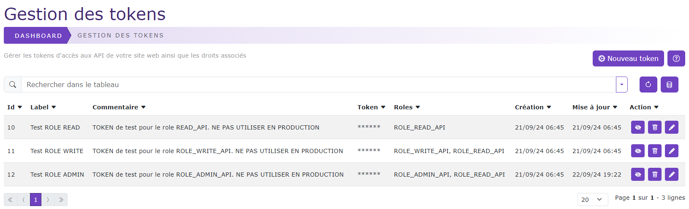
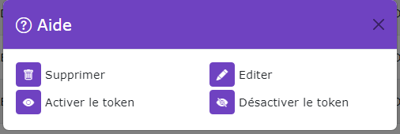

# Gestion des Tokens

[Index](../../../../../index.md) > [Documentation fonctionnelle](../../../index.md) > [Administration](../../index.md) > Gestion des tokens

*Permet de pouvoir gérer les tokens d'accès aux API du CMS*



## Informations générales
Sidebar : **Système > API token**  
Droit d'accès : **ROLE_SUPER_ADMIN**

Nom entité : **ApiToken**  
Nom de la table en bdd : **natheo.api_token**

| Nom        | Type          | Null | Valeur par défaut  |
|------------|---------------|------|--------------------|
| id         | 	Int(11)      | 	Non | 	Aucune            |
| name       | 	Varchar(255) | 	Non | 	Aucune            |
| token      | 	Varchar(255) | 	Non | 	Aucune            |
| roles      | 	Json         | 	Non | 	Aucune            |
| comment    | 	text         | 	Oui | 	NULL              |
| disabled   | boolean       | Non  | Aucune             |
| created_at | 	datetime     | 	Non | 	CURRENT_TIMESTAMP |
| update_at  | 	datetime     | 	Oui | 	NULL              |

### Règles de gestions globales table api_token
- Le champ created_at est mis à la date du jour à la création d'une option
- Le champ update_at est mis à jour à la date du jour au format [aaaa-mm-jj hh:mm:ss] à chaque modification de la valeur d'une option

## Règles de gestions globales du tableau de données
Le tableau de données regroupe l'ensemble des ApiToken présent sur le site, le trie par défaut ce fait sur l'id du ApiToken.

### Liste des actions possibles
Liste des actions possibles sur le listing des ApiToken



#### Nouveau ApiToken
Permet de pouvoir créer un nouvel ApiToken   
Voir [Création d'un ApiToken](new_apiToken.md)

#### Désactiver un token
Met le champ ``api_token.disabled à true``, ce qui interdit tout accès aux APIs avec ce token

#### Activer un token
Met le champ ``api_token.disabled à false``, ce qui autorise tout accès aux APIs avec ce token en fonction de ses droits

#### Supprimer un token
Permet de supprimer de façon définitive un token, si le token est supprimé, toute application qui l'utilise verra ses accès révoqués de façon définitive


#### Modifier un token
Permet de pouvoir modifier les données d'un ApiToken
Voir [Edition d'un ApiToken](new_apiToken.md)


## Fixtures
Path du fichier de données : ``src/DataFixtures/data/api_token_fixtures_data.yaml``  
Nom de la fixture : **ApiTokenFixture**  
Groupe de fixtures : **system, api_token**

Commande pour lancer uniquement cette fixture : ``php bin/console doctrine:fixture:load --group=api_token``

## Exemple de fichier de liste d'utilisateur
Le fichier de config pour générer les api_token est construit sous la forme suivante :
Ce fichier n'est pas utilisé lors de l'installation du CMS sauf si le mode débug est activé
````yaml
api_token:
  token_read:
    name: 'Test ROLE READ'
    token: 'read.CZjfAZu6FatFbECU8MaCudqc.GfmytciCqV8P193QSu3jJizG.EfgV97dTSTxeqVBDHTxX2yh.9xicEZXkXzx7hL85eUZ8YrEJ'
    roles: ROLE_READ_API
    comment: 'TOKEN de test pour le role READ_API. NE PAS UTILISER EN PRODUCTION'
    disabled: 0
````

