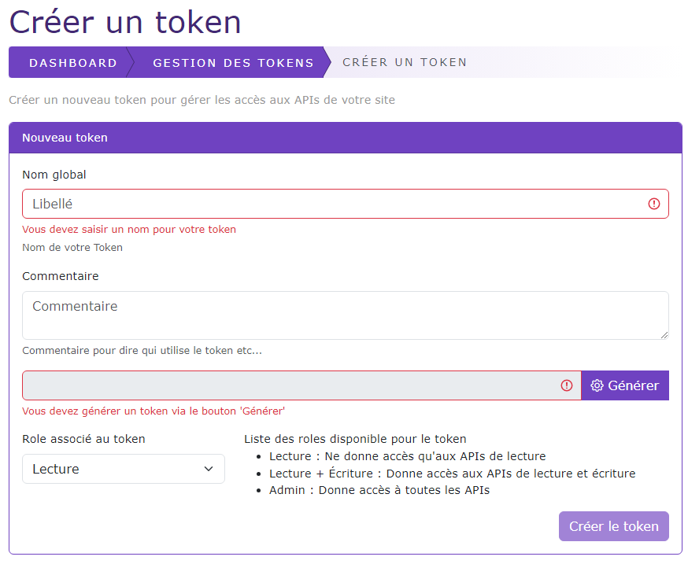

# Ajouter / Editer un ApiToken

[Index](../../../../../index.md) > [Documentation fonctionnelle](../../../index.md) > [Administration](../../index.md) > [Gestion des ApiToken](apiToken.md) >
Ajouter / éditer un ApiToken

*Permet de pouvoir créer ou éditer un token d'accès au API du CMS*

### Règles de gestions globales

* Nom global
    * Permet de donner un nom au token, utilisé uniquement pour la recherche
    * Champ obligatoire
* Commentaire
    * Permet d'ajouter un commentaire au token
    * Champ non obligatoire
* Token
    * Chaine de caractères générés aléatoirement pour s'authentifier aux API du CMS
    * Champ obligatoire
* Role
    * Défini un role d'accès aux API
    * Champ obligatoire

### Actions possibles
Liste des actions possibles pour créer / éditer un token

#### Créer un token
Visible uniquement en création

Utilisable uniquement si l'ensemble des règles de gestions sont valides, permet de créer un token.
Si l'action s'est correctement passé, redirige vers l'édition du token

#### Editer un token
Visible uniquement en édition

Utilisable uniquement si l'ensemble des règles de gestions sont valides, permet d'éditer le token

#### Générer un token
Permet de créer un nouveau token avec une chaine de caractères aléatoire

#### Copier 
Permet de mettre le token dans le presse-papier

