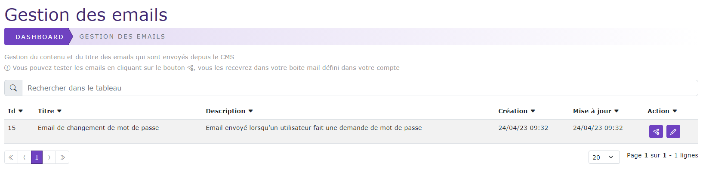
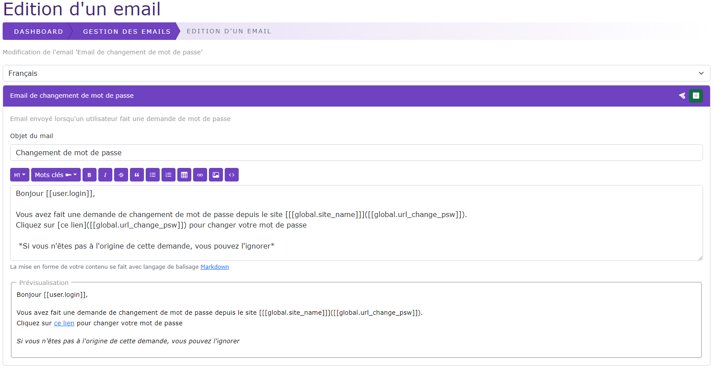

# Gestion des emails

[Index](../../../../index.md) > [Documentation fonctionnelle](../../index.md) > [Administration](../index.md) > Gestion des mails

*Permet de pouvoir éditer les emails envoyés par le CMS *

## Informations générales
Sidebar : **Système > Mail**  
Droit d'accès : **ROLE_SUPER_ADMIN**

Nom entité : **mail**  
Nom de la table en bdd : **natheo.mail**

| Nom         | Type          | Null | Valeur par défaut  |
|-------------|---------------|------|--------------------|
| id          | 	Int(11)      | 	Non | 	Aucune            |
| key         | 	Varchar(255) | 	non | 	Aucune            |
| title       | 	Varchar(255) | 	Non | 	Aucune            |
| description | 	text         | 	Non | 	Aucune            |
| key_words   | 	text         | 	Non | 	Aucune            |
| created_at  | 	datetime     | 	Non | 	CURRENT_TIMESTAMP |
| update_at   | 	datetime     | 	Oui | 	NULL              |

Nom entité : **mailTranslation**  
Nom de la table en bdd : **natheo.mail_translation**

| Nom        | Type         | Null | Valeur par défaut  |
|------------|--------------|------|--------------------|
| id         | 	Int(11)     | 	Non | 	Aucune            |
| mail_id    | 	Int(11)     | 	non | 	Aucune            |
| local      | 	Varchar(10) | 	Non | 	Aucune            |
| title      | 	text        | 	Non | 	Aucune            |
| content    | 	text        | 	Non | 	Aucune            |

### Règles de gestions globales
- mail
  - Le champ key est UNIQUE en base de donnée
  - Un email peut contenir n mailTranslation
  - Le champ created_at est mis à la date du jour à la création d'une option
  - Le champ update_at est mis à jour à la date du jour au format [aaaa-mm-jj hh:mm:ss] à chaque modification de la valeur d'une option
- mail_translation
  - un mailTranslation ne peut être rattaché qu'à un seul mail

### Règles de gestions insertion / modification de donnée
- Chaque mail est définie par le champ key sous la forme de MAIL_{TYPE_MAIL}
- En modification seul les champs title et content de la table mailTranslation
- Les mails sont générées via un fichier de fixture présent dans ``DataFixtures/data/mail_fixtures_data.yaml``

### Liste des mails

| Cle                  | Description                                                  |
|----------------------|--------------------------------------------------------------|
| MAIL_CHANGE_PASSWORD | Mail envoyé lors d'une demande de changement de mot de passe |

### Règle de gestion pour l'écran de listing

Actions possibles
- Tester le mail
  - Permet de pouvoir s'envoyer le mail à son adresse email enregistré dans le compte de la personne connectée
- Editer le mail
  - Permet de pouvoir éditer le titre et le contenu de l'email en fonction de la langue

### Règle de gestion pour l'écran d'édition

Cet écran permet de pouvoir modifier le contenu ainsi que le titre d'un email en fonction de sa langue

Action possibles
- Selection de la langue
  - Liste déroulante contenant les langues gérées par le site, le choix d'une langue charge le contenu du mail associé
  - La langue par défaut affichée est la langue par défaut défini par l'option OS_DEFAULT_LANGUAGE
- Objet du mail
  - Champ input pour le titre du mail (dépendant de la langue sélectionnée)
- Contenu du mail
  - Champ textarea pour le contenu du mail (dépendant de la langue sélectionnée)
  - Le contenu du mail est affiché dans un éditeur markdown pour faciliter la mise en forme
- Mots clés
  - Liste des mots clés associés au mail.
    - Les mots clés sont des éléments que l'on peut rajouter dans le contenu de l'email pour ajouter de la personnalisation
    - Ces mots clés sont propres au mail
-  - Sauvegarder
  - Permet de pouvoir sauvegarder le contenu et le titre de l'email en fonction de la langue
-  - Tester l'email
  - Permet de pouvoir s'envoyer le mail à son adresse email enregistré dans le compte de la personne connectée

### Fixtures
Path du fichier de données : ``src/DataFixtures/data/mail_fixtures_data.yaml``  
Nom de la fixture : **MailFixture**  
Groupe de fixtures : **mail**

Commande pour lancer uniquement cette fixture : ``php bin/console doctrine:fixture:load --group=mail``