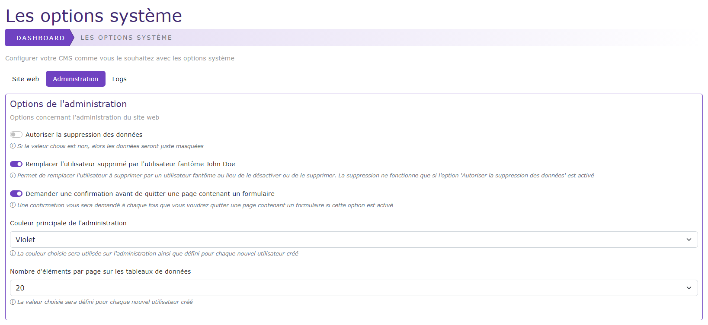

# Les options systèmes

[Index](../../../../index.md) > [Documentation fonctionnelle](../../index.md) > [Administration](../index.md) > Les options systèmes

*Paramétrer de façon simple diverses options afin de pouvoir personnaliser votre site*



## Informations générales
Sidebar : **Système > Sidebar**  
Droit d'accès : **ROLE_SUPER_ADMIN**

Nom entité : **OptionSystem**  
Nom de la table en bdd : **natheo.option_system**

| Nom        | 	Type         | 	Null | 	Valeur par défaut |
|------------|---------------|-------|--------------------|
| id         | 	Int(11)      | 	Non  | 	Aucune            |
| key        | 	Varchar(255) | 	Non  | 	Aucune            |
| value      | 	Varchar(255) | 	Non  | 	Aucune            |
| created_at | 	datetime     | 	Non	 | CURRENT_TIMESTAMP  |
| update_at  | 	datetime     | 	Oui  | 	NULL              |

## Règles de gestions globales
- Le champ key est UNIQUE en base de donnée
- Le champ created_at est mis à la date du jour à la création d'une option
- Le champ update_at est mis à jour à la date du jour au format [aaaa-mm-jj hh:mm:ss] à chaque modification de la valeur d'une option

## Liste des options disponibles

| Clé                         | 	Valeur par défaut | 	Description                                                                                                           |
|-----------------------------|--------------------|------------------------------------------------------------------------------------------------------------------------|
| OS_SITE_NAME                | 	Natheo            | 	Nom du site                                                                                                           |
| OS_OPEN_SITE                | 	1                 | 	Défini si le site front est ouvert ou non                                                                             |
| OS_LOGO_SITE                | 	bi-yin-yang       | 	Défini le logo à côté du nom du site                                                                                  |
| OS_FRONT_SCRIPT_TOP         | 	                  | 	Script à insérer dans le header du site                                                                               |
| OS_FRONT_SCRIPT_START_BODY	 | 	                  | Script à insérer au début de la balise body                                                                            |
| OS_FRONT_SCRIPT_END_BODY    | 	                  | 	Script à insérer à la fin de la balise body                                                                           |
| OS_REPLACE_DELETE_USER      | 	1	                | Défini si on supprime définitivement un utilisateur ou si on le remplace par un utilisateur fantôme                    |
| OS_CONFIRM_LEAVE_FORM       | 	1                 | 	Affiche une confirmation si on quitte un formulaire                                                                   |
| OS_ALLOW_DELETE_DATA        | 	0                 | 	Autorise ou non la suppression de données                                                                             |
| OS_DEFAULT_LANGUAGE         | 	fr                | 	Défini la langue par défaut pour le site, valeur utilisé comme valeur par défaut pour les options user                |
| OS_THEME_SITE               | 	purple            | 	Défini la couleur de base du site, valeur utilisé comme valeur par défaut pour les options user                       |
| OS_NB_ELEMENT               | 	20                | 	Défini le nombre d'élément à afficher dans les tableaux, valeur utilisé comme valeur par défaut pour les options user |
| OS_LOG_DOCTRINE             | 	1                 | 	Défini si on log tout changement dans le bdd ou non                                                                   |
| OS_MAIL_FROM                | info@natheo.fr     | Adresse email qui apparaitra comme expéditeur                                                                          |
| OS_MAIL_REPLY_TO            | support@natheo.fr  | Adresse email utilisé pour répondre                                                                                    |

## Règles de gestions insertion / modification de donnée
- Chaque option est définie par le champ key sous la forme de OS_{OPTION}
- En modification seul le champ value est modifiable.
- Les options sont générées via un fichier de config présent dans ``config/cms/options_system.yaml``

## Accessibilité des options systèmes dans le code
Le service OptionSystemService vous permet de pouvoir récupérer la valeur d'une option système à partir de sa clé
``` php
$this->optionSystemService->getValueByKey(OptionSystemService::OS_ALLOW_DELETE_DATA);
```

Il est possible de pouvoir récupérer la valeur d'une option système depuis une vue twig

````php
get_option_system_value_by_key(constant('App\\Service\\Admin\\OptionSystemService::OS_SITE_NAME'))
````

## Fixtures
Path du fichier de données : ``src/DataFixtures/data/option_system_fixtures_data.yaml``  
Nom de la fixture : **OptionSystemFixtures**  
Groupe de fixtures : **system, option_system**  

Commande pour lancer uniquement cette fixture : ``php bin/console doctrine:fixture:load --group=option_system``

## Exemple de fichier de config
Le fichier de config pour générer les options est construit sous la forme suivante :
Chaque option est personnalisable en fonction de différents paramètres
````yaml
options_system:
  options_system.categorie_web_site:                                                # Categories de l'option
    title :  'options_system.categorie_web_site.title'                              # Titre de la catégorie
    description : 'options_system.categorie_web_site.description'                   # Description de la catégorie
    options :                                                                       # Liste des options disponibles pour cette catégorie
      OS_SITE_NAME:                                                                 # Clé de l'option
        default: 'Natheo'                                                           # Valeur de l'option
        label: 'options_system.site_name'                                           # Libellé de l'option
        type: 'text'                                                                # Type de l'option (text/boolean/select/textarea)
        required: true                                                              # Valeur obligatoire ou non
        msg_error: 'options_system.site_name_msg_error'                             # Message d'erreur si valeur obligatoire
        help: 'options_system.site_name_help'                                       # Message d'aide
        placeholder: 'options_system.site_name_placeholder'                         # Texte dans le placeholder
        success: 'options_system.site_name_msg_success'                             # Message quand l'option s'est bien enregistrée
      OS_OPEN_SITE:
        type: 'boolean'
        label: 'options_system.open_site'
        help: 'options_system.open_site_help'
        default: 1
      OS_DEFAULT_LANGUAGE:
        type: 'select'
        label: 'options_system.default_language'
        list_value: 'fr:global.french|en:global.english|es:global.spanish'          # Liste dans le cas d'un select sous la forme |cle:valeur|
        help: 'options_system.default_language_help'
        default: 'fr'
      OS_FRONT_SCRIPT_TOP:
        type: 'textarea'
        label: 'options_system.front_script_top'
        help: 'options_system.front_script_top_help'
        placeholder: 'options_system.front_script_top_placeholder'
        default: ""
````
