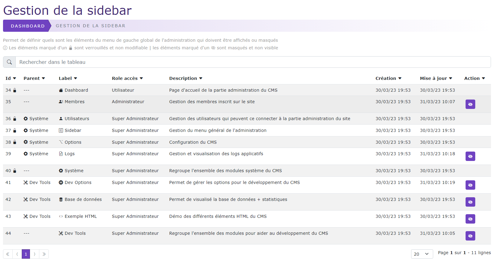
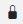

# Gestion du menu (sidebar)

[Index](../../../../index.md) > [Documentation fonctionnelle](../../index.md) > [Administration](../index.md) > Gestion du menu

*Le menu sidebar est le menu global de l'administration, vous pouvez à partir de cette page activer ou désactiver certaines
fonctionnalités de l'administration.*



## Informations générales
Sidebar : **Système > Sidebar**  
Droit d'accès : **ROLE_SUPER_ADMIN**

Nom entité : **SidebarElement**
Nom de la table en bdd : **natheo.sidebar_element**

| Nom         | Type          | Null | Valeur par défaut  |
|-------------|---------------|------|--------------------|
| id          | 	Int(11)      | 	Non | 	Aucune            |
| parent_id   | 	Int(11)      | 	Oui | 	NULL              |
| icon        | 	Varchar(40)  | 	Non | 	Aucune            |
| label       | 	Varchar(255) | 	Non | 	Aucune            |
| path        | 	Varchar(255) | 	Non | 	Aucune            |
| disabled    | 	boolean      | 	Non | 	true              |
| role        | 	Varchar(100) | 	Non | 	Aucune            |
| description | 	text         | 	Non | 	Aucune            |
| lock        | 	boolean      | 	Non | 	false             |
| created_at  | 	datetime     | 	Non | 	CURRENT_TIMESTAMP |
| update_at   | 	datetime     | 	Oui | 	NULL              |

## Règles de gestions globales
- Liaison One-To-Many, Self-referencing 
  - Un SidebarElement ne peut avoir qu'un seul parent 
  - Un SidebarElement peut avoir n enfant
- Un SidebarElement doit prendre en compte la langue courante
- Un SidebarElement doit prendre en compte le rôle de l'utilisateur connecté et s'afficher en conséquence
- Aucune création / modification de donnée n'est possible. 
  - Le remplissage de cette table ne se fera que par les fixtures et/ou ajout d'un module externe
- Le label doit être une clé de traduction
- Le path doit être une route valide de Symfony
- Le champ icon doit être une icon valide bootstrap
- Le champ role doit être un rôle valide

## Règles de validation des champs
*Pas de champs de saisi*

## Règles de gestions des actions possibles
- Action d'activer / désactiver (bouton  et )
  - Si le champ lock est à true, aucun changement n'est possible
    - Un petit  est affiché à côté de l'ID
  - Si le champ lock est à false, on peut changer la valeur de disabled 
  - Si le champ disabled est à TRUE alors on le SidebarElement n'est pas visible 
  - Si le champ disabled est à FALSE alors on le SidebarElement est visible dans le menu dans le cas ou l'utilisateur possède le bon rôle associé 
  - Si le champ disabled change de valeur alors le champ update_at doit être mise à jour avec la date du jour au format [aaaa-mm-jj hh:mm:ss] 
  - Si le changement ce passe correctement 
    - Rafraichissement du tableau et affichage du message "L'élément [sidebar] est maintenant [visible | non visible]" (en fonction de la valeur du champ disabled)
  - Si le changement ne ce fait pas à cause d'une erreur 
    - Enregistrement dans les logs de l'erreur

## Tableau de données
Ce tableau permet de lister l'ensemble des données de la table sidebar_element présent dans la base de données sous la forme d'un listing paginé

Action possible sur le tableau
- Rechercher
- Dans le tableau de listing pour chaque ligne 
  - Activer / Désactiver 
    - Si le champ lock est à false 
      - Si le champ disabled est à TRUE, afficher "Afficher"
      - Si le champ disabled est à FALSE, afficher "Masquer"
      - Voir la règle de gestion ["Action d'activer / désactiver"](#règles-de-gestions-des-actions-possibles)
    - Si le champ lock est à true, ne rien afficher

## Fixtures
Path du fichier de données : ``src/DataFixtures/data/sidebarElementFixturesData.yaml``  
Nom de la fixture : **SidebarElementFixtures**  
Groupe de fixtures : **devTools, sidebarElement**

Commande pour lancer uniquement cette fixture : ``php bin/console doctrine:fixture:load --group=sidebarElement``

Exemple de structure du fichier pour générer un menu
````yaml
    system :
        icon: 'bi-gear-fill'
        label: 'global.system'
        route: '#system'
        disabled: false
        role: 'ROLE_SUPER_ADMIN'
        description: 'sidebar.global.system.description'
        lock: true
        children :
            - user:
                icon: 'bi-person-fill'
                label: 'global.user'
                route: 'admin_user_index'
                disabled: false
                parent: system
                role: 'ROLE_SUPER_ADMIN'
                description: 'sidebar.user.description'
                lock: true
            - droits:
                icon: 'bi-layout-text-sidebar'
                label: 'global.sidebar'
                route: 'admin_sidebar_index'
                disabled: false
                parent : system
                role: 'ROLE_SUPER_ADMIN'
                description: 'sidebar.sidebar.description'
                lock: true
            - options:
                  icon: 'bi-option'
                  label: 'global.system_options'
                  route: 'admin_option-system_change'
                  disabled: false
                  parent: system
                  role: 'ROLE_SUPER_ADMIN'
                  description: 'sidebar.system_options.description'
                  lock: true
            - logs:
                icon: 'bi-file-earmark-text'
                label: 'global.logs'
                route: 'admin_log_index'
                disabled: false
                parent: system
                role: 'ROLE_SUPER_ADMIN'
                description: 'sidebar.log.description'
                lock: false
````
