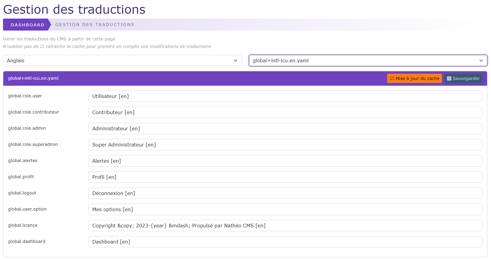

# Gestion du menu (sidebar)

[Index](../../../../index.md) > [Documentation fonctionnelle](../../index.md) > [Administration](../index.md) > Gestion des traductions

*Permet de pouvoir gérer l'ensemble des traductions du site*



## Informations générales
Sidebar : **Système > Traduction**  
Droit d'accès : **ROLE_SUPER_ADMIN**

Natheo CMS est actuellement traduit en 3 langues qui sont
* Français (langue par défaut)
* Anglais
* Espagnol

Les fichiers de traductions sont au format Yaml et porte la nomenclature suivante pour leur nom : 
`[module]+intl-icu.[langue].yaml`, la langue est es, fr ou en

Chaque module du site possède son propre fichier de traduction par langue.

*Exemple de fichier de traduction pour le module GRID*
``` yaml
grid.search.placeholder: 'Rechercher dans le tableau'
grid.loading: 'Chargement des données'
grid.success.titre: 'Action réalisée avec succès !'
grid.confirm.titre: 'Confirmation demandée'
grid.confirm.texte: 'Êtes vous sur de vouloir faire cela ?'
grid.confirm.btn.ok: Oui
grid.confirm.btn.no: Non
grid.page: Page
grid.on: sur
grid.row: lignes
grid.no.result: 'Aucun résultat pour votre recherche'
```

Liste des fichiers de traduction actuellement sur le site (uniquement pour le français) et sont stocker dans le dossier [translations](https://github.com/counteraccro/natheo/tree/master/translations)
* global+intl-icu.fr.yaml
  * Contient les traductions dites "générique" et présent un peu partout sur le site
* grid+intl-icu.fr.yaml
  * Contient les traductions du tableau GRID générique
* log+intl-icu.fr.yaml
  * Contient les traductions du module de log
* messages+intl-icu.fr.yaml
  * Contient les traductions qui sont présentes dans des fichiers de configs
* option_system+intl-icu.fr.yaml
  * Contient les traductions des options systèmes
* security.fr.yaml
  * Contient les traductions de sécurité (propre à Symfony)
* sidebar+intl-icu.fr.yaml
  * Contient les traductions du module de gestion de la sidebar
* translate+intl-icu.fr.yaml
  * Contient les traductions du module de traduction
* user+intl-icu.fr.yaml
  * Contient les traductions de la gestion des users
* validators.fr.yaml
  * Contient les traductions des règles de validations ( propre à Symfony)