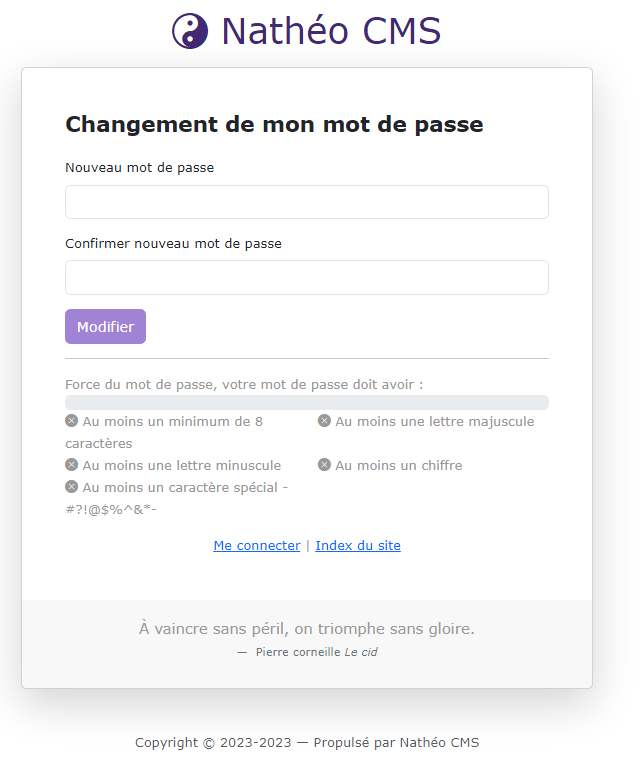

# Changement de mot de passe

[Index](../../../../../index.md) > [Documentation fonctionnelle](../../../index.md) > [Administration](../../index.md) > [Gestion des utilisateurs](user.md) > Changement de mot de passe

*Permet à un utilisateur de pouvoir changer son mot de passe*

## Informations générales
Cette page n'est accessible que sous certaines conditions qui sont :
* Avoir un lien avec un code valide
* Avoir un lien avec un code généré depuis moins de 20 minutes

Dans le cas contraire un message d'erreur sera affiché.

## Règles de validations des champs

Liste des règles de validation pour le changement de mot de passe.

* password (Nouveau mot de passe)
  * Obligatoire
  * Règles de gestion
    * 8 caractères minimum
    * Au moins 1 lettre minuscule
    * Au moins 1 lettre majuscule
    * Au moins 1 chiffre
    * Au moins un caractère spécial - #?!@$%^&*-
* password_confirm (Confirmer nouveau mot de passe)
   * Obligatoire
   * Règles de gestion
   * 8 caractères minimum
   * Au moins 1 lettre minuscule
   * Au moins 1 lettre majuscule
   * Au moins 1 chiffre
   * Au moins un caractère spécial - #?!@$%^&*-

Au submit du bouton "modifier" et si les règles de gestions du formulaire sont respecté :
* Le mot de passe de l'utilisateur est modifié
* Le champ update_at est mis à jour à la date du jour au format [aaaa-mm-jj hh:mm:ss]

L'utilisateur est automatiquement redirigé vers la page de connexion.