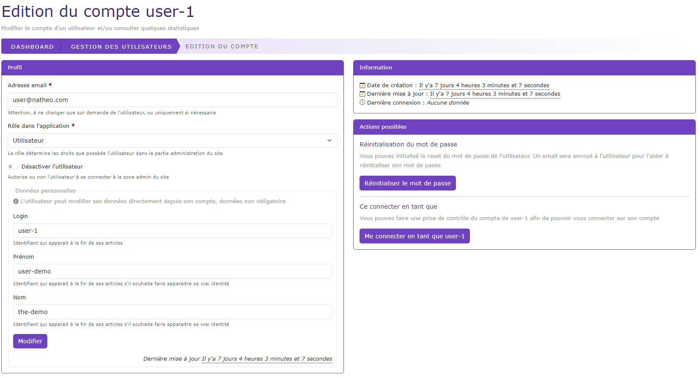

# Editer un utilisateur

[Index](../../../../../index.md) > [Documentation fonctionnelle](../../../index.md) > [Administration](../../index.md) > [Gestion des utilisateurs](user.md) > Editer un utilisateur

*Permet de pouvoir éditer le compte d'un utilisateur*

## Informations générales
Cette page permet de pouvoir modifier certaines données personnelles de l'utilisateur

Cette page affiche aussi certaines statistiques de l'utilisateur qui sont :
* La date de création du compte
* La date de la dernière mise à jour
* La date de la dernière connexion à l'administration

## Règles de gestions globales

Liste des règles de gestion de la page
* Le champ email est unique.
* Le champ role ne peut avoir qu'un seul role
* Les champs login, firstname, lastname ne sont pas obligatoire.

Au submit du bouton "modifier" et si les règles de gestions du formulaire sont respecté :
* Les données de l'utilisateur sont alors modifiés
* Si le champ "désactiver l'utilisateur" est coché alors l'utilisateur ne pourra plus ce connecter à l'administration du CMS
* Le champ create_at est mis à jour à la date du jour au format [aaaa-mm-jj hh:mm:ss]

## Actions possibles
Liste des actions possibles que l'on peut faire en plus de la modification des données de l'utilisateur

### Réinitialiser le mot de passe
Au clic sur le bouton "Réinitialiser le mot de passe" un email est envoyé à l'utilisateur pour lui proposer de changer son mot de passe.  
**Le mot de passe de l'utilisateur n'est pas changé.** L'utilisateur conservera son mot de passe si celui-ci ignore l'email.

Il contient un lien qui donne accès à une [page de changement de mot de passe](change_password.md)  
Ce lien n'est valable que 20 minutes

Vous pouvez changer le contenu de cet email depuis la [gestion des emails](../mail.md)

### Se connecter en tant que
Au cliqué sur le bouton "Me connecter en tant que", vous pouvez prendre le contrôle du compte et ce connecter en son nom.  
Un log est enregistré lors de la prise de contrôle du compte.
