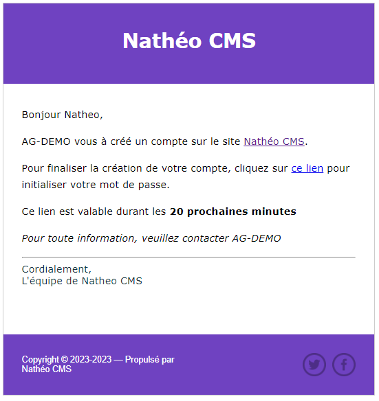

# Ajout nouvel utilisateur

[Index](../../../../../index.md) > [Documentation fonctionnelle](../../../index.md) > [Administration](../../index.md) > [Gestion des utilisateurs](user.md) > Nouvel utilisateur

*Permet de pouvoir ajouter une nouvelle personne qui pourra connecter à la partie administration du CMS*

## Informations générales
Cette page permet de créer un nouvel utilisateur et de définir ses droits pour se connecter à administration 

## Règles de gestions globales

Liste des règles de gestion de la page
* Le champ email est unique.
* Le champ role ne peut avoir qu'un seul role
* Les champs login, firstname, lastname ne sont pas obligatoire.

Au submit du bouton "Créer le nouvel utilisateur" et si les règles de gestions du formulaire sont respecté :
* L'utilisateur est créé en base de donnée
  * Le compte est par défaut actif
  * Un mot de passe aléatoire est généré.
  * Un email est envoyé au nouvel utilisateur en utilisant l'adresse email saisie.

## Email création nouvel utilisateur

Cet email est envoyé à la création d'un nouveau compte. Il contient un lien qui donne accès à une [page de changement de mot de passe](change_password.md)  
Ce lien n'est valable que 20 minutes

Vous pouvez changer le contenu de cet email depuis la [gestion des emails](../mail.md)
