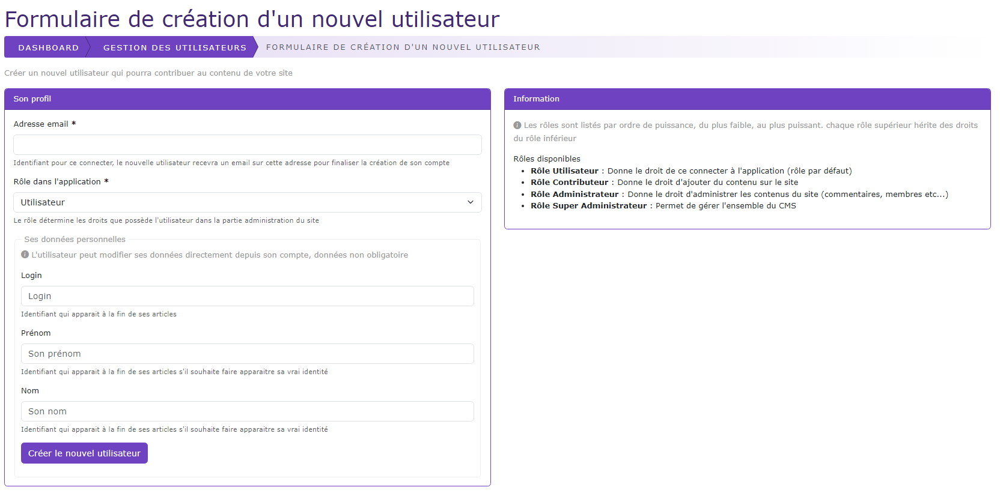

# Ajout nouvel utilisateur

[Index](../../../../../index.md) > [Documentation fonctionnelle](../../../index.md) > [Administration](../../index.md) > [Gestion des utilisateurs](user.md) > Nouvel utilisateur

*Permet de pouvoir ajouter une nouvelle personne qui pourra connecter à la partie administration du CMS*

## Informations générales

## Règles de gestions globales