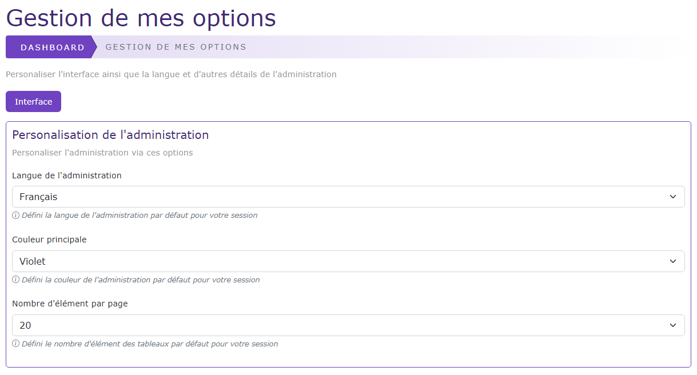

# Les options systèmes

[Index](../../../../../index.md) > [Documentation fonctionnelle](../../../index.md) > [Administration](../../index.md) > Les options users

*Permet aux utilisateurs de la partie admin du CMS de pouvoir configurer certaines options*

## Informations générales
Sidebar :   
Droit d'accès : **ROLE_USER**

Nom entité : **OptionUser**  
Nom de la table en bdd : **natheo.option_user**

| Nom        | 	Type         | 	Null | 	Valeur par défaut |
|------------|---------------|-------|--------------------|
| id         | 	tnt(11)      | 	Non  | 	Aucune            |
| user_id    | 	int(11)      | 	Non  | 	Aucune            |
| key        | 	varchar(255) | 	Non  | 	Aucune            |
| value      | 	varchar(255) | 	Non  | 	Aucune            |
| created_at | 	datetime     | 	Non	 | CURRENT_TIMESTAMP  |
| update_at  | 	datetime     | 	Oui  | 	NULL              |

## Règles de gestions globales
- Liaison Many-to-One avec User 
  - Une option appartient à 1 user 
  - Un user peut avoir n options
- La composition du champ key et user_id est UNIQUE en base de donnée
- Le champ created_at est mis à la date du jour à la création d'une option
- Le champ update_at est mis à jour à la date du jour au format [aaaa-mm-jj hh:mm:ss] à chaque modification de la valeur d'une option

Liste des options disponibles

| Clé	                 | Valeur par défaut    | 	Description                                             |
|----------------------|----------------------|----------------------------------------------------------|
| OU_DEFAULT_LANGUAGE	 | OS_DEFAULT_LANGUAGE	 | Défini la langue pour le site                            |
| OU_THEME_SITE	       | OS_THEME_SITE	       | Défini la couleur de base du site                        |
| OU_NB_ELEMENT	       | OS_NB_ELEMENT	       | Défini le nombre d'éléments à afficher dans les tableaux |

## Règles de gestions insertion / modification de donnée
- Chaque option est définie par le champ key sous la forme de OU_{OPTION}
- En modification seul le champ value est modifiable.
- Les options sont générées via un fichier de config présent dans ``config/cms/options_user.yaml``
- Le fichier est construit de la façon suivante :
  - Voir [fichier options systems](../options_system.md#exemple-de-fichier-de-config)