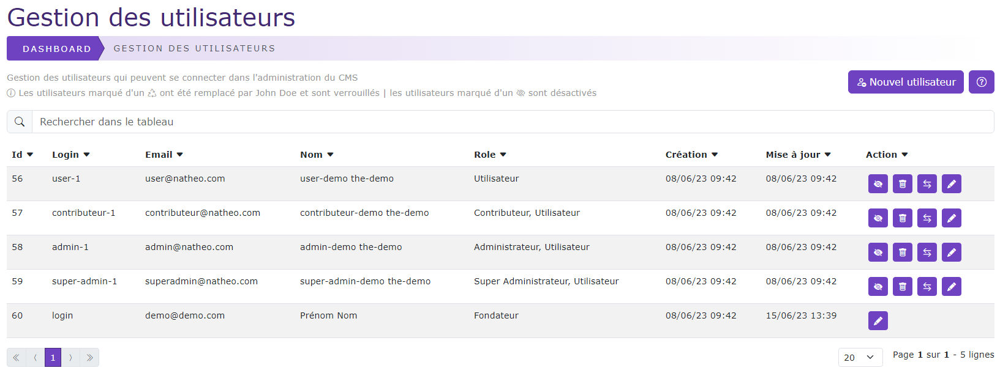
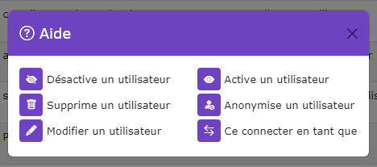

# Gestion des utilisateurs

[Index](../../../../../index.md) > [Documentation fonctionnelle](../../../index.md) > [Administration](../../index.md) > Gestion des utilisateurs

*Permet de pouvoir gérer les personnes qui peuvent ce connecter à la partie administration du CMS*

## Informations générales
Sidebar : **Système > Utilisateur**  
Droit d'accès : **ROLE_SUPER_ADMIN**

Nom entité : **User**  
Nom de la table en bdd : **natheo.user**

| Nom        | Type          | Null | Valeur par défaut  |
|------------|---------------|------|--------------------|
| id         | 	Int(11)      | 	Non | 	Aucune            |
| email      | 	Varchar(180) | 	Non | 	Aucune            |
| roles      | 	Json         | 	Non | 	Aucune            |
| password   | 	Varchar(255) | 	Non | 	Aucune            |
| login      | 	Varchar(100) | 	Oui | 	NULL              |
| firstname  | 	Varchar(100) | 	Oui | 	NULL              |
| lastname   | 	Varchar(100) | 	Oui | 	NULL              |
| disabled   | 	boolean      | 	Non | 	false             |
| anonymous  | 	boolean      | 	Non | 	false             |
| founder    | 	boolean      | 	Non | 	false             |
| created_at | 	datetime     | 	Non | 	CURRENT_TIMESTAMP |
| update_at  | 	datetime     | 	Oui | 	NULL              |

### Règles de gestions globales table user
- Le champ email est unique en base de donnée
- Le champ created_at est mis à la date du jour à la création d'une option
- Le champ update_at est mis à jour à la date du jour au format [aaaa-mm-jj hh:mm:ss] à chaque modification de la valeur d'une option

Nom entité : **UserData**  
Nom de la table en bdd : **natheo.user_data**

| Nom        | Type          | Null | Valeur par défaut  |
|------------|---------------|------|--------------------|
| id         | 	Int(11)      | 	Non | 	Aucune            |
| user_id    | 	Varchar(255) | 	Non | 	Aucune            |
| key        | 	Json         | 	Non | 	Aucune            |
| value      | 	text         | 	Non | 	Aucune            |
| created_at | 	datetime     | 	Non | 	CURRENT_TIMESTAMP |
| update_at  | 	datetime     | 	Oui | 	NULL              |

### Règles de gestions globales table user_data
- Liaison Many-to-One avec User
    - Une UserData appartient à 1 user
    - Un user peut avoir n userData
- La composition du champ key et user_id est UNIQUE en base de donnée
- Le champ created_at est mis à la date du jour à la création d'une option
- Le champ update_at est mis à jour à la date du jour au format [aaaa-mm-jj hh:mm:ss] à chaque modification de la valeur d'une option

## Règles de gestions globales du tableau de données
Le tableau de données regroupe l'ensemble des utilisateurs présent sur le site, le trie par défaut ce fait sur l'id du user.

### Liste des actions possibles
Liste des actions possibles sur le listing des utilisateurs

#### Désactiver un utilisateur
Met le champ ``user.disabled à true``, ce qui empêche la personne de pouvoir ce connecter à la partie administration du CMS.   
Une confirmation est nécessaire pour pouvoir désactiver un utilisateur.   
Un utilisateur désactivé apparaitra avec le symbole  à côté de son l'id

#### Activer un utilisateur
Met le champ ``user.disabled à false``, ce qui autorise la personne à pouvoir ce connecter à la partie administration du CMS.   
Aucune confirmation n'est demandée pour réaliser cette action

#### Supprimer un utilisateur
Permet de supprimer de façon définitive un utilisateur ainsi que toutes les données associées à celui-ci.
Cette action est définitive et sans possibilité de retour.
Une confirmation est nécessaire pour pouvoir supprimer un utilisateur.   
La suppression d'un utilisateur est possible uniquement si :
* L'option OS_ALLOW_DELETE_DATA doit être a 1
* L'option OS_REPLACE_DELETE_USER doit être a 0

#### Anonymiser un utilisateur
Permet d'anonymiser un utilisateur afin de ne plus pouvoir l'identifier. Cette action permet de conserver les données produites sans conserver les données personnelles de l'utilisateur.   
Cette action est définitive et sans possibilité de retour.
Une confirmation est nécessaire pour pouvoir anonymiser un utilisateur.   
L'anonymisation d'un utilisateur est possible uniquement si :
* L'option OS_ALLOW_DELETE_DATA doit être a 1
* L'option OS_REPLACE_DELETE_USER doit être a 1

