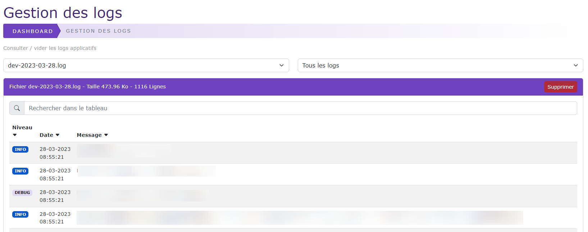

# Gestion des logs

[Index](../../index.md) > [Documentation fonctionnelle](../index.md) > [Administratoin](index.md) > Gestion des logs

*Natheo CMS propose un système d'enregistrement de log à plusieurs niveaux en fonction des [options systèmes](options_system.md) choisies*

## Global
L'ensemble des logs sont enregistrés dans le dossier : ``var/log/cms`` et rangés par environnement (dev pour la dev, prod pour la production etc..)

Liste des logs disponibles :
- auth-[date].log 
  - Enregistre les connexions et tentative de connexion à la partie admin
  - Les logs seront écrits dans la langue du site
- doctrine-[date].log 
  - Enregistre tout changement d'une entité (création / édition / supression)
  - Uniquement si l'option OS_LOG_DOCTRINE est à 1
  - Les logs seront écrits dans la langue du site
- prod-[date].log
  - Enregistre les erreurs applicatives liées au code 

Les logs ont une durée de vie de 10 jours pour éviter les saturations disques

## Gestion des logs

*Cette partie définie la gestion de logs ainsi que la consultation de ceux-ci*

Droit d'accès : **ROLE_SUPER_ADMIN**

*Gestion des logs*

### Règles de gestion globales

Liste des règles de gestion globales

* Les fichiers de logs ne peuvent qu'être lu
* Chaque log est enregistré dans un fichier au format [channel-log]-[date-du-jour].log au format Json

### Règles de gestion de l'écran de gestion des logs

#### Choix du log
La lecture des logs ce fait par le choix du log depuis la liste déroulante "Choix du fichier de log".

Cette liste déroulante liste l'ensemble des logs stockés dans ``var/log/cms``

#### Filtre des fichiers de logs
Il est possible de filtrer les logs afin de réduire la liste de logs

Filtre possible :
* Tous les logs : Affiche l'ensemble des logs
* Aujourd'hui : Affiche uniquement les logs de la date du jour
* Hier : Affiche uniquement les logs d'hier

#### Lecture du fichier de log
Une fois le log choisi depuis la liste déroulante "Choix du fichier de log", le contenu du fichier de log s'affiche dans un
tableau GRID

Actions et information disponible :
* 1: Information sur le fichier, affiche son nom, sa taille et son nombre de lignes
* 2: Permet d'effectuer une recherche sur les lignes affichées
* 3: Permet de supprimer le fichier de log, une confirmation est demandée avant toute action. La suppression est définitive.
* 4: Le tableau contenant les logs affiché de la façon suivante :
  * Le niveau : Défini le niveau d'importance du log (débug, notice, info, warning, error, critical, alert, emergency)
  * La date : Date d'enregistrement du loh
  * le message : Message du log

