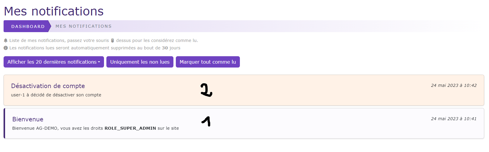

# Mes notifications

[Index](index.md) > [Documentation fonctionnelle](../index.md) > [Administration](index.md) > Mes notifications

*Permet de consulter les notifications de l'utilisateur*

## Informations générales
Droit d'accès : **ROLE_USER**  
*Voir [Notification](Global/notifications.md)*

## Accès à mes notifications
L'accès à la page "mes notifications" ce fait via la petite cloche présent en entête de la partie administration.  

Dans le cas ou l'utilisateur courant à des notifications non lues, le nombre sera indiqué à côté de la cloche.

## Règles de gestions globales
- Uniquement les notifications non lues et les X dernières notifications sont affichées
- Les notifications s'affichent dans la langue de l'utilisateur courant
- Les notifications non lues sont indiqué par une barre à gauche (voir 1 sur l'image)
- Les notifications ont une couleur différente en fonction du niveau de la notification
  - blanc : niveau normal
  - orange: niveau warning
  - rouge : niveau alert 
- La purge automatique des options
  - En fonction de l'option ``OS_PURGE_NOTIFICATION`` les notifications **lues** seront automatiquement supprimées. 
  - Cette suppression ce fait au moment du chargement de la page de façon transparente.

## Règles de gestions des actions
- Bouton "Afficher les X dernières notifications"
  - Permet de définir le nombre de notifications à afficher
- Bouton "Uniquement les non lues"
  - Permet d'afficher uniquement les notifications non lues sans limites de nombre
- Bouton "Marquer tout comme lu"
  - Permet de marquer comme lu l'ensemble des notifications de l'utilisateur courant