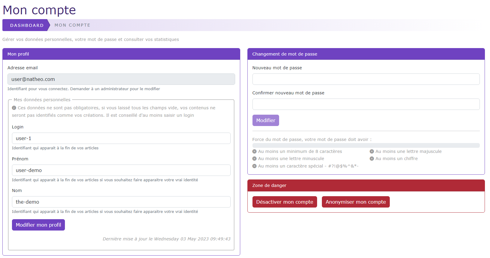

# Mon profil

[Index](index.md) > [Documentation fonctionnelle](../index.md) > [Administration](index.md) > Mon profil

*Cette page permet de pouvoir gérer vos données personnelles sur le CMS dans la partie administration*

## Informations générales
Droit d'accès : **ROLE_USER**  
*Voir [Gestion des utilisateurs](System/users/user.md#informations-générales)*

## Règles de gestions globales
*Voir [Gestion des utilisateurs](System/users/user.md#règles-de-gestions-globales)*

## Règles de validation des champs
Les champs modifiables depuis cette page sont :

* Mon profil
  * login
    * Non obligatoire
  * firstname (Prénom)
    * Non obligatoire
  * lastname (Nom)
    * Non obligatoire

* Changement de mot de passe
  * password (Nouveau mot de passe)
    * Obligatoire
    * Règles de gestion
      * 8 caractères minimum
      * Au moins 1 lettre minuscule
      * Au moins 1 lettre majuscule
      * Au moins 1 chiffre
      * Au moins un caractère spécial - #?!@$%^&*-
  * password_confirm (Confirmer nouveau mot de passe)
    * Obligatoire
    * Règles de gestion
        * 8 caractères minimum
        * Au moins 1 lettre minuscule
        * Au moins 1 lettre majuscule
        * Au moins 1 chiffre
        * Au moins un caractère spécial - #?!@$%^&*-

## Regles de gestion des actions

### Mon profil
* Bouton "Modifier mon profil"
  - Au click sur le bouton "Modifier mon profil", les données suivantes : login / firstname / lastname sont mises à jour dans la base de donnée    

### Changement de mot de passe
* Bouton "Modifier"
  * Le bouton est grisé par défaut
    * Le bouton est actif uniquement dans le cas ou l'ensemble des règles de validation du champ mot de passe et du champ confirmer nouveau mot de passe
    * Règle de validation des champs [voir règle de validation des champs](#règles-de-validation-des-champs)
  * Au click sur le bouton "Modifier", le mot de passe est mis à jour dans la base de données

### Options diverses
*Ne peut être vu que par le compte fondateur*

Ce bloc permet d'activer ou désactiver certaines options supplémentaires

* Bouton "Afficher l'aide de configuration"
  * Permet d'afficher ou masquer le block aide à la configuration sur le dashboard

### Zone de danger
La zone de danger permet de pouvoir désactiver son compte ou le supprimer.

* Bouton "Désactiver mon compte"
  * Désactive le compte de l'utilisateur en mettant le champ disabled à 1
  * Un email est envoyé à l'ensemble des administrateurs pour les prévenir

* Le bouton "Anonymiser mon compte"
  * N'apparait que si OS_ALLOW_DELETE_DATA = 1 et OS_REPLACE_DELETE_USER =1
  * Après confirmation, le compte est anonymisé
    * Le champ login est remplacé par la valeur "John Doe"
    * Le champ firtname est replacé par la valeur "John"
    * Le champ lastname est remplacé par la valeur "Doe"
    * le champ role est remplacé par ROLE_USER
    * le champ email est remplacé par une adresse email généré aléatoirement
    * le champ mot de passe est remplacé par un mot de passe généré aléatoirement
    * le champ disabled est passé à 1
    * le champ anonymous est passé à 1
    * l'ensemble des options users associées sont supprimées
    * Un email est envoyé à l'ensemble des administrateurs pour les prévenir
* Le bouton "Supprimer mon compte"
  * N'apparait que si OS_ALLOW_DELETE_DATA = 1 et OS_REPLACE_DELETE_USER = 0
  * Le compte est supprimé ainsi que l'ensemble des données associées
  * Un email est envoyé à l'ensemble des administrateurs pour les prévenir