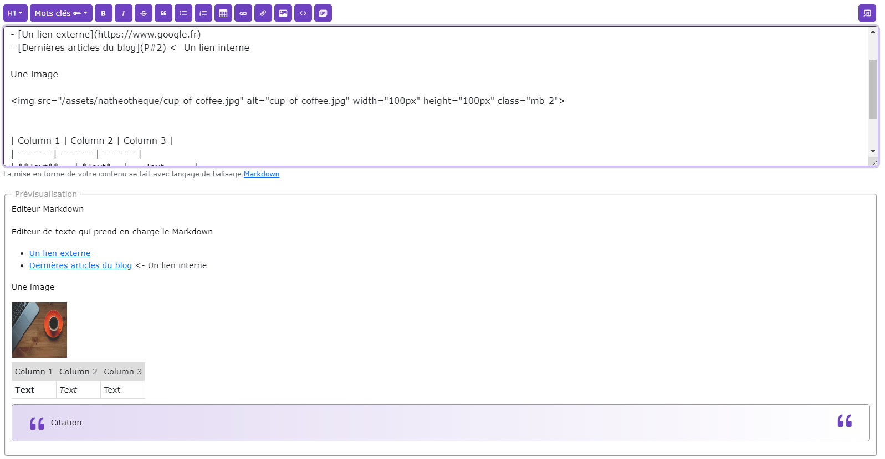

# Editeur Markdown

[Index](../../index.md) > [Documentation fonctionnelle](../index.md) > [Modules](index.md) > Editeur Markdown

*L'éditeur Markdown permet de pouvoir mettre en forme un texte de façon simple avec la mise en forme Markdown*

## Actions possibles

Liste des actions possibles avec l'éditeur
* Bouton "H1"
  * Permet d'ajouter un titre H1 jusqu'à H6
* Bouton "Mots clés"
  * Permet d'ajouter des mots clés pour personnaliser le texte (disponible si le paramètre ``:me-key-words`` n'est pas vide)
* Bouton "B"
  * Permet de mettre le texte en gras
* Bouton "*I*"
  * Permet de mettre le texte en italique
* Bouton "~~S~~"
  * Permet de barrer un texte
* Bouton " &bdquo; "
  * Permet d'ajouter une citation
* Bouton "liste"
  * Permet d'ajouter une liste
* Bouton "liste numéroté"
  * Permet d'ajouter une liste numérotée
* Bouton "Tableau"
  * Permet d'ajouter un tableau
* Bouton "lien"
  * Permet d'ajouter un lien externe
* Bouton "lien penché"
  * Permet d'ajouter un lien interne de page
* Bouton "image"
  * Permet d'ajouter une image
* Bouton "<>"
  * Permet d'ajouter du code
* Bouton "Sauvegarder"
  * Permet de sauvegarder la donnée saisie (si le bouton est activé)
* Bouton "Préview"
  * Permet d'ouvrir dans un autre onglet la préview de la saisie
    * Les liens internes sont alors pris en comptes et correctement affichés

## Prévisualisation en temps réel
La prévisualisation est en temps réel et affiche sous la forme HTML la mise en forme saisie dans l'éditeur

## Prévisualisation autre onglet
Même chose que la prévisualisation en en temps réél mais affiche la vrai url des liens internes

