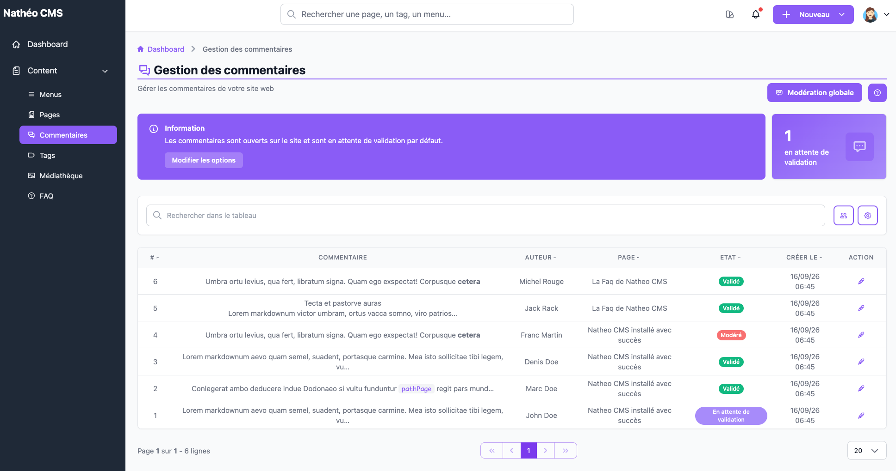

Cette section regroupe tous les commentaires laissés par les visiteurs sur les
pages du site : les consulter, et les modérer un par un ou en masse.
Contrairement aux autres domaines du Guide d'administration, il n'y a pas de
création manuelle possible : un commentaire n'existe que s'il a été déposé
depuis le site.

Cette page est accessible aux contributeurs, administrateurs et
super-administrateurs, à l'URL `/admin/{locale}/comment/`.

## Bandeau d'information

En haut de page, un encart rappelle l'état des commentaires sur le site :
ouverts ou désactivés, et, s'ils sont ouverts, s'ils sont soumis à modération
avant publication. Un lien **Modifier les options** amène directement aux
[options système](../../Systeme/options.md).

Juste à côté, une carte affiche en continu le nombre de commentaires **en
attente de validation**.

## Listing

Le tableau liste l'ensemble des commentaires du site, avec pour chacun : son
contenu (tronqué, converti du Markdown vers HTML), son auteur, la page sur
laquelle il a été déposé (lien direct vers l'édition de cette page), son
statut et sa date de création. Vous pouvez trier chaque colonne en cliquant
sur son en-tête, et retrouver un commentaire grâce à la barre de recherche
(sur le contenu, l'auteur ou l'e-mail). Le filtre **Moi / Tous** restreint la
liste aux commentaires que **vous** avez personnellement modérés — pas à ceux
déposés sur vos propres pages.

Une seule action est disponible depuis la ligne :

- ✏️ **Modérer** — ouvre le commentaire en détail pour changer son statut

## Modération globale

Le bouton **Modération globale**, en haut de page, ouvre un écran dédié pour
traiter plusieurs commentaires à la fois (par exemple valider en une fois
tous ceux en attente d'une page donnée).

## Voir aussi
- [Modérer un commentaire](moderation.md)
- [Modération globale](moderation_globale.md)
- [Référence technique](technique.md)
