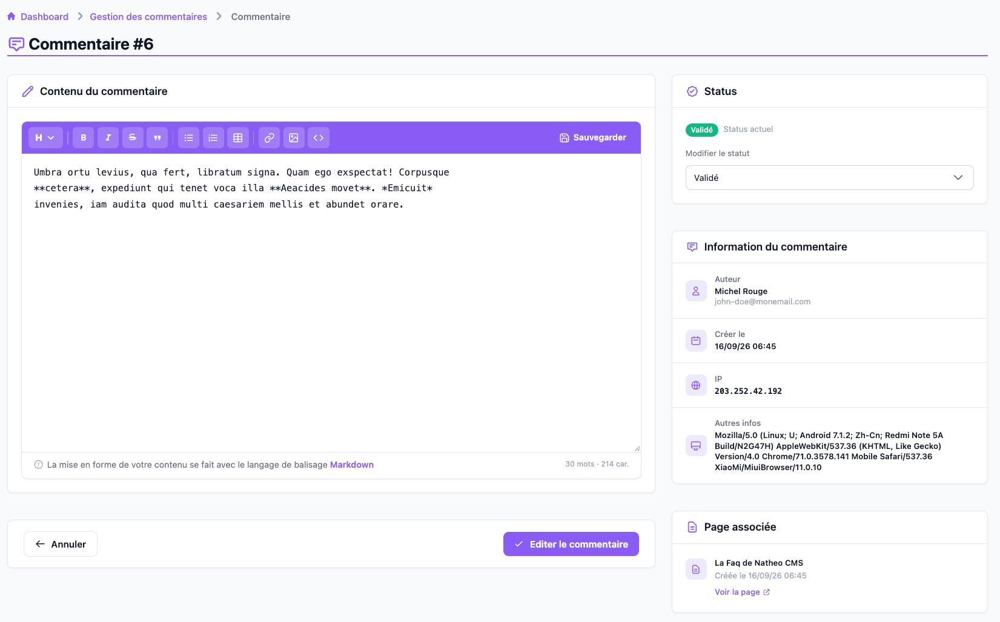

Cet écran permet de consulter le détail d'un commentaire et de modifier son
contenu ou son statut, depuis le [listing des commentaires](listing.md)
(icône ✏️) ou depuis le lien **Voir le commentaire** d'une
[notification](../../MonCompte/Notifications/notifications.md) de nouveau
commentaire.

Il est accessible aux contributeurs, administrateurs et
super-administrateurs, à l'URL `/admin/{locale}/comment/see/{id}`.

Si le commentaire n'existe plus (supprimé entre-temps), un message « Aucun
commentaire trouvé » s'affiche à la place, avec un bouton pour revenir au
listing.

## Contenu

Le contenu du commentaire s'édite dans l'[éditeur Markdown](../../Modules/editeur_markdown.md).
Un bouton **Annuler** ramène au listing sans enregistrer, **Éditer le
commentaire** sauvegarde les modifications.

## Statut

Un badge rappelle le statut actuel du commentaire (**En attente de
validation**, **Validé** ou **Modéré**). Une liste déroulante permet de le
changer :

- Si vous choisissez **Modéré**, un champ **Commentaire de modération**
  apparaît pour expliquer votre décision — il sera visible ensuite dans la
  [modération globale](moderation_globale.md) — et votre compte est
  enregistré comme modérateur.
- Pour tout autre statut, le commentaire de modération et le modérateur
  précédemment enregistrés (le cas échéant) sont effacés à l'enregistrement.

## Informations

Trois blocs complètent l'écran :

- **Auteur** — nom et e-mail renseignés par le visiteur
- **Créé le** — date de dépôt du commentaire
- **IP** et **Autres infos** (user-agent) — pour identifier l'origine du
  commentaire

## Page associée

Rappelle la page sur laquelle le commentaire a été déposé et sa date de
création, avec un lien **Voir la page** vers sa version publiée sur le site.

## Voir aussi
- [Listing des commentaires](listing.md)
- [Modération globale](moderation_globale.md)
- [Référence technique](technique.md)
