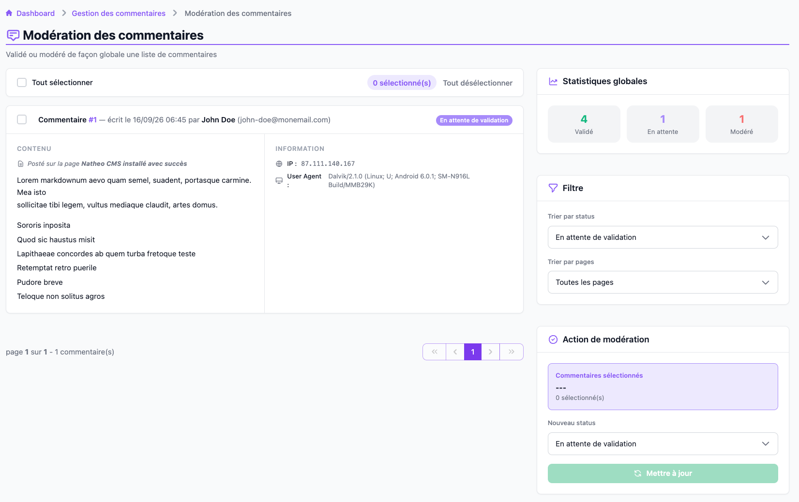

Cet écran permet de traiter plusieurs commentaires en une seule fois — par
exemple valider en bloc tous les commentaires en attente d'une page. Il est
accessible depuis le bouton **Modération globale** du
[listing des commentaires](listing.md).

Il est accessible aux contributeurs, administrateurs et
super-administrateurs, à l'URL `/admin/{locale}/comment/moderate`.

## Filtres et statistiques

Dans la colonne de droite, un bloc **Statistiques globales** résume, tous
filtres confondus, le nombre de commentaires validés, en attente et modérés.

Juste en dessous, deux listes déroulantes filtrent la liste de gauche : par
**statut** (par défaut, seuls les commentaires **en attente de validation**
sont affichés) et par **page**. Chaque changement recharge immédiatement la
liste et sa pagination.

## Liste et sélection

Chaque commentaire de la liste affiche son contenu (converti du Markdown),
son auteur, la page concernée, son statut, ses informations techniques (IP,
user-agent) et, s'il a déjà été modéré, le commentaire de modération laissé
et son auteur.

Une case à cocher sur chaque commentaire (et **Tout sélectionner** /
**Tout désélectionner**, disponibles à la fois en en-tête de liste et dans le
bloc **Action de modération**) permet de constituer une sélection. Le nombre
de commentaires sélectionnés est rappelé en permanence.

## Action de modération

Une fois une sélection faite, le bloc **Action de modération** permet de
choisir le **nouveau statut** à leur appliquer en une fois. Si ce statut est
**Modéré**, un champ **Commentaire de modération** apparaît et sera appliqué
à tous les commentaires sélectionnés. Le bouton **Mettre à jour** — désactivé
tant qu'aucun commentaire n'est sélectionné — applique le changement,
enregistre l'utilisateur courant comme modérateur (si le statut choisi est
**Modéré**), réinitialise la sélection et recharge la liste.

> 💡 Passer un commentaire à un statut autre que **Modéré** efface son
> éventuel commentaire de modération et son modérateur précédemment
> enregistrés.

## Voir aussi
- [Listing des commentaires](listing.md)
- [Modérer un commentaire](moderation.md)
- [Référence technique](technique.md)
