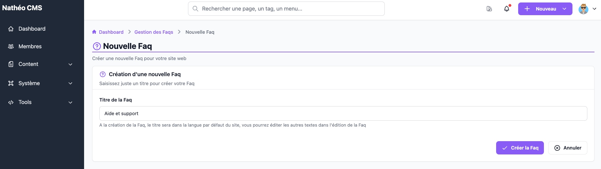
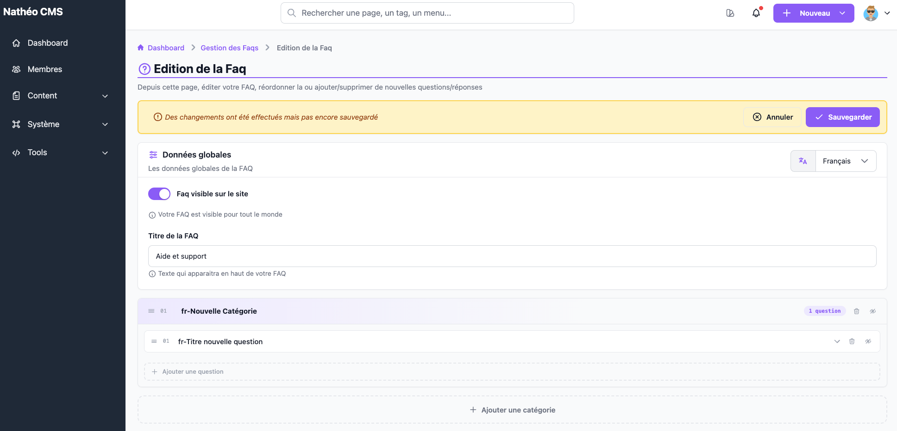
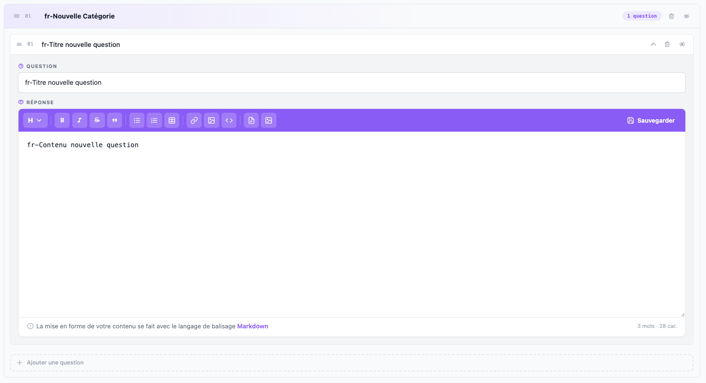

Contrairement aux autres domaines du Guide d'administration, la création
d'une FAQ se fait en deux temps : un formulaire minimal pour créer la FAQ,
puis un écran de construction complet pour organiser ses catégories et ses
questions, depuis le [listing des FAQ](listing.md).

Ces écrans sont accessibles aux contributeurs, administrateurs et
super-administrateurs, aux URLs `/admin/{locale}/faq/add/` (création) et
`/admin/{locale}/faq/update/{id}` (édition). Si la FAQ demandée en édition
n'existe plus (supprimée entre-temps), un message « Aucune FAQ trouvée »
s'affiche à la place, avec un bouton pour revenir au listing ou en créer une
nouvelle.

## Étape 1 : création

À la création, un seul champ est demandé :

| Champ | Description | Obligatoire |
|---|---|---|
| Titre de la Faq | Titre de la nouvelle FAQ | Oui |

Ce titre est enregistré dans la langue par défaut du site ; pour les autres
langues, il est pré-rempli avec la locale en préfixe (par exemple
`en-Mon titre`) en attendant d'être traduit depuis l'édition. Une fois
**Créer la Faq** cliqué, vous êtes automatiquement redirigé vers l'écran
d'édition complet de la FAQ qui vient d'être créée — avec une première
catégorie et une première question déjà présentes, prêtes à être
personnalisées.

## Étape 2 : édition complète

### Bandeau d'état

En haut de l'écran, un bandeau reste visible en permanence (il suit le défilement de la page) et prend une couleur différente selon la situation :

- **Neutre** — « Aucun changement pour le moment »
- **Orange** — « Des changements ont été effectués mais pas encore
  sauvegardé »
- **Rouge** — une ou plusieurs erreurs de validation empêchent
  l'enregistrement (voir plus bas)

Il porte aussi les boutons **Annuler** (retour au listing sans enregistrer)
et **Sauvegarder**, désactivé tant qu'une erreur de validation subsiste.

### Données globales

- **Faq visible sur le site** — bascule qui active/désactive l'ensemble de la
  FAQ (équivalent à l'action 👁️ du listing)
- **Titre de la FAQ** — texte affiché en haut de la FAQ publiée
- Un sélecteur de langue, en haut à droite de la carte, permet de basculer
  entre les langues du site pour éditer les titres et réponses dans chacune
  d'elles ; il est désactivé tant qu'une erreur de validation subsiste,
  pour éviter de perdre de vue un champ invalide en changeant de langue

### Catégories et questions

Chaque catégorie est un bloc numéroté qui liste ses questions :

- Elle se glisse-dépose (poignée ☰) pour réordonner les catégories entre
  elles
- Un badge indique son nombre de questions
- 🗑️ supprime la catégorie (et toutes ses questions), après confirmation
- 👁️ bascule la catégorie en visible/masquée

Chaque question, dans sa catégorie, fonctionne de la même façon : poignée de
glisser-déposer, 🗑️ (suppression après confirmation) et 👁️
(visible/masquée). Cliquer sur son titre déplie un panneau d'édition :

| Champ | Description |
|---|---|
| Question | Titre de la question |
| Réponse | Contenu de la réponse, dans l'[éditeur Markdown](../../Modules/editeur_markdown.md) |

Les questions se glissent-déposent aussi **d'une catégorie à une autre**, pas
seulement au sein de la même catégorie.

En bas de chaque catégorie, **Ajouter une question** crée une nouvelle
question (placeholder à personnaliser) directement dans cette catégorie. En
bas de l'écran, **Ajouter une catégorie** crée une nouvelle catégorie vide.

## Boutons et effets

| Bouton / action | Effet |
|---|---|
| Sauvegarder | Enregistre la FAQ, ses catégories et ses questions ; recharge ensuite les données depuis le serveur |
| Annuler | Revient au listing sans enregistrer |
| 👁️ (FAQ, catégorie, question) | Bascule la visibilité de l'élément |
| 🗑️ (catégorie, question) | Supprime l'élément, après confirmation dans une fenêtre modale |
| Ajouter une question / Ajouter une catégorie | Ajoute un nouvel élément vide, prêt à être édité |

## Notes de comportement

- **Validation** — la sauvegarde est bloquée tant que le titre de la FAQ,
  ou le titre d'une catégorie, ou le titre/la réponse d'une question sont
  vides dans la langue courante, ou qu'une catégorie n'a aucune question. Le
  bandeau passe alors au rouge et le bouton **Sauvegarder** est désactivé.
- **Désactivation en cascade** — désactiver une catégorie désactive
  automatiquement toutes ses questions. En revanche, **réactiver** une
  catégorie ne réactive pas ses questions : chacune doit être réactivée
  individuellement si besoin.
- **Éléments non enregistrés** — tant qu'une FAQ n'a pas été sauvegardée, les
  catégories et questions nouvellement ajoutées n'ont pas encore d'identifiant
  définitif côté serveur (elles n'en obtiennent un qu'à l'enregistrement).
- **Statistiques** — le nombre de catégories et de questions affiché dans le
  [listing](listing.md) est recalculé et figé à chaque sauvegarde, il ne
  reflète pas les changements en cours tant que vous n'avez pas cliqué sur
  **Sauvegarder**.

## Voir aussi
- [Listing des FAQ](listing.md)
- [Référence technique](technique.md) *(tables, services, routes)*
