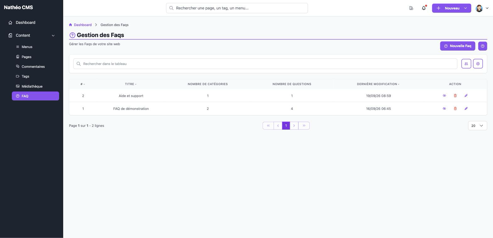

Une FAQ regroupe des questions/réponses organisées en catégories, affichées
sur le site. Un site peut avoir plusieurs FAQ (chacune avec son propre titre,
ses catégories et ses questions) ; chacune est visible ou non indépendamment
des autres.

Cette page est accessible aux contributeurs, administrateurs et
super-administrateurs, à l'URL `/admin/{locale}/faq/`.

Le tableau liste toutes les FAQ existantes, avec leur nombre de catégories,
leur nombre de questions et leur date de dernière modification. Seules les
colonnes **#**, **Titre** et **Dernière modification** sont triables en
cliquant sur leur en-tête (le nombre de catégories/questions ne l'est pas).
Vous pouvez aussi retrouver une FAQ grâce à la barre de recherche (sur le
titre), et filtrer sur **Moi / Tous** pour n'afficher que les FAQ dont vous
êtes l'auteur.

Pour chaque FAQ, plusieurs actions sont disponibles directement depuis la
ligne :

- 👁️ **Activer / Désactiver** — une FAQ désactivée disparaît du site, mais
  rien n'est supprimé : vous pouvez la réactiver à tout moment
- 🗑️ **Supprimer** — retire définitivement la FAQ, avec l'ensemble de ses
  catégories et questions
- ✏️ **Modifier** — ouvre la FAQ pour l'éditer

Et en haut de page, le bouton **Nouvelle Faq** ouvre le formulaire de
création.

## Voir aussi
- [Créer ou éditer une FAQ](ajouter_editer.md)
- [Référence technique](technique.md) *(tables, services, routes)*
