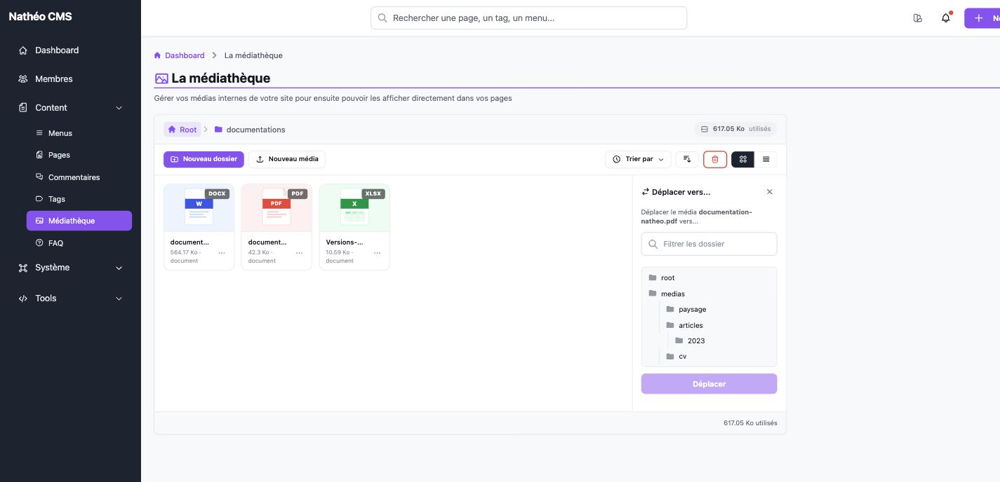
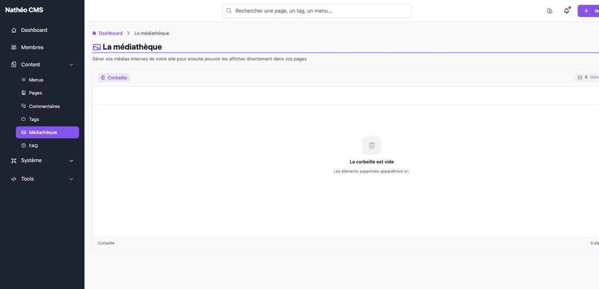

Ce document couvre le déplacement d'un dossier ou d'un média, ainsi que la
corbeille de la [médiathèque](mediatheque.md).

## Déplacer un média ou un dossier

Le lien **Déplacer** du menu **…** ouvre un panneau listant l'arborescence
complète des dossiers de la médiathèque.

La recherche en haut du panneau filtre la liste par nom de dossier. Cliquer
sur un dossier le sélectionne (ligne surlignée) ; **root** représente la
racine de la médiathèque. Le bouton **Déplacer** ne devient actif qu'une fois
un dossier sélectionné, et valide le déplacement.

Lorsqu'il s'agit d'un dossier, ses propres sous-dossiers ne sont pas proposés
comme destination (impossible de déplacer un dossier dans lui-même ou dans
l'un de ses enfants). Le déplacement met à jour le chemin de l'élément — et,
pour un dossier, de tout son contenu en cascade — en base de données, ainsi
que sur le disque si la création physique des dossiers est activée.

## La corbeille

Mettre un élément à la corbeille (lien **Corbeille** du menu **…**, ou icône
🗑️ en survol dans certains affichages) ne le supprime pas immédiatement : il
reste stocké et physiquement présent sur le disque, mais disparaît du
navigateur de la médiathèque. Mettre un **dossier** à la corbeille y pousse
aussi, en cascade, tous les dossiers et médias qu'il contient.

Le badge sur l'icône 🗑️ de la barre d'outils indique le nombre total
d'éléments actuellement dans la corbeille (dossiers et médias confondus). Y
cliquer ouvre la vue corbeille :

Depuis le menu **…** d'un élément de la corbeille, deux actions sont
proposées :

| Action | Effet |
|---|---|
| ↩️ **Restaurer** | Retire l'élément de la corbeille ; il réapparaît dans son dossier d'origine |
| 🗑️ **Supprimer** | Ouvre une confirmation inline sur la vignette ; une fois confirmée, supprime l'élément **définitivement**, y compris le fichier physique sur le disque |

> La suppression définitive n'est protégée par aucune vérification de
> l'option système *Autoriser la suppression des données*
> (`OS_ALLOW_DELETE_DATA`) côté médiathèque : n'importe quel contributeur peut
> supprimer définitivement un élément de la corbeille, que cette option soit
> activée ou non. Le back-end calcule pourtant un indicateur `canDelete` basé
> sur cette option à chaque chargement, mais rien dans l'écran ne l'exploite
> actuellement.

## Voir aussi
- [Ajouter, informer et modifier un média](medias.md)
- [Créer et renommer un dossier](dossiers.md)
- [Référence technique](technique.md)
