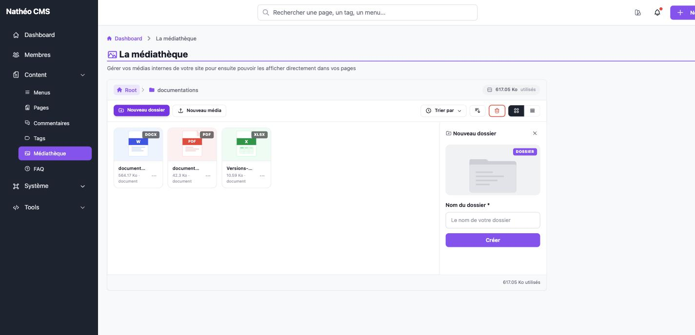

Les dossiers permettent d'organiser les médias, comme un explorateur de
fichiers classique. Ce document couvre leur création et leur renommage depuis
le [listing de la médiathèque](mediatheque.md).

## Créer un dossier

Le bouton **Nouveau dossier** de la barre d'outils ouvre le formulaire de
création, dans le dossier actuellement ouvert (le nouveau dossier sera donc un
sous-dossier de celui-ci, ou un dossier racine si vous êtes à la racine).

| Champ | Obligatoire | Description |
|---|---|---|
| Nom du dossier | Oui | Nom du dossier |

Le bouton **Créer** valide la création. Le nom saisi est nettoyé
automatiquement à la sortie du champ : seuls les lettres non accentuées, les
chiffres et les tirets sont conservés. Deux dossiers ne peuvent pas porter le
même nom **au sein d'un même dossier parent** (l'unicité est vérifiée dossier
par dossier, pas sur toute la médiathèque : deux dossiers différents peuvent
tout à fait s'appeler pareil) — un message d'erreur s'affiche sinon.

Si l'option système de création physique des dossiers est activée (réglage
par défaut), un dossier réel est également créé sur le serveur, dans lequel
seront stockés les fichiers ajoutés à ce dossier.

## Renommer un dossier

Le lien **Éditer** du menu **…** d'un dossier ouvre le même formulaire, avec
le nom actuel pré-rempli et le bouton renommé en **Modifier**.

Renommer un dossier met aussi à jour, en cascade, le chemin (`path`) de tous
ses sous-dossiers et de tous les médias qu'il contient — directement en base
de données, et sur le disque si la création physique des dossiers est
activée.

> Valider le formulaire **sans changer le nom** est sans effet : le message
> de succès s'affiche, mais aucune écriture n'est faite (ni en base, ni sur
> le disque). Ce n'est plus le cas de deux dossiers frères portant le même
> nom : la vérification d'unicité exclut le dossier en cours d'édition, donc
> renommer un dossier vers son propre nom actuel ne déclenche pas non plus
> d'erreur.

## Voir aussi
- [Ajouter, informer et modifier un média](medias.md)
- [Déplacer et mettre à la corbeille](deplacer_et_corbeille.md)
- [Référence technique](technique.md)
