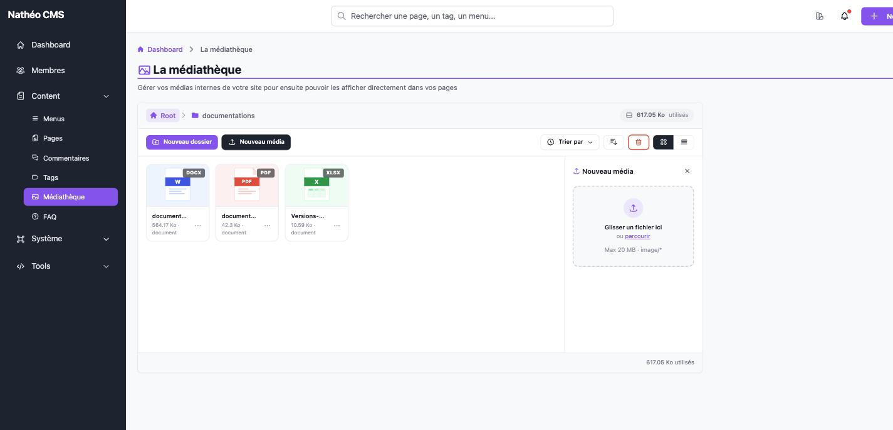
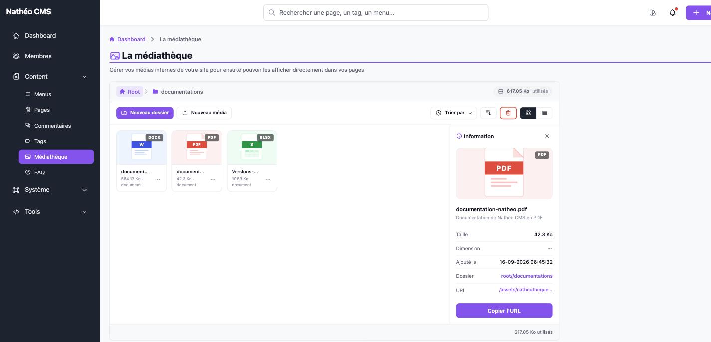
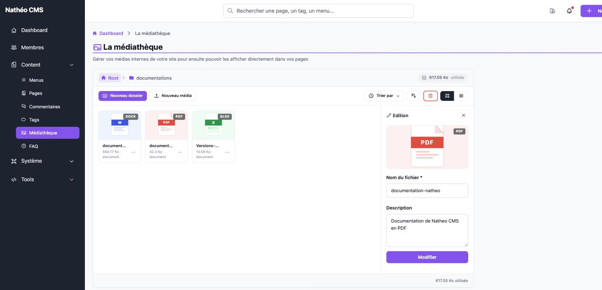

Ce que vous pouvez faire sur un **média** (par opposition à un dossier), depuis
le [listing de la médiathèque](mediatheque.md) : l'ajouter, consulter ses
informations, ou modifier son nom et sa description.

## Ajouter un média

Le bouton **Nouveau média** de la barre d'outils ouvre un panneau de dépôt de
fichier, dans le dossier actuellement ouvert.

Vous pouvez glisser-déposer un fichier dans la zone, ou cliquer sur
**parcourir** pour choisir un fichier depuis votre poste. Une fois le fichier
sélectionné, un aperçu s'affiche (miniature pour une image, icône générique
pour les autres formats) avec deux champs facultatifs :

| Champ | Description |
|---|---|
| Titre | Si laissé vide, le nom du fichier est utilisé par défaut |
| Description | Description libre du média |

Cliquer sur **Télécharger** envoie le fichier au serveur ; le panneau se ferme
automatiquement une fois l'ajout confirmé et la médiathèque se recharge.

Le panneau refuse côté navigateur tout fichier de plus de **20 Mo** ; le
serveur applique la même limite de son côté (rejet si dépassée, même en cas
de contournement du contrôle client). Le serveur n'accepte que les extensions
suivantes : `jpg`, `jpeg`, `png`, `gif`, `webp`, `pdf`, `doc`, `docx`, `xls`,
`xlsx`, `ppt`, `pptx` — le contenu du fichier est également vérifié (type MIME
réel attendu pour l'extension déclarée), pas seulement son extension. Le
sélecteur de fichier du panneau filtre sur ce même ensemble de types
(`image/*` + `.pdf`/`.doc`/`.docx`/`.xls`/`.xlsx`/`.ppt`/`.pptx`).

> **Cas particulier du WebP** : le format `webp` est accepté à l'upload et
> traité comme une image dans l'aperçu du panneau avant envoi, mais le
> serveur ne sait générer de miniature que pour `jpg`, `jpeg`, `png` et
> `gif`. Un média WebP est donc enregistré comme un fichier générique (pas
> comme une image) et s'affiche avec l'icône de fichier par défaut dans la
> médiathèque, plutôt qu'avec un véritable aperçu.

## Informations d'un média

Le lien **Information** du menu **…** affiche, dans le panneau latéral, les
détails d'un média :

| Champ | Description |
|---|---|
| Taille | Poids du fichier |
| Dimension | Largeur × hauteur (uniquement pour les images ; `--` sinon) |
| Ajouté le | Date de création |
| Dossier | Chemin du dossier contenant le média (`root`, ou `root/.../nom` — un double `/` peut apparaître pour un média rangé directement dans un dossier de premier niveau, comme sur la capture ci-dessus) |
| URL | Chemin web public du fichier |

Le bouton **Copier l'URL** copie ce chemin dans le presse-papiers — pratique
pour réutiliser le média ailleurs (balise ``, lien manuel…) sans passer
par l'[éditeur Markdown](../../../Architecture/composants/editeur_markdown.md),
qui dispose de son propre sélecteur de médias intégré.

## Modifier un média

Le lien **Éditer** du menu **…** ouvre le même panneau, en mode édition :

| Champ | Obligatoire | Description |
|---|---|---|
| Nom du fichier | Oui | Correspond en réalité au **titre** du média (`Media::title`), pas au nom physique du fichier sur le disque |
| Description | Non | Description libre |

Dès que vous quittez le champ **Nom du fichier**, sa valeur est nettoyée
automatiquement : seuls les lettres non accentuées, les chiffres et les tirets
sont conservés (espaces, accents et ponctuation sont supprimés). Un titre
saisi `Résumé du projet` devient ainsi `Rsumduprojet`.

Le bouton **Modifier** enregistre les deux champs. Aucune des deux valeurs
n'affecte le nom du fichier sur le disque ni son URL publique — seuls le titre
et la description affichés dans la médiathèque changent.

## Voir aussi
- [Créer et renommer un dossier](dossiers.md)
- [Déplacer et mettre à la corbeille](deplacer_et_corbeille.md)
- [Référence technique](technique.md)
