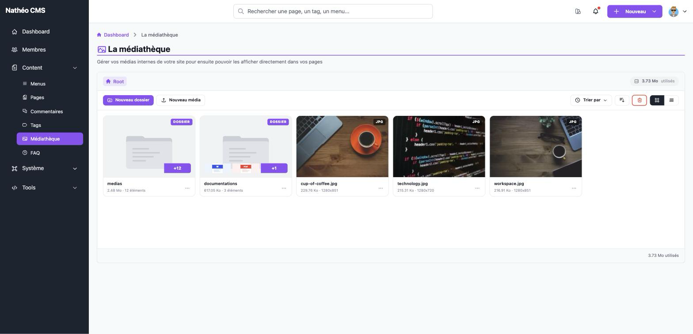
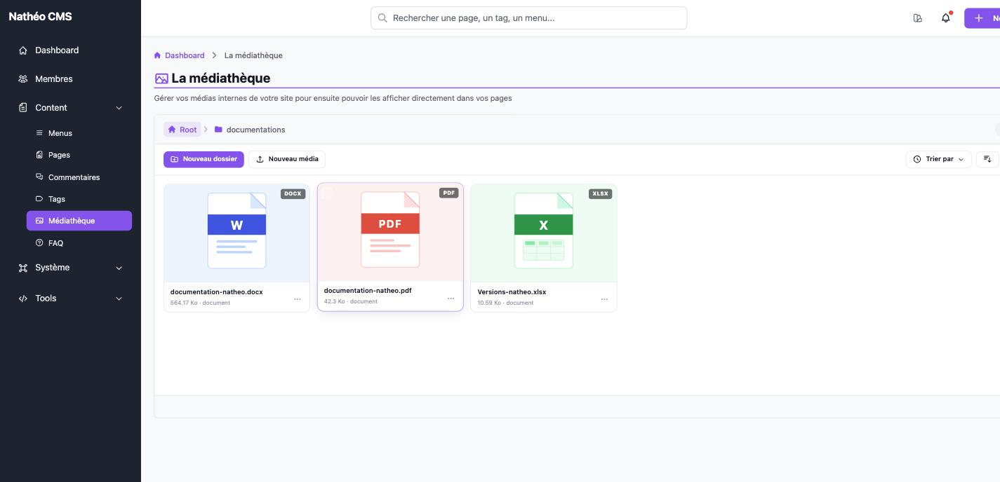

La médiathèque centralise tous les fichiers internes de votre site (images,
PDF, documents bureautiques…) que vous pouvez ensuite réutiliser dans vos
pages, votre FAQ ou tout autre contenu passant par l'éditeur Markdown. Les
fichiers sont organisés en dossiers, comme un explorateur de fichiers
classique.

Cette page est accessible aux contributeurs, administrateurs et
super-administrateurs, à l'URL `/admin/{locale}/media/`.

## Navigation

Le fil d'Ariane en haut du bloc (**Root** puis chaque sous-dossier traversé)
permet de remonter à tout moment vers un dossier parent en cliquant dessus.
Cliquer sur une **vignette de dossier** l'ouvre ; cliquer sur une **vignette de
média** l'ouvre dans un nouvel onglet.

Un dossier affiche un aperçu de son contenu directement sur sa vignette (les
deux premiers éléments qu'il contient) ainsi que le nombre total d'éléments.
Chaque type de fichier a sa propre icône générique lorsqu'il n'a pas de
miniature (PDF, Word, Excel, PowerPoint…) — seules les images (`jpg`, `jpeg`,
`png`, `gif`) ont une véritable miniature, générée automatiquement au moment
de l'ajout.

## Barre d'outils

| Élément | Rôle |
|---|---|
| **Nouveau dossier** | Ouvre le formulaire de création d'un [dossier](dossiers.md) dans le dossier courant |
| **Nouveau média** | Ouvre le formulaire d'[ajout d'un média](medias.md#ajouter-un-média) dans le dossier courant |
| **Trier par** | Change le critère de tri : date de création, nom ou type |
| Bouton d'inversion (flèches) | Inverse le sens du tri (croissant / décroissant) |
| Icône corbeille (rouge) | Ouvre la [corbeille](deplacer_et_corbeille.md#la-corbeille) |
| Icônes grille / liste | Bascule entre l'affichage en grille (vignettes) et en tableau |

L'espace utilisé par la médiathèque (tous dossiers confondus) est affiché en
haut à droite du bloc, et rappelé en bas de page pour le dossier courant.

## Actions sur un élément

Quatre actions sont disponibles sur chaque dossier ou média, mais leur accès
diffère selon l'affichage :

| Action | Effet |
|---|---|
| ℹ️ **Information** | Affiche les [informations](medias.md#informations-dun-média) de l'élément (taille, date, URL…) |
| ✏️ **Éditer** | [Renomme un dossier](dossiers.md#renommer-un-dossier) ou [modifie le nom/la description d'un média](medias.md#modifier-un-média) |
| ⇄ **Déplacer** | [Déplace](deplacer_et_corbeille.md#déplacer-un-média-ou-un-dossier) l'élément vers un autre dossier |
| 🗑️ **Corbeille** | [Met l'élément à la corbeille](deplacer_et_corbeille.md#la-corbeille) |

- En **vue grille**, ces quatre actions sont regroupées derrière le menu
  **…** de chaque vignette, et la mise à la corbeille demande une
  confirmation (Oui / Non) affichée directement sur la vignette avant d'être
  effectuée.
- En **vue liste**, les quatre actions sont représentées par des icônes
  directement visibles dans la colonne *Actions* de chaque ligne — il n'y a
  pas de menu **…**. La mise à la corbeille y est **immédiate, sans aucune
  confirmation**, contrairement à la vue grille.

Les panneaux Information/Éditer/Déplacer s'ouvrent dans un panneau latéral à
droite de la médiathèque, sans recharger la page.

> Mettre un dossier à la corbeille y pousse aussi tous les dossiers et médias
> qu'il contient.

> L'action 🗑️ **Corbeille** (menu **…** ou icône directe selon l'affichage)
> n'est visible que si l'option système *Autoriser la suppression des
> données* (`OS_ALLOW_DELETE_DATA`) est activée. Si elle est désactivée, les
> trois autres actions restent disponibles mais il devient impossible de
> mettre quoi que ce soit à la corbeille depuis cet écran — voir
> [la corbeille](deplacer_et_corbeille.md#la-corbeille).

> **Autre différence entre les deux affichages** : en vue liste, la colonne
> *Nom* d'un média affiche son nom de fichier physique tel que stocké sur le
> disque (avec le suffixe aléatoire ajouté à l'upload, ex.
> `cup-of-coffee-3f9a2b1c….jpg`), alors que la vue grille affiche son titre
> (ex. `cup-of-coffee.jpg`). De même, la colonne *Type* de la vue liste
> n'affiche pas l'extension du fichier mais littéralement `media` ou
> `folder`.

## Voir aussi
- [Ajouter, informer et modifier un média](medias.md)
- [Créer et renommer un dossier](dossiers.md)
- [Déplacer et mettre à la corbeille](deplacer_et_corbeille.md)
- [Référence technique](technique.md) *(tables, services, routes)*
