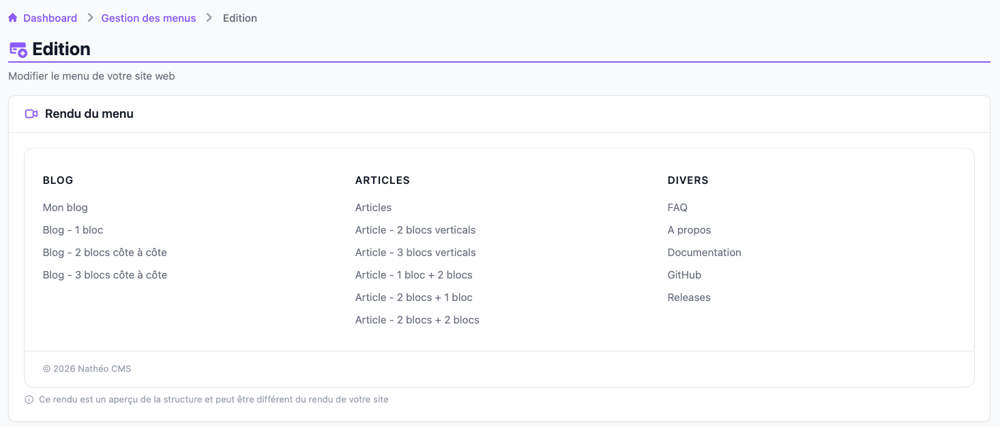
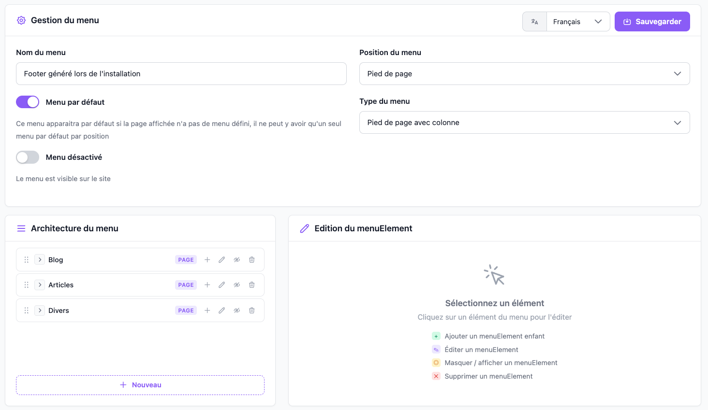
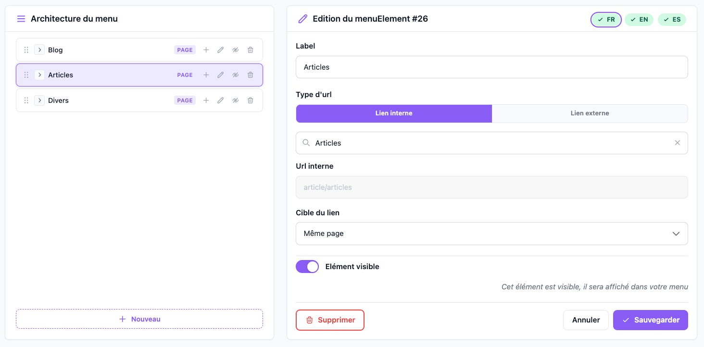
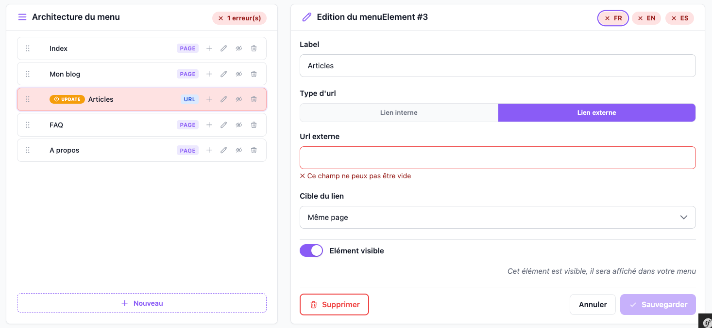

La création et l'édition d'un menu se font sur le même écran, aux URLs
`/admin/{locale}/menu/add/` (bouton **Nouveau menu**) et
`/admin/{locale}/menu/update/{id}` (bouton **Éditer** du
[listing](listing.md)), accessible aux contributeurs, administrateurs et
super-administrateurs.

Un menu est composé d'informations générales (nom, position, type) et d'une
**arborescence d'éléments** (liens vers une page interne ou une URL externe,
avec sous-niveaux). L'écran est structuré en trois blocs empilés :

## Aperçu du rendu

En haut de page, un aperçu simplifié du menu se met à jour en temps réel au
fil de vos modifications, avant tout enregistrement.

> Cet aperçu **n'est qu'une approximation de la structure** (l'écran le
> rappelle explicitement) : le rendu réel sur le site dépend du thème front et
> peut différer, en particulier pour les mises en page complexes (méga-menus,
> colonnes).

## Informations générales

Le bloc **Gestion du menu** regroupe les réglages globaux :

| Champ | Obligatoire | Description |
|---|---|---|
| Nom du menu | Oui | Nom interne, affiché dans le [listing](listing.md) — n'apparaît pas sur le site |
| Position du menu | Oui | `Haut de page`, `Pied de page`, `A gauche` ou `A droite` |
| Type du menu | Oui | Liste dépendante de la position choisie (voir ci-dessous) |
| Menu par défaut | — | Voir [Le menu par défaut](#le-menu-par-défaut) |
| Menu désactivé | — | Un menu désactivé n'apparaît plus nulle part sur le site |

Les types disponibles selon la position :

| Position | Types |
|---|---|
| Haut de page | Menu side-bar, Menu déroulant classique, Menu déroulant géant (1, 2, 3 ou 4 colonnes) |
| A gauche / A droite | Menu side-bar, Menu side-bar avec accordéons |
| Pied de page | Pied de page 1 ligne à droite, Pied de page 1 ligne centrée, Pied de page avec colonnes |

Changer la position réinitialise le type sélectionné si celui-ci n'existe pas
pour la nouvelle position. Le sélecteur de langue en haut à droite de ce bloc
détermine la langue affichée dans l'arborescence et le formulaire d'élément
ci-dessous (indépendamment pour chaque élément, voir plus bas) ; le bouton
**Sauvegarder** de ce bloc est le seul qui enregistre réellement le menu côté
serveur (voir [Enregistrer le menu](#enregistrer-le-menu)).

### Le menu par défaut

Chaque **position** (haut de page, pied de page, gauche — *à droite* n'est pas
concerné) peut avoir un menu marqué **par défaut** : c'est celui qui s'affiche
par défaut pour cette position. Activer ce réglage sur un menu retire
**automatiquement** ce statut à tout autre menu de la même position — il ne
peut jamais y en avoir plus d'un à la fois par position, sans confirmation
supplémentaire au moment de l'enregistrement.

Le [listing](listing.md) affiche une alerte en haut de page si une position
n'a aucun menu par défaut, ou en a plusieurs par erreur (base incohérente).

> Un menu **non défini par défaut** peut tout de même s'afficher sur des
> pages précises : cette association se fait **depuis la page elle-même**
> (onglet *Menu* de l'écran d'édition d'une page, un menu au choix par
> position), pas depuis cet écran — ce formulaire de menu n'a aucun contrôle
> pour choisir les pages qui l'utilisent.

## Architecture du menu

Le bloc **Architecture du menu** affiche l'arborescence des éléments du menu,
sur autant de niveaux que nécessaire (sous-menus, méga-menus…).

Pour chaque élément :

| Action | Effet |
|---|---|
| ⣿ (poignée) | Glisser-déposer pour réordonner l'élément **parmi ses frères et sœurs du même niveau** |
| ▸ | Déplie / replie les enfants de l'élément |
| ➕ | Ajoute un nouvel élément enfant, directement sous celui-ci |
| ✏️ | Sélectionne l'élément pour l'éditer dans le panneau de droite |
| 👁️ **Masquer** | Masque l'élément **et tous ses enfants** ; ré-cliquer les réaffiche tous |
| 🗑️ **Supprimer** | Demande confirmation, puis retire l'élément **et tous ses enfants** de l'arborescence |

Le bouton **+ Nouveau** en bas du bloc ajoute un nouvel élément à la racine.

> Le glisser-déposer ne permet de réordonner un élément qu'au sein de son
> niveau actuel (mêmes frères et sœurs) : il est impossible de faire glisser
> un élément pour changer son parent. Le seul moyen de créer un lien
> parent/enfant est le bouton ➕ **Ajouter un enfant** au moment de la
> création ; une fois un élément créé, il n'existe aucun moyen de le déplacer
> vers un autre parent — il faut le supprimer et le recréer au bon endroit.

Un élément invalide (voir validation plus bas) est entouré en rouge et une
pastille **« {n} erreur(s) »** apparaît dans l'en-tête du bloc. Un élément dont
les modifications n'ont pas encore été enregistrées porte une pastille orange
(le texte affiché sur cette pastille est littéralement *update*, non
traduit).

## Éditer un élément de menu

Cliquer sur ✏️ ou sur le bouton ➕ ouvre le formulaire de l'élément dans le
panneau **Édition du menuElement**, à droite de l'arborescence.

| Champ | Obligatoire | Description |
|---|---|---|
| Label | Oui | Texte affiché dans le menu, **par langue** (voir ci-dessous) |
| Type d'url | Oui | Onglets **Lien interne** / **Lien externe**, **commun à toutes les langues** de l'élément (voir [Contenu multilingue](#contenu-multilingue)) |
| Page (lien interne) | Oui si lien interne | Recherche par autocomplétion parmi les pages du site, **commune à toutes les langues** ; l'URL interne résultante s'affiche juste en dessous, en lecture seule (recalculée par langue à partir de l'URL propre à chaque traduction de la page) |
| URL externe (lien externe) | Oui si lien externe | Saisie libre, **indépendante par langue** |
| Cible du lien | — | *Même page* (`_self`) ou *Nouvel onglet* (`_blank`) |
| Élément visible | — | Équivalent à l'action 👁️ **Masquer** de l'arborescence, cascade comprise sur les enfants |

Un élément est valide pour une langue donnée si son **label** n'est pas vide
**et** qu'il a soit une page associée, soit une URL externe renseignée (le
placeholder `#` de l'URL externe ne compte pas comme renseigné). Basculer
d'un type de lien à l'autre réinitialise le lien courant.

### Contenu multilingue

Le **label** et, pour un lien externe, l'**URL** sont **indépendants pour
chaque langue** du site. En revanche, le **type de lien** (interne/externe)
et, pour un lien interne, la **page associée** sont **partagés par
l'ensemble des langues** de l'élément : basculer vers un lien externe ou
changer de page cible pendant l'édition d'une langue s'applique aussitôt aux
autres. Seuls le label et l'URL externe de la langue en cours d'édition sont
réinitialisés au moment du basculement de type (voir plus haut) — ceux déjà
saisis pour les autres langues restent inchangés, même si l'onglet actif
change pour toutes.

Une fois un élément sélectionné, des pastilles FR / EN / ES apparaissent
en haut du panneau (✓ vert si la langue est valide, ✗ rouge sinon) : cliquer
dessus (ou utiliser le sélecteur de langue du bloc **Gestion du menu**)
change la langue en cours d'édition sans perdre les saisies des autres
langues.

Les boutons en bas du formulaire agissent uniquement sur l'élément en cours :

| Bouton | Effet |
|---|---|
| Supprimer | Identique à 🗑️ dans l'arborescence (avec confirmation) |
| Annuler | Restaure l'élément à son état au moment de son ouverture dans le formulaire, referme le panneau |
| Sauvegarder | Valide et referme le panneau — **n'enregistre rien côté serveur** |

> Le bouton **Sauvegarder** du formulaire d'élément ne fait que valider et
> répercuter les changements dans l'arborescence affichée : l'élément reste
> marqué comme non sauvegardé (pastille orange) tant que le menu entier n'a
> pas été enregistré via le bouton **Sauvegarder** du bloc
> [Informations générales](#informations-générales).

## Enregistrer le menu

Le bouton **Sauvegarder** du bloc **Gestion du menu** est désactivé tant que :
- le nom du menu est vide,
- l'arborescence ne contient aucun élément,
- ou au moins un élément est invalide, toutes langues confondues.

Un bandeau d'alerte résume l'état bloquant en cours (aucun élément, N
élément(s) en erreur, ou modifications non enregistrées). Un enregistrement
réussi affiche une confirmation ; lors d'une **création**, vous êtes
automatiquement redirigé vers l'écran d'édition du menu nouvellement créé.

## Voir aussi
- [Menus](listing.md)
- [Référence technique](technique.md) *(tables, services, routes)*
