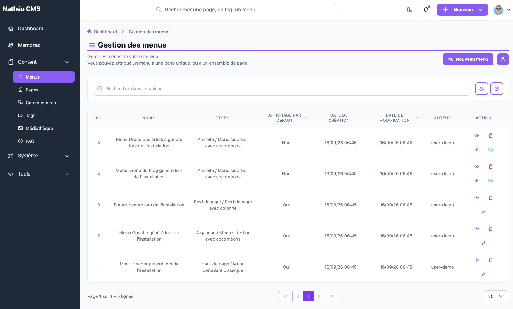

Les menus définissent la navigation de votre site : en-tête, pied de page, ou
menus latéraux gauche/droite. Chaque position peut avoir un menu **par
défaut** (voir [Ajouter / Éditer un menu](ajouter_editer.md#le-menu-par-défaut)).

Cette page est accessible aux contributeurs, administrateurs et
super-administrateurs, à l'URL `/admin/{locale}/menu/`.

Le tableau ([composant Grid](../../../Architecture/composants/grid.md)) liste
tous les menus existants, avec leur position/type combinés, leur statut
« affichage par défaut », leurs dates de création et de modification, et leur
auteur. Vous pouvez trier chaque colonne triable en cliquant sur son en-tête,
et retrouver rapidement un menu grâce à la barre de recherche (sur le nom).

Si une position (haut de page, pied de page ou menu de gauche) n'a **aucun**
menu par défaut, ou en a **plusieurs**, une alerte s'affiche en haut de page
pour le signaler — voir [Le menu par défaut](ajouter_editer.md#le-menu-par-défaut).
Cette alerte ne se rafraîchit qu'au chargement suivant de la page. La position
*À droite* n'est volontairement pas concernée par cette vérification : elle
n'a pas besoin d'un menu par défaut.

Pour chaque menu, les actions suivantes sont disponibles depuis la ligne :

| Action | Effet |
|---|---|
| 👁️ **Activer / Désactiver** | Un menu désactivé n'apparaît plus sur le site, mais rien n'est supprimé ; une confirmation est demandée uniquement pour la désactivation |
| 🗑️ **Supprimer** | Retire définitivement le menu (irréversible) — n'apparaît que si l'option système *Autoriser la suppression des données* est activée |
| ✏️ **Éditer** | Ouvre le menu en édition |
| 🟩 **Définir par défaut** | N'apparaît que si le menu n'est pas déjà par défaut ; demande confirmation, puis retire automatiquement le statut par défaut de tout autre menu de la **même position** |

Une icône ☰ à côté du numéro `#` d'un menu indique qu'il s'agit du menu par
défaut de sa position.

Et en haut de page, le bouton **Nouveau menu** ouvre le formulaire de
création.

## Voir aussi
- [Ajouter / Éditer un menu](ajouter_editer.md)
- [Référence technique](technique.md) *(tables, services, routes)*
