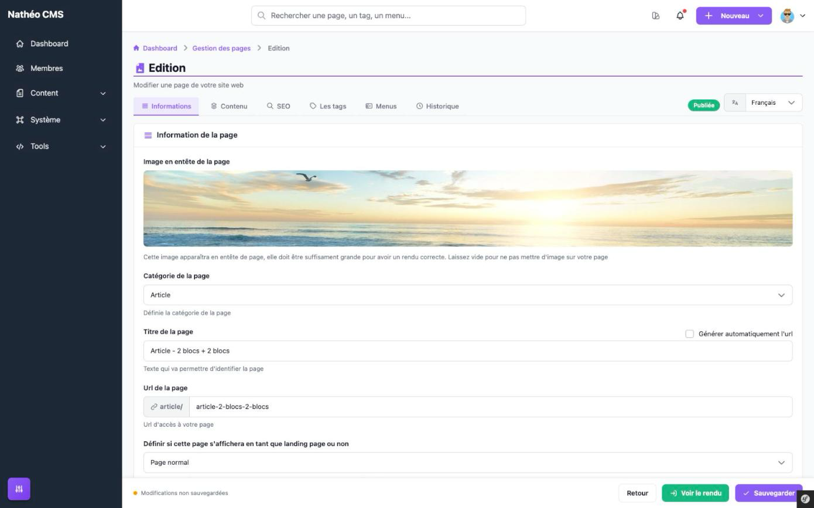
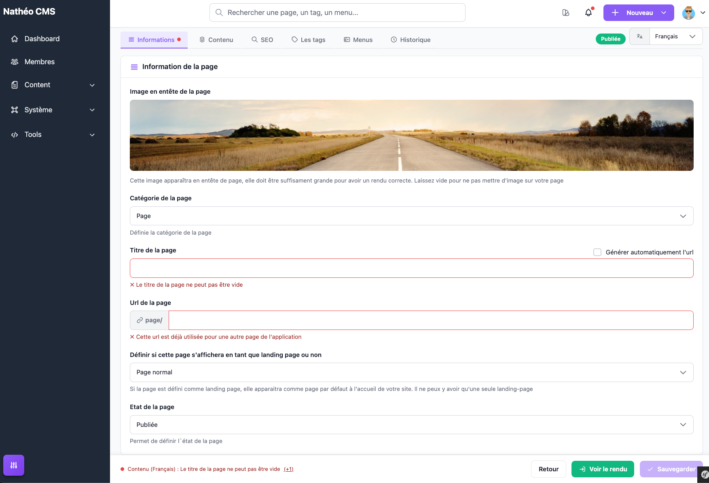

La création et l'édition d'une page se font sur un seul écran, organisé en
7 onglets : **Informations**, **Contenu**, **SEO**, **Les tags**, **Menus**,
**Commentaires** et **Historique**. Cette page décrit l'organisation
générale de l'écran et le détail des onglets **Informations** et
**Commentaires** ; les autres onglets sont détaillés dans [Le contenu de la
page](contenu.md), [SEO, tags et menus](seo_tags_menus.md) et [Historique et
aperçu](historique_apercu.md).

## Accès

Accessible aux contributeurs, administrateurs et super-administrateurs, via
le bouton **Nouvelle page** du [listing](listing.md) (`/admin/{locale}/page/add/`)
ou l'action ✏️ **Modifier** d'une ligne (`/admin/{locale}/page/update/{id}`).

## Organisation de l'écran

En haut de l'écran, un badge affiche le statut courant de la page
(**Brouillon**, **Publiée** ou **Archivée**) et un sélecteur permet de
changer la langue affichée dans le formulaire — toutes les langues du site
sont éditées sur le même écran, il suffit de changer la langue pour voir et
remplir les champs correspondants.

En bas de l'écran, une barre reste toujours visible quel que soit l'onglet
actif :

- à gauche, l'état de la sauvegarde automatique (voir
  [Historique et aperçu](historique_apercu.md#sauvegarde-automatique)), ou,
  si un ou plusieurs champs sont invalides, un résumé cliquable des erreurs
  qui vous amène directement à l'onglet et à la langue concernés ;
- à droite, les boutons **Retour** (liste), **Voir le rendu** (aperçu, désactivé
  tant que la page n'a jamais été sauvegardée) et **Sauvegarder** (désactivé
  tant qu'une erreur de validation subsiste).

Un onglet dont un champ est invalide affiche un petit point rouge à côté de
son nom. C'est le cas pour **Informations** (titre/URL) et **Contenu** (aucun
bloc rempli) ; **Informations** est aussi le premier onglet affiché à
l'ouverture de l'éditeur.

Si une sauvegarde automatique plus récente que la page existe (parce qu'une
modification n'a pas été explicitement enregistrée), un bandeau apparaît en
haut de l'écran pour proposer de la restaurer — voir
[Historique et aperçu](historique_apercu.md#sauvegarde-automatique).

## Onglet Informations

Premier onglet, il regroupe les informations générales de la page.

| Champ | Description |
|---|---|
| Image en entête de la page | Image optionnelle, choisie depuis la [médiathèque](../Mediatheque/mediatheque.md), affichée en haut du rendu de la page |
| Catégorie de la page | Une des 9 catégories (Page, Article, Projet, Blog, Évènement, Nouveauté, Evolution, Documentation, FAQ) ; entre dans la construction de l'URL publique de la page (`/{locale}/{categorie}/{url}`) |
| Titre de la page *(obligatoire)* | Propre à chaque langue ; ne peut pas être vide |
| Générer automatiquement l'url *(case à cocher)* | Recalcule l'URL à partir du titre à chaque frappe (suppression des accents/caractères spéciaux) ; se décoche automatiquement dès que vous modifiez l'URL à la main |
| Url de la page *(obligatoire)* | Propre à chaque langue ; ne peut pas être vide et doit être unique sur l'ensemble du site (vérifié en direct, avec un indicateur de chargement) |
| Landing page | *Landing Page* ou *Page normale* ; il ne peut y avoir qu'une seule landing page à la fois (voir le [listing](listing.md)) |
| Etat de la page | *Brouillon*, *Publiée* ou *Archivée* |

L'unicité de l'URL est revérifiée à chaque langue séparément : deux langues
différentes de la **même** page peuvent tout à fait partager la même URL,
seules deux pages différentes ne le peuvent pas.

Sur une page toute neuve, avant la première saisie, le titre et l'URL sont
vides : les deux onglets concernés (**Informations** et **Contenu**, ce
dernier tant qu'aucun bloc n'est rempli) affichent un point rouge et le
bouton **Sauvegarder** reste désactivé.

Notez que le message affiché sous une URL vide (« Cette url est déjà
utilisée pour une autre page de l'application ») est le même que pour une
URL réellement en doublon — un champ vide n'a pas de message dédié, c'est un
raccourci de copie côté CMS plutôt qu'une vraie erreur d'unicité.

## Onglet Commentaires

Permet de paramétrer les commentaires pour cette page spécifiquement :

| Champ | Description |
|---|---|
| Autoriser les commentaires sur cette page *(interrupteur)* | Ouvre ou ferme les commentaires pour la page |
| Statut par défaut du commentaire à sa soumission | Statut appliqué à tout nouveau commentaire déposé sur cette page (voir les [statuts de modération](../Commentaires/listing.md)) |

Un encart rappelle le paramétrage **global** des commentaires (module
[Commentaires](../Commentaires/listing.md), options système) : celui-ci est
prioritaire sur la configuration de la page — par exemple, si la
configuration globale impose « en attente de validation », les commentaires
de la page restent en attente de validation même si son propre statut par
défaut est réglé sur « validé ».

## Voir aussi
- [Le contenu de la page](contenu.md)
- [SEO, tags et menus](seo_tags_menus.md)
- [Historique et aperçu](historique_apercu.md)
- [Commentaires](../Commentaires/listing.md)
- [Référence technique](technique.md)
