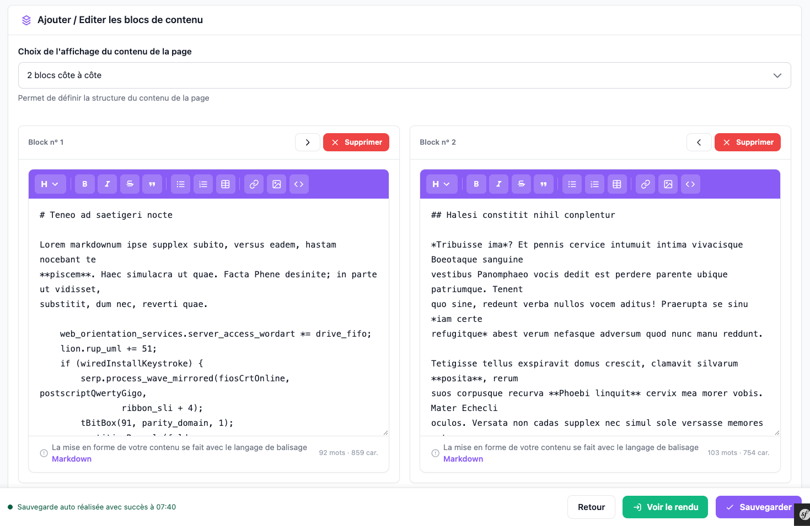
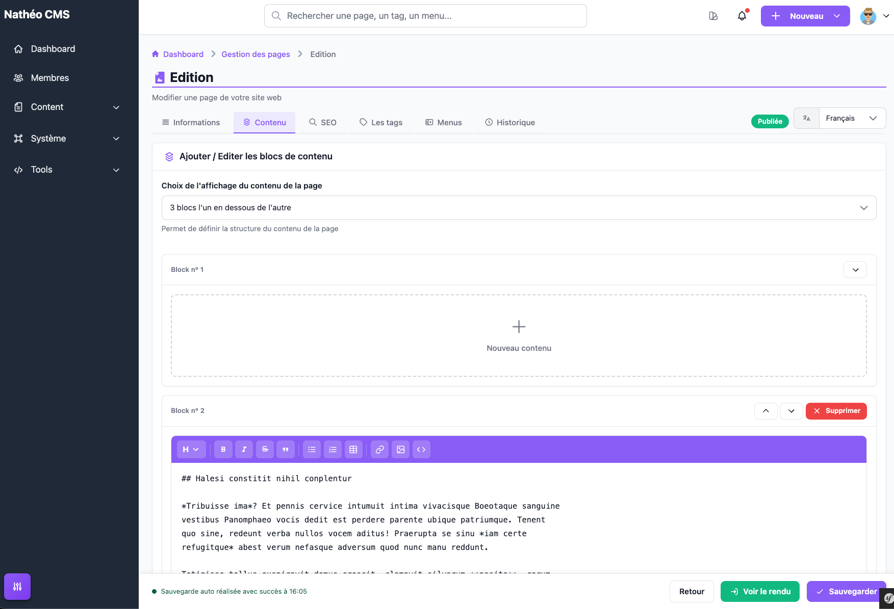
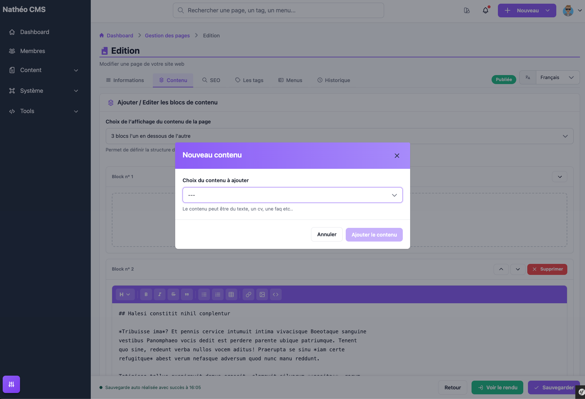

L'onglet **Contenu** de l'éditeur (voir [Créer et éditer une page](ajouter_editer.md))
est celui où vous construisez ce qui s'affiche réellement sur la page : sa
mise en page, et le contenu de chacun de ses blocs.

## Choix de la mise en page

Le champ **Choix de l'affichage du contenu de la page** définit combien de
blocs compose la page et comment ils sont disposés :

| Mise en page | Blocs |
|---|---|
| 1 bloc | 1 bloc pleine largeur |
| 2 blocs côte à côte | 2 blocs sur une ligne |
| 3 blocs côte à côte | 3 blocs sur une ligne |
| 2 blocs l'un en dessous de l'autre | 2 blocs, un par ligne |
| 3 blocs l'un en dessous de l'autre | 3 blocs, un par ligne |
| Un bloc au dessus + 2 blocs côte à côte en dessous | 1 bloc, puis 2 blocs sur la ligne suivante |
| 2 blocs côte à côte + 1 bloc en dessous | 2 blocs, puis 1 bloc sur la ligne suivante |
| 2 blocs côte à côte + 2 blocs côte à côte en dessous | 4 blocs, 2 par ligne |

Changer la mise en page ne supprime pas le contenu déjà saisi dans les blocs
existants ; seul le nombre de blocs affichés change. Au moins un bloc doit
être rempli pour pouvoir sauvegarder la page.

## Les blocs de contenu

Chaque bloc est vide au départ :

Cliquer sur **Nouveau contenu** ouvre une fenêtre pour choisir le type de
contenu à y placer :

| Type de contenu | Description |
|---|---|
| Bloc de texte | Texte libre saisi dans un [éditeur Markdown](../../Modules/editeur_markdown.md) intégré au bloc |
| Faq | Insère une FAQ existante ([voir FAQ](../Faq/listing.md)) ; seules les FAQ non désactivées sont proposées |
| Listing | Insère une liste paginée des pages d'une catégorie donnée (voir [Pages](listing.md)) |

Pour un bloc **Faq** ou **Listing**, une seconde liste déroulante apparaît
pour choisir la FAQ ou la catégorie à afficher. Un bloc déjà rempli affiche
son type et, pour Faq/Listing, l'identifiant choisi ; il peut être vidé avec
le bouton **Supprimer** (rouge, en haut du bloc) pour en choisir un autre
type. Une fenêtre de confirmation s'affiche avant la suppression effective,
qui rappelle que le contenu reste récupérable via l'onglet
[Historique](historique_apercu.md) tant qu'une sauvegarde automatique ou une
sauvegarde explicite antérieure existe.

Sur chaque bloc rempli, des flèches permettent de l'échanger avec un bloc
voisin (haut/bas/gauche/droite selon la mise en page) — c'est le seul moyen
de réorganiser les blocs entre eux, il n'y a pas de glisser-déposer.

## Voir aussi
- [Créer et éditer une page](ajouter_editer.md)
- [SEO, tags et menus](seo_tags_menus.md)
- [Éditeur Markdown](../../Modules/editeur_markdown.md)
- [Référence technique](technique.md)
