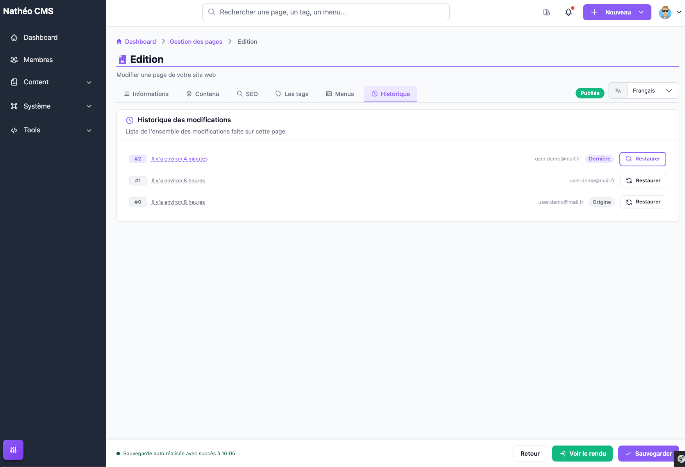

L'éditeur de page (voir [Créer et éditer une page](ajouter_editer.md))
sauvegarde automatiquement votre travail en tâche de fond, garde un
historique de ces sauvegardes automatiques, et propose un aperçu du rendu de
la page avant de la publier.

## Sauvegarde automatique

Dès que vous modifiez un champ de la page (tous onglets confondus), une
sauvegarde automatique se déclenche 2 secondes après votre dernière
modification — tant qu'aucun champ n'est en erreur. L'état de cette
sauvegarde s'affiche en bas à gauche de l'écran, dans la barre de statut :

- un indicateur discret pendant l'enregistrement ;
- une confirmation avec l'heure de la dernière sauvegarde réussie ;
- un message d'erreur si la sauvegarde automatique a échoué.

Cette sauvegarde automatique **n'est pas** un enregistrement en base de
données comme le bouton **Sauvegarder** : elle écrit l'état complet de la
page dans un fichier propre à cette page (ou, pour une page pas encore
créée, propre à vous en tant qu'auteur) sur le serveur. Elle sert de filet
de sécurité en cas de fermeture accidentelle de l'onglet ou de perte de
connexion, pas de mécanisme de publication.

Si vous rouvrez une page pour laquelle une sauvegarde automatique plus
récente que le dernier enregistrement existe, un bandeau apparaît en haut de
l'écran pour vous proposer de **restaurer** cette version ou de l'ignorer.

## Onglet Historique

Cet onglet liste, du plus récent au plus ancien, toutes les sauvegardes
automatiques faites sur la page : un numéro, la date (relative, par exemple
« il y a 5 minutes »), et l'auteur de la modification (selon sa préférence
d'affichage des données personnelles). La première ligne de la liste est
mise en avant comme étant la **dernière** version. Un bouton **Charger
plus...** affiche les entrées suivantes par paquets de 10.

Chaque ligne propose un bouton **Restaurer** : il recharge immédiatement le
contenu de cette version dans le formulaire, dans **tous** les onglets, sans
recharger la page — pensez à cliquer sur **Sauvegarder** ensuite si vous
voulez conserver cette restauration.

Cet historique est propre aux sauvegardes automatiques : il ne s'agit pas
d'un suivi de chaque clic sur **Sauvegarder**, et il n'existe aucun moyen de
comparer deux versions entre elles (pas de « diff »).

## Aperçu

Le bouton **Voir le rendu**, toujours visible dans la barre de statut, ouvre
dans un nouvel onglet un aperçu de la page dans la langue actuellement
sélectionnée, avec un sélecteur pour changer de langue. Il est désactivé
tant que la page n'a jamais été sauvegardée (elle n'a pas encore d'identifiant).

> ⚠️ **Point relevé lors de la rédaction de cette page (2026-09-22)** :
> l'écran d'aperçu tel que trouvé dans le code affiche uniquement le bandeau
> et l'avertissement « Ceci est une préview... », sans aucun contenu de
> page — le composant Vue attendu par le template
> (`Admin/Content/Page/PagePreview`) est introuvable dans le code source
> (seul `Admin/Content/Page/Page` existe). Aucune erreur n'est visible côté
> utilisateur, la page reste simplement vide. À vérifier avant de s'appuyer
> sur cette fonctionnalité.

## Voir aussi
- [Créer et éditer une page](ajouter_editer.md)
- [Le contenu de la page](contenu.md)
- [Référence technique](technique.md)
